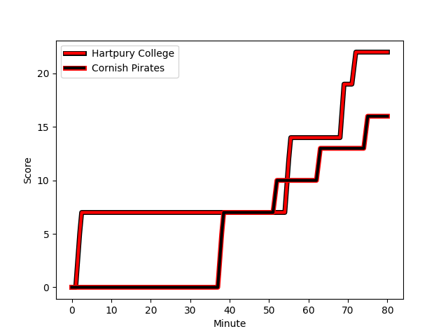
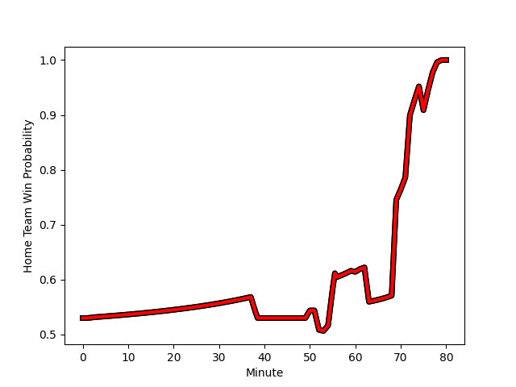

---  
layout: page  
title: Cornish Pirates at Hartpury College; 16-22  
date: 2022-12-23 20:45:00 18:00:00 -0500  
categories: match review  
---
# Cornish Pirates (1432.82) at Hartpury College (1482.34); 16-22

# Prediction: Hartpury College by 8.0

Hartpury College by 5.0 on a neutral field
## Scores over Time

## Win Probability over Time

# Pre-Match Prediction: Hartpury College by 0.3

Cornish Pirates by 2.7 on a neutral pitch

|   Away Minutes | Away Player                                                                 |   Away elo |   Away Percentile |   Number |   Home Percentile |   Home elo | Home Player                                                              |   Home Minutes |
|---------------:|:----------------------------------------------------------------------------|-----------:|------------------:|---------:|------------------:|-----------:|:-------------------------------------------------------------------------|---------------:|
|             56 | [Ollie Adkins](..//playerfiles//OllieAdkins_cleaned.md)                     |      86.61 |                13 |        1 |                62 |      98.54 | [Joe Wrafter](..//playerfiles//JoeWrafter_cleaned.md)                    |             60 |
|             62 | [William Crane](..//playerfiles//WilliamCrane_cleaned.md)                   |      89.91 |                23 |        2 |               nan |      97.46 | [Will Tanner](..//playerfiles//WillTanner_cleaned.md)                    |             60 |
|             56 | [Matt Johnson](..//playerfiles//MattJohnson_cleaned.md)                     |      99.4  |                66 |        3 |                 1 |      74.21 | [Alex Gibson](..//playerfiles//AlexGibson_cleaned.md)                    |             54 |
|             80 | [Cory Teague](..//playerfiles//CoryTeague_cleaned.md)                       |      80.87 |                 8 |        4 |                60 |      97.95 | [Jack Davies](..//playerfiles//JackDavies_cleaned.md)                    |             80 |
|             60 | [Will Britton](..//playerfiles//WillBritton_cleaned.md)                     |      90.57 |                29 |        5 |                73 |     102.31 | [Dale Lemon](..//playerfiles//DaleLemon_cleaned.md)                      |             80 |
|             80 | [Alex Everett](..//playerfiles//AlexEverett_cleaned.md)                     |      93.49 |                42 |        6 |                36 |      92.29 | [Samuel Lewis](..//playerfiles//SamuelLewis_cleaned.md)                  |             80 |
|             80 | [John Stevens](..//playerfiles//JohnStevens_cleaned.md)                     |     107.97 |                84 |        7 |                91 |     111.96 | [Harry Short](..//playerfiles//HarryShort_cleaned.md)                    |             80 |
|             50 | [Sebastian Nagle-Taylor](..//playerfiles//SebastianNagle-Taylor_cleaned.md) |      98.16 |                55 |        8 |                43 |      95.17 | [Joe Howard](..//playerfiles//JoeHoward_cleaned.md)                      |             80 |
|             73 | [Tom Kessell](..//playerfiles//TomKessell_cleaned.md)                       |      93.7  |                26 |        9 |                74 |     102.17 | [Matty Jones](..//playerfiles//MattyJones_cleaned.md)                    |             63 |
|             80 | [Harry Bazalgette](..//playerfiles//HarryBazalgette_cleaned.md)             |      95.66 |                49 |       10 |                84 |     109.67 | [Tommy Mathews](..//playerfiles//TommyMathews_cleaned.md)                |             80 |
|             80 | [Tom Wyatt](..//playerfiles//TomWyatt_cleaned.md)                           |      93.01 |                39 |       11 |                93 |     116.93 | [Sam Smith](..//playerfiles//SamSmith_cleaned.md)                        |             80 |
|             80 | [Joe Elderkin](..//playerfiles//JoeElderkin_cleaned.md)                     |      92.83 |                38 |       12 |                17 |      86.44 | [James Williams](..//playerfiles//JamesWilliams_cleaned.md)              |             80 |
|             50 | [Rory Parata](..//playerfiles//RoryParata_cleaned.md)                       |     102.33 |                73 |       13 |                56 |      97.43 | [William Butler](..//playerfiles//WilliamButler_cleaned.md)              |             80 |
|             80 | [Robin Wedlake](..//playerfiles//RobinWedlake_cleaned.md)                   |      87.79 |                18 |       14 |                75 |     102.12 | [Bradley Denty](..//playerfiles//BradleyDenty_cleaned.md)                |             80 |
|             80 | [Alexander AJ Cant](..//playerfiles//AlexanderAJCant_cleaned.md)            |     123.1  |                97 |       15 |                42 |      92.28 | [Noah Heward](..//playerfiles//NoahHeward_cleaned.md)                    |             80 |
|             30 | [Rusiate Tuima](..//playerfiles//RusiateTuima_cleaned.md)                   |      80.9  |                 7 |       16 |                36 |      93.03 | [Mikey Summerfield](..//playerfiles//MikeySummerfield_cleaned.md)        |             26 |
|             30 | [Garyn Smith](..//playerfiles//GarynSmith_cleaned.md)                       |      98.2  |                53 |       17 |               nan |      96.05 | [George Kloska](..//playerfiles//GeorgeKloska_cleaned.md)                |             20 |
|             24 | [Harvey Beaton](..//playerfiles//HarveyBeaton_cleaned.md)                   |      93.62 |                36 |       18 |                65 |      98.99 | [Luke Stratford](..//playerfiles//LukeStratford_cleaned.md)              |             20 |
|             24 | [Marlen Walker](..//playerfiles//MarlenWalker_cleaned.md)                   |     103.76 |                82 |       19 |               nan |      99.99 | [Arthur William Lennon](..//playerfiles//ArthurWilliamLennon_cleaned.md) |             17 |
|             20 | [Josh Williams](..//playerfiles//JoshWilliams_cleaned.md)                   |      95.68 |               nan |       20 |               nan |     nan    | nan                                                                      |            nan |
|             18 | [Max Norey](..//playerfiles//MaxNorey_cleaned.md)                           |      94.21 |               nan |       21 |               nan |     nan    | nan                                                                      |            nan |
|              7 | [Alex Schwarz](..//playerfiles//AlexSchwarz_cleaned.md)                     |      91.3  |                27 |       22 |               nan |     nan    | nan                                                                      |            nan |

