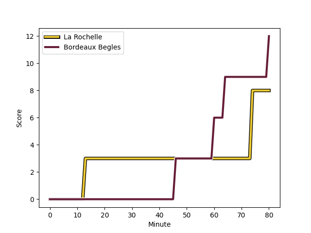
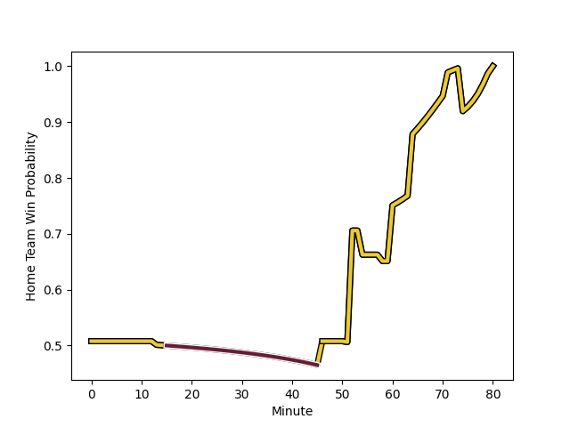

---  
layout: page  
title: Bordeaux Begles at La Rochelle; 12-8  
date: 2022-12-23 18:45:00 18:00:00 -0500  
categories: match review  
---
# Bordeaux Begles (1565.35) at La Rochelle (1575.54); 12-8

# Prediction: La Rochelle by 4.0

La Rochelle by 1.0 on a neutral field
## Scores over Time

## Win Probability over Time

# Pre-Match Prediction: La Rochelle by 7.6

La Rochelle by 4.6 on a neutral pitch

|   Away Minutes | Away Player                                                             |   Away elo |   Away Percentile |   Number |   Home Percentile |   Home elo | Home Player                                                            |   Home Minutes |
|---------------:|:------------------------------------------------------------------------|-----------:|------------------:|---------:|------------------:|-----------:|:-----------------------------------------------------------------------|---------------:|
|             52 | [Lekso Kaulashvili](..//playerfiles//LeksoKaulashvili_cleaned.md)       |     105.93 |                85 |        1 |                92 |     110.56 | [Reda Wardi](..//playerfiles//RedaWardi_cleaned.md)                    |             60 |
|             52 | [Connor Sa](..//playerfiles//ConnorSa_cleaned.md)                       |      91    |                31 |        2 |                89 |     107.91 | [Pierre Bourgarit](..//playerfiles//PierreBourgarit_cleaned.md)        |             73 |
|             52 | [Sipili Falatea](..//playerfiles//SipiliFalatea_cleaned.md)             |     101.36 |                74 |        3 |                87 |     109.24 | [Joel Sclavi](..//playerfiles//JoelSclavi_cleaned.md)                  |             51 |
|             52 | [Alban Roussel](..//playerfiles//AlbanRoussel_cleaned.md)               |      98    |                64 |        4 |                81 |     105.42 | [Romain Sazy](..//playerfiles//RomainSazy_cleaned.md)                  |             80 |
|             80 | [Jandré Marais](..//playerfiles//JandréMarais_cleaned.md)               |     116.35 |                92 |        5 |                62 |      98.48 | [Remi Picquette](..//playerfiles//RemiPicquette_cleaned.md)            |             58 |
|             80 | [Antoine Miquel](..//playerfiles//AntoineMiquel_cleaned.md)             |      94.17 |                45 |        6 |                78 |     104.28 | [Ultan Dillane](..//playerfiles//UltanDillane_cleaned.md)              |             80 |
|             80 | [Mahamadou Diaby](..//playerfiles//MahamadouDiaby_cleaned.md)           |     101.02 |                71 |        7 |                 2 |      73.53 | [Kyle Hatherell](..//playerfiles//KyleHatherell_cleaned.md)            |             54 |
|             80 | [Tom Willis](..//playerfiles//TomWillis_cleaned.md)                     |      94.19 |                44 |        8 |                36 |      93.89 | [Paul Boudehent](..//playerfiles//PaulBoudehent_cleaned.md)            |             80 |
|             80 | [Maxime Lucu](..//playerfiles//MaximeLucu_cleaned.md)                   |     140.35 |               100 |        9 |                26 |      94.23 | [Thomas Berjon](..//playerfiles//ThomasBerjon_cleaned.md)              |             71 |
|             58 | [Zack Holmes](..//playerfiles//ZackHolmes_cleaned.md)                   |     121.73 |                94 |       10 |                16 |      88.89 | [Pierre Popelin](..//playerfiles//PierrePopelin_cleaned.md)            |             51 |
|             80 | [Santiago Cordero](..//playerfiles//SantiagoCordero_cleaned.md)         |     104.41 |                81 |       11 |                90 |     113.03 | [Dillyn Leyds](..//playerfiles//DillynLeyds_cleaned.md)                |             80 |
|             71 | [Remi Lamerat](..//playerfiles//RemiLamerat_cleaned.md)                 |     109.07 |                85 |       12 |                97 |     126.9  | [Levani Botia Veivuke](..//playerfiles//LevaniBotiaVeivuke_cleaned.md) |             80 |
|             80 | [Jean-Baptiste Dubie](..//playerfiles//Jean-BaptisteDubie_cleaned.md)   |      96.8  |                53 |       13 |                78 |     105.75 | [Raymond Rhule](..//playerfiles//RaymondRhule_cleaned.md)              |             80 |
|             80 | [Louis Bielle-Biarrey](..//playerfiles//LouisBielle-Biarrey_cleaned.md) |      88.58 |                27 |       14 |                81 |     105.21 | [Teddy Thomas](..//playerfiles//TeddyThomas_cleaned.md)                |             80 |
|             80 | [Romain Buros](..//playerfiles//RomainBuros_cleaned.md)                 |     110.34 |                84 |       15 |                96 |     123.71 | [Brice Dulin](..//playerfiles//BriceDulin_cleaned.md)                  |             64 |
|             28 | [Christopher Vaotoa](..//playerfiles//ChristopherVaotoa_cleaned.md)     |      96.12 |                55 |       16 |                95 |     113.65 | [Uini Atonio](..//playerfiles//UiniAtonio_cleaned.md)                  |             29 |
|             28 | [Vadim Cobilas](..//playerfiles//VadimCobilas_cleaned.md)               |     117.87 |                97 |       17 |                60 |      98.32 | [Ulupano Seuteni](..//playerfiles//UlupanoSeuteni_cleaned.md)          |             29 |
|             28 | [Maxime Lamothe](..//playerfiles//MaximeLamothe_cleaned.md)             |      90.71 |                32 |       18 |                92 |     118.96 | [Gregory Alldritt](..//playerfiles//GregoryAlldritt_cleaned.md)        |             26 |
|             28 | [Thomas Jolmes](..//playerfiles//ThomasJolmes_cleaned.md)               |      86.6  |                18 |       19 |                92 |     114.38 | [Will Skelton](..//playerfiles//WillSkelton_cleaned.md)                |             22 |
|             22 | [Matthieu Jalibert](..//playerfiles//MatthieuJalibert_cleaned.md)       |     104.96 |                75 |       20 |                45 |      96.09 | [Thierry Paiva](..//playerfiles//ThierryPaiva_cleaned.md)              |             20 |
|              9 | [Nicolas Depoortere](..//playerfiles//NicolasDepoortere_cleaned.md)     |      95    |               nan |       21 |                49 |      95.22 | [Pierre Boudehent](..//playerfiles//PierreBoudehent_cleaned.md)        |             16 |
|            nan | nan                                                                     |     nan    |               nan |       22 |               nan |      95    | [Lucas Zamora](..//playerfiles//LucasZamora_cleaned.md)                |              9 |
|            nan | nan                                                                     |     nan    |               nan |       23 |                79 |     103.15 | [Samuel Lagrange](..//playerfiles//SamuelLagrange_cleaned.md)          |              7 |

