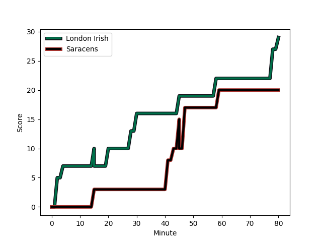
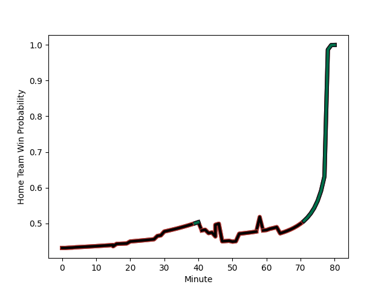

---  
layout: page  
title: Saracens at London Irish; 20-29  
date: 2022-12-23 14:45:00 18:00:00 -0500  
categories: match review  
---
# Saracens (1674.21) at London Irish (1553.33); 20-29

# Prediction: Saracens by 9.1

Saracens by 12.1 on a neutral field
## Scores over Time

## Win Probability over Time

# Pre-Match Prediction: Saracens by 8.6

Saracens by 11.6 on a neutral pitch

|   Away Minutes | Away Player                                                       |   Away elo |   Away Percentile |   Number |   Home Percentile |   Home elo | Home Player                                                                       |   Home Minutes |
|---------------:|:------------------------------------------------------------------|-----------:|------------------:|---------:|------------------:|-----------:|:----------------------------------------------------------------------------------|---------------:|
|             52 | [Mako Vunipola](..//playerfiles//MakoVunipola_cleaned.md)         |     132.22 |                99 |        1 |                51 |      96.13 | [Will Goodrick-Clarke](..//playerfiles//WillGoodrick-Clarke_cleaned.md)           |             47 |
|             16 | [Tom Woolstencroft](..//playerfiles//TomWoolstencroft_cleaned.md) |     104.73 |                88 |        2 |                76 |     101.81 | [Mike Willemse](..//playerfiles//MikeWillemse_cleaned.md)                         |             64 |
|             52 | [Marco Riccioni](..//playerfiles//MarcoRiccioni_cleaned.md)       |      94.24 |                42 |        3 |                95 |     113.2  | [Oli Hoskins](..//playerfiles//OliHoskins_cleaned.md)                             |             64 |
|             80 | [Nick Isiekwe](..//playerfiles//NickIsiekwe_cleaned.md)           |     101.23 |                71 |        4 |                65 |      99.31 | [Api Ratuniyarawa](..//playerfiles//ApiRatuniyarawa_cleaned.md)                   |             60 |
|             61 | [Hugh Tizard](..//playerfiles//HughTizard_cleaned.md)             |     108.22 |                85 |        5 |                94 |     118.45 | [Adam Coleman](..//playerfiles//AdamColeman_cleaned.md)                           |             80 |
|             80 | [Andy Christie](..//playerfiles//AndyChristie_cleaned.md)         |     101.04 |                69 |        6 |                81 |     105.66 | [Juan Martin Gonzalez](..//playerfiles//JuanMartinGonzalez_cleaned.md)            |             64 |
|             80 | [Ben Earl](..//playerfiles//BenEarl_cleaned.md)                   |     120.82 |                96 |        7 |                91 |     112.66 | [Tom Pearson](..//playerfiles//TomPearson_cleaned.md)                             |             80 |
|             80 | [Billy Vunipola](..//playerfiles//BillyVunipola_cleaned.md)       |     127.88 |                96 |        8 |                92 |     118.98 | [So'otala Fa'aso'o](..//playerfiles//So'otalaFa'aso'o_cleaned.md)                 |             16 |
|             50 | [Ivan van Zyl](..//playerfiles//IvanvanZyl_cleaned.md)            |      95.42 |                48 |        9 |                76 |     102.18 | [Ben White](..//playerfiles//BenWhite_cleaned.md)                                 |             60 |
|             80 | [Owen Farrell](..//playerfiles//OwenFarrell_cleaned.md)           |     129.9  |                97 |       10 |                81 |     108.61 | [Paddy Jackson](..//playerfiles//PaddyJackson_cleaned.md)                         |             80 |
|             61 | [Sean Maitland](..//playerfiles//SeanMaitland_cleaned.md)         |     124.12 |                97 |       11 |                34 |      92.1  | [Ollie Hassell-Collins](..//playerfiles//OllieHassell-Collins_cleaned.md)         |             80 |
|             80 | [Nick Tompkins](..//playerfiles//NickTompkins_cleaned.md)         |     128.23 |                98 |       12 |                51 |      95.94 | [Benhard Janse van Rensburg](..//playerfiles//BenhardJansevanRensburg_cleaned.md) |             80 |
|             80 | [Elliot Daly](..//playerfiles//ElliotDaly_cleaned.md)             |     105.36 |                77 |       13 |                52 |      96.19 | [Will Joseph](..//playerfiles//WillJoseph_cleaned.md)                             |             10 |
|             80 | [Alex Lewington](..//playerfiles//AlexLewington_cleaned.md)       |      97.14 |                56 |       14 |                41 |      93.6  | [Lucio Cinti](..//playerfiles//LucioCinti_cleaned.md)                             |             80 |
|             80 | [Alex Goode](..//playerfiles//AlexGoode_cleaned.md)               |     125.66 |                95 |       15 |                82 |     108.56 | [Ben Loader](..//playerfiles//BenLoader_cleaned.md)                               |             80 |
|             64 | [Kapeli Pifeleti](..//playerfiles//KapeliPifeleti_cleaned.md)     |      92.15 |                35 |       16 |               nan |      93.01 | [Ignacio Ruiz](..//playerfiles//IgnacioRuiz_cleaned.md)                           |             16 |
|             28 | [Robin Hislop](..//playerfiles//RobinHislop_cleaned.md)           |      96.9  |                55 |       17 |                26 |      92.13 | [Danilo Fischetti](..//playerfiles//DaniloFischetti_cleaned.md)                   |             33 |
|             28 | [Eduardo Bello](..//playerfiles//EduardoBello_cleaned.md)         |      90.7  |                25 |       18 |               nan |      95.53 | [Ciaran Parker](..//playerfiles//CiaranParker_cleaned.md)                         |             16 |
|              0 | [Andrew Kitchener](..//playerfiles//AndrewKitchener_cleaned.md)   |      81.65 |                10 |       19 |                77 |     102.9  | [Chunya Munga](..//playerfiles//ChunyaMunga_cleaned.md)                           |             20 |
|             19 | [Jackson Wray](..//playerfiles//JacksonWray_cleaned.md)           |     129.17 |                97 |       20 |                94 |     118.48 | [Rob Simmons](..//playerfiles//RobSimmons_cleaned.md)                             |             64 |
|             30 | [Aled Davies](..//playerfiles//AledDavies_cleaned.md)             |     101.59 |                72 |       21 |                51 |      93.6  | [Chandler Cunningham-South](..//playerfiles//ChandlerCunningham-South_cleaned.md) |             16 |
|              0 | [Josh Hallett](..//playerfiles//JoshHallett_cleaned.md)           |      94    |               nan |       22 |                56 |      97.14 | [Caolan Englefield](..//playerfiles//CaolanEnglefield_cleaned.md)                 |             20 |
|             19 | [Max Malins](..//playerfiles//MaxMalins_cleaned.md)               |     100.42 |                65 |       23 |                52 |      96.27 | [Rory Jennings](..//playerfiles//RoryJennings_cleaned.md)                         |             70 |

