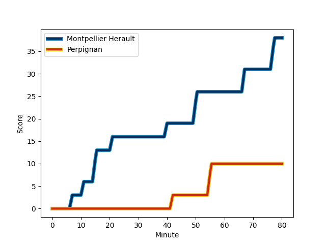
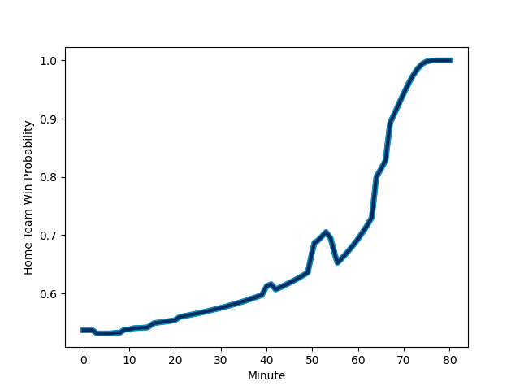

---  
layout: page  
title: Perpignan at Montpellier Herault; 10-38  
date: 2022-12-23 18:45:00 18:00:00 -0500  
categories: match review  
---
# Perpignan (1526.48) at Montpellier Herault (1597.22); 10-38

# Prediction: Montpellier Herault by 10.1

Montpellier Herault by 7.1 on a neutral field
## Scores over Time

## Win Probability over Time

# Pre-Match Prediction: Montpellier Herault by 11.4

Montpellier Herault by 8.4 on a neutral pitch

|   Away Minutes | Away Player                                                             |   Away elo |   Away Percentile |   Number |   Home Percentile |   Home elo | Home Player                                                             |   Home Minutes |
|---------------:|:------------------------------------------------------------------------|-----------:|------------------:|---------:|------------------:|-----------:|:------------------------------------------------------------------------|---------------:|
|             51 | [Xavier Chiocci](..//playerfiles//XavierChiocci_cleaned.md)             |      86.7  |                13 |        1 |                92 |     110.71 | [Enzo Forletta](..//playerfiles//EnzoForletta_cleaned.md)               |             51 |
|             51 | [Seilala Lam](..//playerfiles//SeilalaLam_cleaned.md)                   |      84.17 |                 9 |        2 |                51 |      94.75 | [Curtis Langdon](..//playerfiles//CurtisLangdon_cleaned.md)             |             67 |
|             51 | [Siua Halanukonuka](..//playerfiles//SiuaHalanukonuka_cleaned.md)       |     100.85 |                72 |        3 |                37 |      93.3  | [Mohamed Haouas](..//playerfiles//MohamedHaouas_cleaned.md)             |             51 |
|             80 | [Piula Faasalele](..//playerfiles//PiulaFaasalele_cleaned.md)           |     100.55 |                69 |        4 |                96 |     121.41 | [Bastien Chalureau](..//playerfiles//BastienChalureau_cleaned.md)       |             80 |
|             54 | [Victor Moreaux](..//playerfiles//VictorMoreaux_cleaned.md)             |      88.16 |                21 |        5 |                96 |     123.03 | [Paul Willemse](..//playerfiles//PaulWillemse_cleaned.md)               |             67 |
|             54 | [Brad Shields](..//playerfiles//BradShields_cleaned.md)                 |     111.15 |                90 |        6 |                94 |     116.41 | [Yacouba Camara](..//playerfiles//YacoubaCamara_cleaned.md)             |             80 |
|             80 | [Kelian Galletier](..//playerfiles//KelianGalletier_cleaned.md)         |      92.09 |                35 |        7 |                17 |      87.2  | [Alexandre Becognee](..//playerfiles//AlexandreBecognee_cleaned.md)     |             64 |
|             54 | [Joaquin Oviedo](..//playerfiles//JoaquinOviedo_cleaned.md)             |     103.78 |                73 |        8 |                59 |      99.33 | [Zach Mercer](..//playerfiles//ZachMercer_cleaned.md)                   |             80 |
|             51 | [Sadek Deghmache](..//playerfiles//SadekDeghmache_cleaned.md)           |      92.36 |                26 |        9 |                79 |     103.22 | [Léo Coly](..//playerfiles//LéoColy_cleaned.md)                         |             64 |
|             80 | [Jake McIntyre](..//playerfiles//JakeMcIntyre_cleaned.md)               |     110.12 |                84 |       10 |                85 |     110.6  | [Louis Carbonel](..//playerfiles//LouisCarbonel_cleaned.md)             |             64 |
|             80 | [Mathieu Acebes](..//playerfiles//MathieuAcebes_cleaned.md)             |     135.72 |                99 |       11 |                95 |     118.91 | [George Bridge](..//playerfiles//GeorgeBridge_cleaned.md)               |              9 |
|             80 | [Jeronimo de la Fuente](..//playerfiles//JeronimodelaFuente_cleaned.md) |     111.45 |                88 |       12 |                82 |     108.33 | [Paolo Garbisi](..//playerfiles//PaoloGarbisi_cleaned.md)               |             80 |
|             80 | [Afusipa Taumoepeau](..//playerfiles//AfusipaTaumoepeau_cleaned.md)     |     111.13 |                87 |       13 |                17 |      86.83 | [Pierre Lucas](..//playerfiles//PierreLucas_cleaned.md)                 |             80 |
|             80 | [George Tilsley](..//playerfiles//GeorgeTilsley_cleaned.md)             |      92.53 |                35 |       14 |                90 |     115.98 | [Julien Tisseron](..//playerfiles//JulienTisseron_cleaned.md)           |             80 |
|              3 | [Tristan Tedder](..//playerfiles//TristanTedder_cleaned.md)             |      83.22 |                11 |       15 |                81 |     107.88 | [Anthony Bouthier](..//playerfiles//AnthonyBouthier_cleaned.md)         |             80 |
|             77 | [Lucas Dubois](..//playerfiles//LucasDubois_cleaned.md)                 |      92.15 |                30 |       16 |                98 |     129.8  | [Vincent Rattez](..//playerfiles//VincentRattez_cleaned.md)             |             71 |
|             29 | [Ma'afu Fia](..//playerfiles//Ma'afuFia_cleaned.md)                     |     103.44 |                80 |       17 |                70 |     100.08 | [Simon-Pierre Chauvac](..//playerfiles//Simon-PierreChauvac_cleaned.md) |             29 |
|             29 | [Mike Tadjer Barbosa](..//playerfiles//MikeTadjerBarbosa_cleaned.md)    |      90.5  |                23 |       18 |                40 |      94.19 | [Titi Lamositele](..//playerfiles//TitiLamositele_cleaned.md)           |             29 |
|             29 | [Sacha Lotrian](..//playerfiles//SachaLotrian_cleaned.md)               |     100.34 |                71 |       19 |                18 |      87.24 | [Thomas Darmon](..//playerfiles//ThomasDarmon_cleaned.md)               |             16 |
|             29 | [Tom Ecochard](..//playerfiles//TomEcochard_cleaned.md)                 |     103.25 |                78 |       20 |                71 |     100.68 | [Gela Aprasidze](..//playerfiles//GelaAprasidze_cleaned.md)             |             16 |
|             26 | [Shahn Eru](..//playerfiles//ShahnEru_cleaned.md)                       |      92.41 |                37 |       21 |                47 |      94.92 | [Clément Doumenc](..//playerfiles//ClémentDoumenc_cleaned.md)           |             16 |
|             26 | [Genesis Mamea Lemalu](..//playerfiles//GenesisMameaLemalu_cleaned.md)  |     105.72 |                78 |       22 |                48 |      94.49 | [Brandon Paenga-Amosa](..//playerfiles//BrandonPaenga-Amosa_cleaned.md) |             13 |
|             26 | [Lucas Bachelier](..//playerfiles//LucasBachelier_cleaned.md)           |     110.39 |                89 |       23 |                79 |     103.79 | [Marco Tauleigne](..//playerfiles//MarcoTauleigne_cleaned.md)           |             13 |

