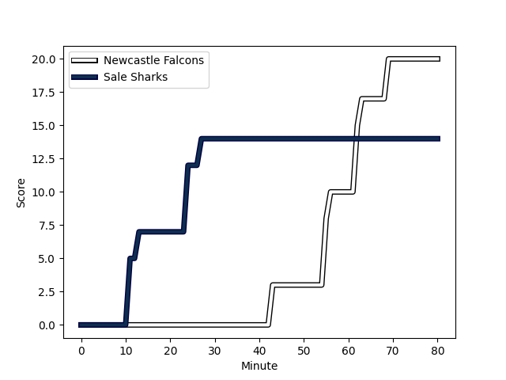

---  
layout: page  
title: Sale Sharks at Newcastle Falcons; 14-20  
date: 2022-12-23 14:45:00 18:00:00 -0500  
categories: match review  
---
# Sale Sharks (1521.82) at Newcastle Falcons (1401.82); 14-20

# Prediction: Sale Sharks by 9.0

Sale Sharks by 12.0 on a neutral field
## Scores over Time

## Win Probability over Time

# Pre-Match Prediction: Sale Sharks by 6.7

Sale Sharks by 9.7 on a neutral pitch

|   Away Minutes | Away Player                                                      |   Away elo |   Away Percentile |   Number |   Home Percentile |   Home elo | Home Player                                                          |   Home Minutes |
|---------------:|:-----------------------------------------------------------------|-----------:|------------------:|---------:|------------------:|-----------:|:---------------------------------------------------------------------|---------------:|
|             80 | [Ross Harrison](..//playerfiles//RossHarrison_cleaned.md)        |     119.64 |                98 |        1 |                 9 |      81.28 | [Adam Brocklebank](..//playerfiles//AdamBrocklebank_cleaned.md)      |             56 |
|             80 | [Ewan Ashman](..//playerfiles//EwanAshman_cleaned.md)            |      94.69 |                42 |        2 |                50 |      94.85 | [Jamie Blamire](..//playerfiles//JamieBlamire_cleaned.md)            |             80 |
|             53 | [Nic Schonert](..//playerfiles//NicSchonert_cleaned.md)          |      86.94 |                14 |        3 |                 0 |      70.21 | [Trevor Davison](..//playerfiles//TrevorDavison_cleaned.md)          |             80 |
|             56 | [Cobus Wiese](..//playerfiles//CobusWiese_cleaned.md)            |      95.67 |                51 |        4 |                 2 |      72.54 | [Greg Peterson](..//playerfiles//GregPeterson_cleaned.md)            |             80 |
|             53 | [Jonny Hill](..//playerfiles//JonnyHill_cleaned.md)              |      87.29 |                19 |        5 |                20 |      87.45 | [Sebastian de Chaves](..//playerfiles//SebastiandeChaves_cleaned.md) |             80 |
|             80 | [Jono Ross](..//playerfiles//JonoRoss_cleaned.md)                |      95.26 |                43 |        6 |                12 |      85.33 | [Gary Graham](..//playerfiles//GaryGraham_cleaned.md)                |             80 |
|             80 | [Ben Curry](..//playerfiles//BenCurry_cleaned.md)                |      95.15 |                48 |        7 |                43 |      94.11 | [Callum Chick](..//playerfiles//CallumChick_cleaned.md)              |             80 |
|             76 | [Daniel du Preez](..//playerfiles//DanielduPreez_cleaned.md)     |     120.68 |                93 |        8 |                72 |     103.41 | [Carl Fearns](..//playerfiles//CarlFearns_cleaned.md)                |             59 |
|             53 | [Gus Warr](..//playerfiles//GusWarr_cleaned.md)                  |      88.66 |                19 |        9 |                95 |     117.07 | [Michael Young](..//playerfiles//MichaelYoung_cleaned.md)            |             56 |
|             80 | [Robert du Preez](..//playerfiles//RobertduPreez_cleaned.md)     |      83.6  |                 9 |       10 |                 4 |      75.11 | [Brett Connon](..//playerfiles//BrettConnon_cleaned.md)              |             80 |
|             80 | [Tom O'Flaherty](..//playerfiles//TomO'Flaherty_cleaned.md)      |     119.7  |                95 |       11 |                37 |      92.8  | [Mateo Carreras](..//playerfiles//MateoCarreras_cleaned.md)          |             80 |
|             80 | [Sam Hill](..//playerfiles//SamHill_cleaned.md)                  |      95.14 |                48 |       12 |                92 |     116.99 | [Tom Penny](..//playerfiles//TomPenny_cleaned.md)                    |             80 |
|             80 | [Ryan Mills](..//playerfiles//RyanMills_cleaned.md)              |      98.35 |                59 |       13 |                87 |     111.85 | [Matias Moroni](..//playerfiles//MatiasMoroni_cleaned.md)            |             80 |
|             80 | [Arron Reed](..//playerfiles//ArronReed_cleaned.md)              |     111.98 |                89 |       14 |                93 |     117.38 | [Adam Radwan](..//playerfiles//AdamRadwan_cleaned.md)                |             80 |
|             72 | [Luke James](..//playerfiles//LukeJames_cleaned.md)              |     105.3  |                77 |       15 |                34 |      91.34 | [Elliott Obatoyinbo](..//playerfiles//ElliottObatoyinbo_cleaned.md)  |             80 |
|              4 | [Ethan Caine](..//playerfiles//EthanCaine_cleaned.md)            |      95    |               nan |       16 |               nan |      95    | [Ollie Fletcher](..//playerfiles//OllieFletcher_cleaned.md)          |              0 |
|              0 | [Tumy Onasanya](..//playerfiles//TumyOnasanya_cleaned.md)        |      95    |               nan |       17 |                93 |     111.11 | [Logovi'i Mulipola](..//playerfiles//Logovi'iMulipola_cleaned.md)    |             24 |
|             27 | [Joe Jones](..//playerfiles//JoeJones_cleaned.md)                |      91.09 |               nan |       18 |                65 |      97.27 | [Richard Palframan](..//playerfiles//RichardPalframan_cleaned.md)    |              0 |
|             27 | [Josh Beaumont](..//playerfiles//JoshBeaumont_cleaned.md)        |     107.88 |                84 |       19 |                16 |      85.94 | [Matthew Dalton](..//playerfiles//MatthewDalton_cleaned.md)          |              0 |
|             24 | [Jean-Luc du Preez](..//playerfiles//Jean-LucduPreez_cleaned.md) |     126.63 |                97 |       20 |               nan |      86.57 | [Tom Marshall](..//playerfiles//TomMarshall_cleaned.md)              |             21 |
|             27 | [Joe Simpson](..//playerfiles//JoeSimpson_cleaned.md)            |     104.94 |               nan |       21 |                 0 |      68.99 | [Sam Stuart](..//playerfiles//SamStuart_cleaned.md)                  |             24 |
|              0 | [Tom Curtis](..//playerfiles//TomCurtis_cleaned.md)              |      92.64 |               nan |       22 |                78 |     106.26 | [Tian Schoeman](..//playerfiles//TianSchoeman_cleaned.md)            |              0 |
|              8 | [Byron McGuigan](..//playerfiles//ByronMcGuigan_cleaned.md)      |     124.45 |                96 |       23 |               nan |      94.43 | [Zach Kerr](..//playerfiles//ZachKerr_cleaned.md)                    |              0 |

