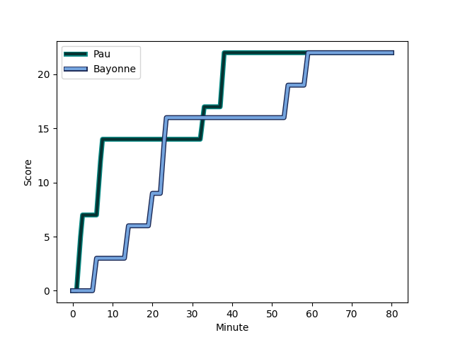
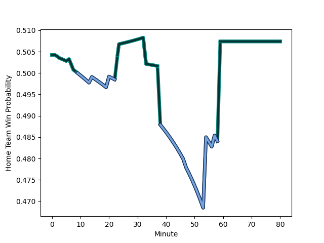

---  
layout: page  
title: Bayonne at Pau; 22-22  
date: 2022-12-23 18:45:00 18:00:00 -0500  
categories: match review  
---
# Bayonne (1520.54) at Pau (1536.26); 22-22

# Prediction: Pau by 4.6

Pau by 1.6 on a neutral field
## Scores over Time

## Win Probability over Time

# Pre-Match Prediction: Pau by 6.7

Pau by 3.7 on a neutral pitch

|   Away Minutes | Away Player                                                                  |   Away elo |   Away Percentile |   Number |   Home Percentile |   Home elo | Home Player                                                           |   Home Minutes |
|---------------:|:-----------------------------------------------------------------------------|-----------:|------------------:|---------:|------------------:|-----------:|:----------------------------------------------------------------------|---------------:|
|             51 | [Swan Cormenier](..//playerfiles//SwanCormenier_cleaned.md)                  |      94.83 |                49 |        1 |                86 |     107.75 | [Ignacio Calles](..//playerfiles//IgnacioCalles_cleaned.md)           |             47 |
|             67 | [Facundo Bosch](..//playerfiles//FacundoBosch_cleaned.md)                    |     104.83 |                86 |        2 |                 7 |      83.06 | [Lucas Rey](..//playerfiles//LucasRey_cleaned.md)                     |             57 |
|             80 | [Pascal Cotet](..//playerfiles//PascalCotet_cleaned.md)                      |      85.7  |                13 |        3 |                 4 |      79.8  | [Guram Papidze](..//playerfiles//GuramPapidze_cleaned.md)             |             47 |
|             59 | [Denis Marchois](..//playerfiles//DenisMarchois_cleaned.md)                  |     125.15 |                97 |        4 |                45 |      94.51 | [Hugo Auradou](..//playerfiles//HugoAuradou_cleaned.md)               |             65 |
|             80 | [Thomas Ceyte](..//playerfiles//ThomasCeyte_cleaned.md)                      |     122.32 |                96 |        5 |                59 |      98.35 | [Fabrice Metz](..//playerfiles//FabriceMetz_cleaned.md)               |             51 |
|             67 | [Pierre Huguet](..//playerfiles//PierreHuguet_cleaned.md)                    |      82.05 |                 7 |        6 |                71 |     103.49 | [Beka Gorgadze](..//playerfiles//BekaGorgadze_cleaned.md)             |             80 |
|             80 | [Baptiste Heguy](..//playerfiles//BaptisteHeguy_cleaned.md)                  |     107    |                87 |        7 |                43 |      93.23 | [Reece Hewat](..//playerfiles//ReeceHewat_cleaned.md)                 |             80 |
|             80 | [Uzair Cassiem](..//playerfiles//UzairCassiem_cleaned.md)                    |     104.59 |                80 |        8 |                38 |      94.21 | [Jordan Joseph](..//playerfiles//JordanJoseph_cleaned.md)             |             57 |
|             54 | [Guillaume Rouet Piffard](..//playerfiles//GuillaumeRouetPiffard_cleaned.md) |      95.54 |                50 |        9 |                95 |     118.84 | [Dan Robson](..//playerfiles//DanRobson_cleaned.md)                   |             71 |
|             80 | [Camille Lopez](..//playerfiles//CamilleLopez_cleaned.md)                    |     138.32 |                99 |       10 |                97 |     130.19 | [Zack Henry](..//playerfiles//ZackHenry_cleaned.md)                   |             73 |
|             80 | [Remy Baget](..//playerfiles//RemyBaget_cleaned.md)                          |     102.4  |                76 |       11 |                89 |     113.02 | [Émilien Gailleton](..//playerfiles//ÉmilienGailleton_cleaned.md)     |             80 |
|             52 | [Yann David](..//playerfiles//YannDavid_cleaned.md)                          |      94.25 |                44 |       12 |                59 |      98.34 | [Jale Vatubua](..//playerfiles//JaleVatubua_cleaned.md)               |             80 |
|             80 | [Sireli Maqala](..//playerfiles//SireliMaqala_cleaned.md)                    |      88.37 |                21 |       13 |                98 |     129.5  | [Tumua Manu](..//playerfiles//TumuaManu_cleaned.md)                   |             80 |
|             67 | [Arnaud Erbinartegaray](..//playerfiles//ArnaudErbinartegaray_cleaned.md)    |      96.31 |               nan |       14 |                39 |      92.53 | [Mathias Colombet](..//playerfiles//MathiasColombet_cleaned.md)       |             80 |
|             80 | [Martin Bogado](..//playerfiles//MartinBogado_cleaned.md)                    |      95.52 |                48 |       15 |                56 |      97.61 | [Jack Maddocks](..//playerfiles//JackMaddocks_cleaned.md)             |             80 |
|             29 | [Pieter Scholtz](..//playerfiles//PieterScholtz_cleaned.md)                  |      81.75 |                 6 |       16 |                80 |     103.85 | [Remi Seneca](..//playerfiles//RemiSeneca_cleaned.md)                 |             33 |
|             28 | [Guillaume Martocq](..//playerfiles//GuillaumeMartocq_cleaned.md)            |      90.86 |                29 |       17 |                 4 |      80.75 | [Nicolas Corato](..//playerfiles//NicolasCorato_cleaned.md)           |             33 |
|             26 | [Maxime Machenaud](..//playerfiles//MaximeMachenaud_cleaned.md)              |      99.66 |                65 |       18 |                63 |      99.01 | [Lekima Tagitagivalu](..//playerfiles//LekimaTagitagivalu_cleaned.md) |             29 |
|             21 | [Geoff Cridge](..//playerfiles//GeoffCridge_cleaned.md)                      |      90.32 |                28 |       19 |                75 |     103.56 | [Romain Ruffenach](..//playerfiles//RomainRuffenach_cleaned.md)       |             23 |
|             13 | [Kote Mikautadze](..//playerfiles//KoteMikautadze_cleaned.md)                |      73.7  |                 3 |       20 |                25 |      90.17 | [Sacha Zegueur](..//playerfiles//SachaZegueur_cleaned.md)             |             23 |
|             13 | [Thomas Acquier](..//playerfiles//ThomasAcquier_cleaned.md)                  |     115.73 |                95 |       21 |                58 |      97.55 | [Martin Puech](..//playerfiles//MartinPuech_cleaned.md)               |             15 |
|             13 | [Jason Robertson](..//playerfiles//JasonRobertson_cleaned.md)                |      75.83 |                 3 |       22 |                95 |     116.8  | [Thibault Daubagna](..//playerfiles//ThibaultDaubagna_cleaned.md)     |              9 |
|            nan | nan                                                                          |     nan    |               nan |       23 |                74 |     104.28 | [Thibault Debaes](..//playerfiles//ThibaultDebaes_cleaned.md)         |              7 |

