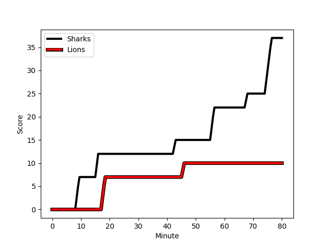
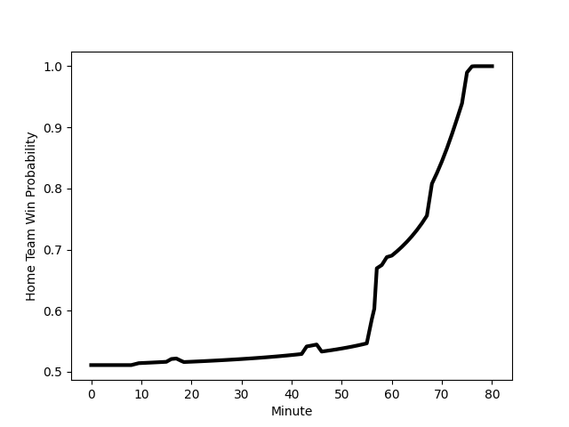

---  
layout: page  
title: Lions at Sharks; 10-37  
date: 2022-12-23 16:00:00 18:00:00 -0500  
categories: match review  
---
# Lions (1514.26) at Sharks (1536.65); 10-37

# Prediction: Sharks by 5.2

Sharks by 2.2 on a neutral field
## Scores over Time

## Win Probability over Time

# Pre-Match Prediction: Sharks by 5.7

Sharks by 2.7 on a neutral pitch

|   Away Minutes | Away Player                                                                   |   Away elo |   Away Percentile |   Number |   Home Percentile |   Home elo | Home Player                                                                      |   Home Minutes |
|---------------:|:------------------------------------------------------------------------------|-----------:|------------------:|---------:|------------------:|-----------:|:---------------------------------------------------------------------------------|---------------:|
|             61 | [Jean-Pierre Smith](..//playerfiles//Jean-PierreSmith_cleaned.md)             |      92.27 |                32 |        1 |                85 |     105.99 | [Thomas du Toit](..//playerfiles//ThomasduToit_cleaned.md)                       |             77 |
|             20 | [PJ Botha](..//playerfiles//PJBotha_cleaned.md)                               |      88.3  |                17 |        2 |                41 |      90.08 | [Daniel Viljoen Jooste](..//playerfiles//DanielViljoenJooste_cleaned.md)         |             35 |
|             61 | [Asenathi Ntlabakanye](..//playerfiles//AsenathiNtlabakanye_cleaned.md)       |      78.94 |                 3 |        3 |                12 |      86.05 | [Carlu Sadie](..//playerfiles//CarluSadie_cleaned.md)                            |             57 |
|             57 | [Willem Alberts](..//playerfiles//WillemAlberts_cleaned.md)                   |     104.4  |                79 |        4 |                 7 |      79.78 | [Gerbrandt Grobler](..//playerfiles//GerbrandtGrobler_cleaned.md)                |             80 |
|             80 | [Reinhard Nothnagel](..//playerfiles//ReinhardNothnagel_cleaned.md)           |     101.98 |                69 |        5 |                60 |      97.05 | [Hyron Andrews](..//playerfiles//HyronAndrews_cleaned.md)                        |             60 |
|             80 | [Emmanuel Tshituka](..//playerfiles//EmmanuelTshituka_cleaned.md)             |      83.21 |                12 |        6 |                84 |     108.23 | [Sikhumbuzo Notshe](..//playerfiles//SikhumbuzoNotshe_cleaned.md)                |             80 |
|             80 | [Darrien-Lane Landsberg](..//playerfiles//Darrien-LaneLandsberg_cleaned.md)   |      94.45 |                42 |        7 |                15 |      86.25 | [Jeandre Labuschagne](..//playerfiles//JeandreLabuschagne_cleaned.md)            |             53 |
|             64 | [Ruan Venter](..//playerfiles//RuanVenter_cleaned.md)                         |     113.3  |                91 |        8 |                81 |     106.82 | [Phepsi Buthelezi](..//playerfiles//PhepsiButhelezi_cleaned.md)                  |             80 |
|             59 | [Sanele Nohamba](..//playerfiles//SaneleNohamba_cleaned.md)                   |     111.68 |                90 |        9 |                81 |     104.76 | [Grant Williams](..//playerfiles//GrantWilliams_cleaned.md)                      |             57 |
|             72 | [Jordan Hendrikse](..//playerfiles//JordanHendrikse_cleaned.md)               |      89.34 |                23 |       10 |                79 |     106.99 | [Curwin Bosch](..//playerfiles//CurwinBosch_cleaned.md)                          |             66 |
|             80 | [Quan Horn](..//playerfiles//QuanHorn_cleaned.md)                             |     108.43 |                86 |       11 |                96 |     120.78 | [Makazole Mapimpi](..//playerfiles//MakazoleMapimpi_cleaned.md)                  |             80 |
|             80 | [Marius Louw](..//playerfiles//MariusLouw_cleaned.md)                         |     113.47 |                89 |       12 |                76 |     104.94 | [Rohan Janse van Rensburg](..//playerfiles//RohanJansevanRensburg_cleaned.md)    |             80 |
|             80 | [Rynardt Jonker](..//playerfiles//RynardtJonker_cleaned.md)                   |     108.48 |                80 |       13 |                94 |     119.68 | [Lukhanyo Am](..//playerfiles//LukhanyoAm_cleaned.md)                            |             60 |
|             80 | [Edwill van der Merwe](..//playerfiles//EdwillvanderMerwe_cleaned.md)         |      95.14 |                48 |       14 |                81 |     104.58 | [Werner Kok](..//playerfiles//WernerKok_cleaned.md)                              |             80 |
|             50 | [Andries Coetzee](..//playerfiles//AndriesCoetzee_cleaned.md)                 |     103.38 |                72 |       15 |                72 |     103.46 | [Boeta Chamberlain](..//playerfiles//BoetaChamberlain_cleaned.md)                |             80 |
|             60 | [Jaco Visagie](..//playerfiles//JacoVisagie_cleaned.md)                       |     110.81 |                92 |       16 |                26 |      90.53 | [Kerron van Vuuren](..//playerfiles//KerronvanVuuren_cleaned.md)                 |             45 |
|             23 | [Pieter Jansen van Vuuren](..//playerfiles//PieterJansenvanVuuren_cleaned.md) |     103.8  |                77 |       17 |                91 |     112.13 | [Siya Kolisi](..//playerfiles//SiyaKolisi_cleaned.md)                            |             27 |
|             21 | [Andre Warner](..//playerfiles//AndreWarner_cleaned.md)                       |      89.12 |                19 |       18 |                16 |      89.77 | [Dian Bleuler](..//playerfiles//DianBleuler_cleaned.md)                          |             23 |
|             30 | [Stean Pienaar](..//playerfiles//SteanPienaar_cleaned.md)                     |     110.63 |                88 |       19 |                82 |     105.52 | [Jaden Hendrikse](..//playerfiles//JadenHendrikse_cleaned.md)                    |             23 |
|             19 | [Sti Sithole](..//playerfiles//StiSithole_cleaned.md)                         |     106.04 |                83 |       20 |                82 |     108.91 | [Reniel Hugo](..//playerfiles//RenielHugo_cleaned.md)                            |             20 |
|             19 | [Ruan Smith](..//playerfiles//RuanSmith_cleaned.md)                           |     108.18 |                87 |       21 |                79 |     106.09 | [Ben Tapuai](..//playerfiles//BenTapuai_cleaned.md)                              |             20 |
|             16 | [Jaco Kriel](..//playerfiles//JacoKriel_cleaned.md)                           |     126.63 |                97 |       22 |                92 |     116.65 | [Lionel Cronje](..//playerfiles//LionelCronje_cleaned.md)                        |             14 |
|              8 | [Gianni Dean Lombard](..//playerfiles//GianniDeanLombard_cleaned.md)          |     100.26 |                65 |       23 |                65 |      97.43 | [Khuthuzani Kingdom Mchunu](..//playerfiles//KhuthuzaniKingdomMchunu_cleaned.md) |              3 |

