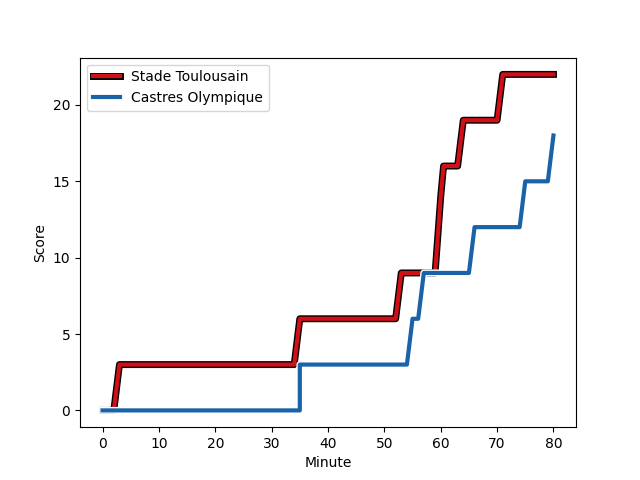
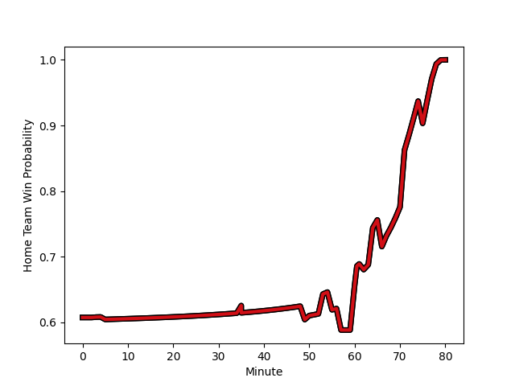

---  
layout: page  
title: Castres Olympique at Stade Toulousain; 18-22  
date: 2022-12-23 21:00:00 18:00:00 -0500  
categories: match review  
---
# Castres Olympique (1473.88) at Stade Toulousain (1663.76); 18-22

# Prediction: Stade Toulousain by 26.0

Stade Toulousain by 19.0 on a neutral field
## Scores over Time

## Win Probability over Time

# Pre-Match Prediction: Stade Toulousain by 24.8

Stade Toulousain by 17.8 on a neutral pitch

|   Away Minutes | Away Player                                                                   |   Away elo |   Away Percentile |   Number |   Home Percentile |   Home elo | Home Player                                                         |   Home Minutes |
|---------------:|:------------------------------------------------------------------------------|-----------:|------------------:|---------:|------------------:|-----------:|:--------------------------------------------------------------------|---------------:|
|             62 | [Quentin Walcker](playerfiles//QuentinWalcker_cleaned.md)                     |      91.84 |                29 |        1 |                90 |     109.26 | [Cyril Baille](playerfiles//CyrilBaille_cleaned.md)                 |             49 |
|             67 | [Gaetan Barlot](playerfiles//GaetanBarlot_cleaned.md)                         |     113.25 |                94 |        2 |                95 |     114.8  | [Peato Mauvaka](playerfiles//PeatoMauvaka_cleaned.md)               |             49 |
|             62 | [Wilfrid Hounkpatin](playerfiles//WilfridHounkpatin_cleaned.md)               |     100.83 |                72 |        3 |                96 |     114.87 | [Dorian Aldegheri](playerfiles//DorianAldegheri_cleaned.md)         |             53 |
|             58 | [Gauthier Maravat](playerfiles//GauthierMaravat_cleaned.md)                   |      84.08 |                14 |        4 |                80 |     105.05 | [Joshua Brennan](playerfiles//JoshuaBrennan_cleaned.md)             |             49 |
|             80 | [Tom Staniforth](playerfiles//TomStaniforth_cleaned.md)                       |      88.1  |                21 |        5 |                47 |      94.76 | [Emmanuel Meafou](playerfiles//EmmanuelMeafou_cleaned.md)           |             80 |
|             80 | [Mathieu Babillot](playerfiles//MathieuBabillot_cleaned.md)                   |      96.17 |                51 |        6 |                95 |     117.88 | [Thibaud Flament](playerfiles//ThibaudFlament_cleaned.md)           |             50 |
|             55 | [Nick Champion de Crespigny](playerfiles//NickChampiondeCrespigny_cleaned.md) |      91.93 |                34 |        7 |                90 |     111.11 | [Rynhardt Elstadt](playerfiles//RynhardtElstadt_cleaned.md)         |             67 |
|             67 | [Baptiste Delaporte](playerfiles//BaptisteDelaporte_cleaned.md)               |     104.95 |                80 |        8 |                74 |     104.21 | [Anthony Jelonch](playerfiles//AnthonyJelonch_cleaned.md)           |             80 |
|             69 | [Julien Blanc](playerfiles//JulienBlanc_cleaned.md)                           |      99.32 |                65 |        9 |                98 |     127.32 | [Antoine Dupont](playerfiles//AntoineDupont_cleaned.md)             |             80 |
|              5 | [Louis Le Brun](playerfiles//LouisLeBrun_cleaned.md)                          |      85.11 |                13 |       10 |                85 |     110.43 | [Romain Ntamack](playerfiles//RomainNtamack_cleaned.md)             |             80 |
|             80 | [Filipo Nakosi](playerfiles//FilipoNakosi_cleaned.md)                         |     105.66 |                81 |       11 |                99 |     133.04 | [Matthis Lebel](playerfiles//MatthisLebel_cleaned.md)               |             80 |
|             80 | [Adrien Seguret](playerfiles//AdrienSeguret_cleaned.md)                       |      95.3  |                49 |       12 |                75 |     104.3  | [Sofiane Guitoune](playerfiles//SofianeGuitoune_cleaned.md)         |             80 |
|             80 | [Antoine Zeghdar](playerfiles//AntoineZeghdar_cleaned.md)                     |      95.26 |                48 |       13 |                80 |     106.55 | [Dimitri Delibes](playerfiles//DimitriDelibes_cleaned.md)           |             53 |
|             80 | [Geoffrey Palis](playerfiles//GeoffreyPalis_cleaned.md)                       |     114.91 |                92 |       14 |                86 |     108.42 | [Lucas Tauzin](playerfiles//LucasTauzin_cleaned.md)                 |             80 |
|             80 | [Julien Dumora](playerfiles//JulienDumora_cleaned.md)                         |      95.27 |                47 |       15 |                92 |     116.15 | [Melvyn Jaminet](playerfiles//MelvynJaminet_cleaned.md)             |             80 |
|             75 | [Vilimoni Botitu](playerfiles//VilimoniBotitu_cleaned.md)                     |      93.21 |                39 |       16 |                92 |     111.3  | [Julien Marchand](playerfiles//JulienMarchand_cleaned.md)           |             31 |
|             25 | [Asier Usarraga](playerfiles//AsierUsarraga_cleaned.md)                       |      99    |                64 |       17 |                30 |      90.91 | [Richie Arnold](playerfiles//RichieArnold_cleaned.md)               |             31 |
|             18 | [Antoine Tichit](playerfiles//AntoineTichit_cleaned.md)                       |     102.87 |                78 |       18 |                 7 |      82.39 | [Rodrigue Neti](playerfiles//RodrigueNeti_cleaned.md)               |             31 |
|             18 | [Antoine Guillamon](playerfiles//AntoineGuillamon_cleaned.md)                 |      97.92 |                53 |       19 |                96 |     128    | [Alexandre Roumat](playerfiles//AlexandreRoumat_cleaned.md)         |             30 |
|             11 | [Gauthier Doubrere](playerfiles//GauthierDoubrere_cleaned.md)                 |     101.15 |                71 |       20 |                60 |      98.39 | [Yannick Youyoutte](playerfiles//YannickYouyoutte_cleaned.md)       |             13 |
|             22 | [Florent Vanverberghe](playerfiles//FlorentVanverberghe_cleaned.md)           |     101.03 |                65 |       21 |                99 |     128.56 | [Charlie Faumuina](playerfiles//CharlieFaumuina_cleaned.md)         |             27 |
|             13 | [Pierre Colonna](playerfiles//PierreColonna_cleaned.md)                       |      93.21 |                41 |       22 |                51 |      96.19 | [Pierre-Louis Barassi](playerfiles//Pierre-LouisBarassi_cleaned.md) |             27 |
|             13 | [Baptiste Cope](playerfiles//BaptisteCope_cleaned.md)                         |      96.48 |               nan |       23 |               nan |     nan    | nan                                                                 |            nan |

