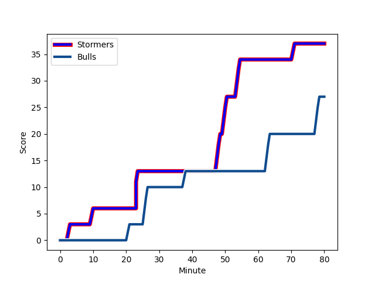
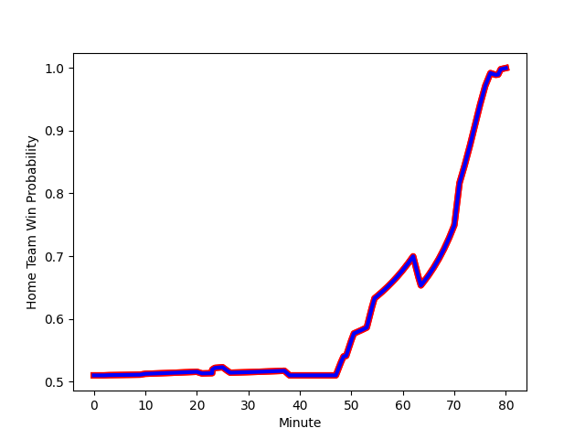

---  
layout: page  
title: Bulls at Stormers; 27-37  
date: 2022-12-23 18:15:00 18:00:00 -0500  
categories: match review  
---
# Bulls (1613.9) at Stormers (1626.26); 27-37

# Prediction: Stormers by 4.2

Stormers by 1.2 on a neutral field
## Scores over Time

## Win Probability over Time

# Pre-Match Prediction: Stormers by 4.6

Stormers by 1.6 on a neutral pitch

|   Away Minutes | Away Player                                                          |   Away elo |   Away Percentile |   Number |   Home Percentile |   Home elo | Home Player                                                              |   Home Minutes |
|---------------:|:---------------------------------------------------------------------|-----------:|------------------:|---------:|------------------:|-----------:|:-------------------------------------------------------------------------|---------------:|
|             64 | [Gerhard Steenekamp](..//playerfiles//GerhardSteenekamp_cleaned.md)  |     112.99 |                94 |        1 |                99 |     127.38 | [Steven Kitshoff](..//playerfiles//StevenKitshoff_cleaned.md)            |             71 |
|             72 | [Johan Grobbelaar](..//playerfiles//JohanGrobbelaar_cleaned.md)      |     121.01 |                98 |        2 |                55 |      96.24 | [Joseph Dweba](..//playerfiles//JosephDweba_cleaned.md)                  |             64 |
|             72 | [Mornay Smith](..//playerfiles//MornaySmith_cleaned.md)              |      98.57 |                63 |        3 |                93 |     111.48 | [Frans Malherbe](..//playerfiles//FransMalherbe_cleaned.md)              |             56 |
|             67 | [Ruan Vermaak](..//playerfiles//RuanVermaak_cleaned.md)              |      89.64 |                25 |        4 |                78 |     100.58 | [Ben-Jason Dixon](..//playerfiles//Ben-JasonDixon_cleaned.md)            |             72 |
|             80 | [Ruan Nortje](..//playerfiles//RuanNortje_cleaned.md)                |     104.91 |                81 |        5 |                62 |      98.32 | [Marvin Orie](..//playerfiles//MarvinOrie_cleaned.md)                    |             80 |
|             80 | [Marco van Staden](..//playerfiles//MarcovanStaden_cleaned.md)       |     102.91 |                76 |        6 |                98 |     131.91 | [Deon Fourie](..//playerfiles//DeonFourie_cleaned.md)                    |             72 |
|             51 | [Cyle Brink](..//playerfiles//CyleBrink_cleaned.md)                  |      88.91 |                22 |        7 |                89 |     110    | [Willie Engelbrecht](..//playerfiles//WillieEngelbrecht_cleaned.md)      |             64 |
|             80 | [Elrigh Louw](..//playerfiles//ElrighLouw_cleaned.md)                |     105.86 |                78 |        8 |                79 |     106.55 | [Hacjivah Dayimani](..//playerfiles//HacjivahDayimani_cleaned.md)        |             80 |
|             51 | [Embrose Papier](..//playerfiles//EmbrosePapier_cleaned.md)          |     108.8  |                85 |        9 |                25 |      90.89 | [Albertus Paul de Wet](..//playerfiles//AlbertusPauldeWet_cleaned.md)    |             72 |
|             71 | [Johan Goosen](..//playerfiles//JohanGoosen_cleaned.md)              |      99.86 |                65 |       10 |                85 |     110.57 | [Manie Libbok](..//playerfiles//ManieLibbok_cleaned.md)                  |             80 |
|             80 | [Canan Moodie](..//playerfiles//CananMoodie_cleaned.md)              |     115.2  |                91 |       11 |                82 |     105.72 | [Leolin Zas](..//playerfiles//LeolinZas_cleaned.md)                      |             80 |
|             80 | [Harold Vorster](..//playerfiles//HaroldVorster_cleaned.md)          |     123.43 |                96 |       12 |                91 |     114.41 | [Daniel du Plessis](..//playerfiles//DanielduPlessis_cleaned.md)         |             74 |
|             80 | [Lionel Mapoe](..//playerfiles//LionelMapoe_cleaned.md)              |     107.51 |                79 |       13 |                62 |     101.26 | [Suleiman  Hartzenberg](..//playerfiles//SuleimanHartzenberg_cleaned.md) |             80 |
|             74 | [Cornal Hendricks](..//playerfiles//CornalHendricks_cleaned.md)      |     100.27 |                65 |       14 |                84 |     107.05 | [Angelo Davids](..//playerfiles//AngeloDavids_cleaned.md)                |             80 |
|             80 | [Kurt-Lee Arendse](..//playerfiles//Kurt-LeeArendse_cleaned.md)      |     132.23 |                99 |       15 |                98 |     127.85 | [Damian Willemse](..//playerfiles//DamianWillemse_cleaned.md)            |             80 |
|             16 | [Simphiwe Matanzima](..//playerfiles//SimphiweMatanzima_cleaned.md)  |     100.04 |                64 |       16 |                82 |     104.22 | [Neethling Fouche](..//playerfiles//NeethlingFouche_cleaned.md)          |             24 |
|             29 | [Zak Burger](..//playerfiles//ZakBurger_cleaned.md)                  |     108.78 |                86 |       17 |                61 |      97.58 | [Junior Pokomela](..//playerfiles//JuniorPokomela_cleaned.md)            |             16 |
|             29 | [Nizaam Carr](..//playerfiles//NizaamCarr_cleaned.md)                |     102.1  |                75 |       18 |                44 |      92.74 | [JJ Kotze](..//playerfiles//JJKotze_cleaned.md)                          |             16 |
|             13 | [Janko Swanepoel](..//playerfiles//JankoSwanepoel_cleaned.md)        |      92.06 |                35 |       19 |                94 |     111.62 | [Alistair Vermaak](..//playerfiles//AlistairVermaak_cleaned.md)          |              9 |
|              9 | [Chris Smith](..//playerfiles//ChrisSmith_cleaned.md)                |     106.88 |                80 |       20 |                40 |      92.11 | [Connor Evans](..//playerfiles//ConnorEvans_cleaned.md)                  |              8 |
|              8 | [Bismarck du Plessis](..//playerfiles//BismarckduPlessis_cleaned.md) |     119.85 |                97 |       21 |                21 |      88.92 | [Marcel Theunissen](..//playerfiles//MarcelTheunissen_cleaned.md)        |              8 |
|              6 | [Stravino Jacobs](..//playerfiles//StravinoJacobs_cleaned.md)        |      87.26 |                16 |       22 |                 6 |      81.04 | [Godlen Masimla](..//playerfiles//GodlenMasimla_cleaned.md)              |              8 |
|              8 | [Sebastian Lombard](..//playerfiles//SebastianLombard_cleaned.md)    |      93.75 |               nan |       23 |                77 |     105.33 | [Clayton Blommetjies](..//playerfiles//ClaytonBlommetjies_cleaned.md)    |              6 |

