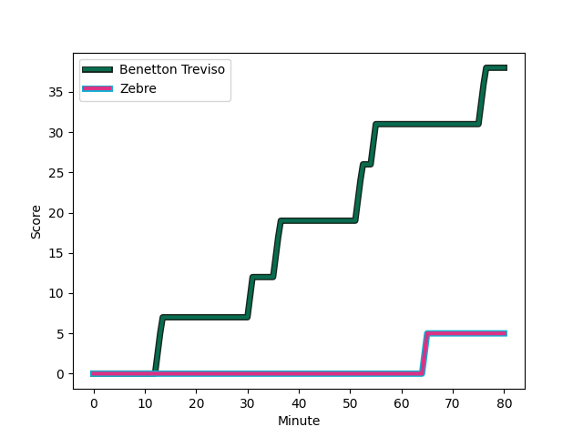
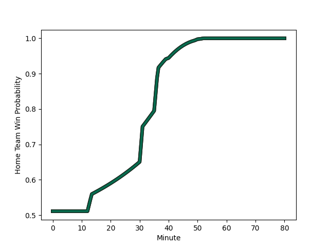

---  
layout: page  
title: Zebre at Benetton Treviso; 5-38  
date: 2022-12-24 13:30:00 18:00:00 -0500  
categories: match review  
---
# Zebre (1446.73) at Benetton Treviso (1466.25); 5-38

# Prediction: Benetton Treviso by 9.0

Benetton Treviso by 2.0 on a neutral field
## Scores over Time

## Win Probability over Time

# Pre-Match Prediction: Benetton Treviso by 9.2

Benetton Treviso by 2.2 on a neutral pitch

|   Away Minutes | Away Player                                                             |   Away elo |   Away Percentile |   Number |   Home Percentile |   Home elo | Home Player                                                       |   Home Minutes |
|---------------:|:------------------------------------------------------------------------|-----------:|------------------:|---------:|------------------:|-----------:|:------------------------------------------------------------------|---------------:|
|             62 | [Luca Rizzoli](playerfiles//LucaRizzoli_cleaned.md)                     |      89.57 |                17 |        1 |               nan |      95.31 | [Cherif Traore](playerfiles//CherifTraore_cleaned.md)             |             56 |
|             56 | [Marco Manfredi](playerfiles//MarcoManfredi_cleaned.md)                 |      73.89 |                 1 |        2 |                79 |     102.87 | [Giacomo Nicotera](playerfiles//GiacomoNicotera_cleaned.md)       |             59 |
|             53 | [Matteo Nocera](playerfiles//MatteoNocera_cleaned.md)                   |      95.65 |                46 |        3 |                83 |     104.9  | [Simone Ferrari](playerfiles//SimoneFerrari_cleaned.md)           |             59 |
|             56 | [Jan Uys](playerfiles//JanUys_cleaned.md)                               |     114    |                91 |        4 |                 2 |      71.53 | [Marco Lazzaroni](playerfiles//MarcoLazzaroni_cleaned.md)         |             66 |
|             80 | [Andrea Zambonin](playerfiles//AndreaZambonin_cleaned.md)               |      83.67 |                13 |        5 |                 3 |      74.78 | [Niccolo Cannone](playerfiles//NiccoloCannone_cleaned.md)         |             80 |
|             62 | [Luca Andreani](playerfiles//LucaAndreani_cleaned.md)                   |      87.19 |                17 |        6 |                88 |     113.27 | [Giovanni Pettinelli](playerfiles//GiovanniPettinelli_cleaned.md) |             53 |
|             80 | [Matt Kvesic](playerfiles//MattKvesic_cleaned.md)                       |     104.34 |                72 |        7 |                90 |     111.77 | [Michele Lamaro](playerfiles//MicheleLamaro_cleaned.md)           |             80 |
|             80 | [Taina Fox-Matamua](playerfiles//TainaFox-Matamua_cleaned.md)           |     119.86 |                93 |        8 |                75 |     104.73 | [Lorenzo Cannone](playerfiles//LorenzoCannone_cleaned.md)         |             80 |
|             40 | [Chris Cook](playerfiles//ChrisCook_cleaned.md)                         |      91.18 |                27 |        9 |                70 |     100.84 | [Alessandro Garbisi](playerfiles//AlessandroGarbisi_cleaned.md)   |             53 |
|             56 | [Geronimo Prisciantelli](playerfiles//GeronimoPrisciantelli_cleaned.md) |     126.77 |                96 |       10 |                85 |     110.55 | [Tomas Albornoz](playerfiles//TomasAlbornoz_cleaned.md)           |             53 |
|             80 | [Simone Gesi](playerfiles//SimoneGesi_cleaned.md)                       |      94.46 |                46 |       11 |                 7 |      79.36 | [Mattia Bellini](playerfiles//MattiaBellini_cleaned.md)           |             80 |
|             80 | [Enrico Lucchin](playerfiles//EnricoLucchin_cleaned.md)                 |     111.7  |                87 |       12 |                38 |      92.82 | [Joaquin Riera](playerfiles//JoaquinRiera_cleaned.md)             |             50 |
|             56 | [Erich Cronje](playerfiles//ErichCronje_cleaned.md)                     |      90.5  |                27 |       13 |                72 |     102.75 | [Juan Ignacio Brex](playerfiles//JuanIgnacioBrex_cleaned.md)      |             80 |
|             80 | [Pierre Bruno](playerfiles//PierreBruno_cleaned.md)                     |      87.65 |                17 |       14 |                55 |      97.02 | [Onisi Ratave](playerfiles//OnisiRatave_cleaned.md)               |             80 |
|             80 | [Lorenzo Pani](playerfiles//LorenzoPani_cleaned.md)                     |      93.14 |                40 |       15 |                74 |     104.3  | [Rhyno Smith](playerfiles//RhynoSmith_cleaned.md)                 |             80 |
|             40 | [Ratko Jelic](playerfiles//RatkoJelic_cleaned.md)                       |      96.98 |                55 |       16 |                85 |     110.18 | [Marco Zanon](playerfiles//MarcoZanon_cleaned.md)                 |             30 |
|             27 | [Ion Neculai](playerfiles//IonNeculai_cleaned.md)                       |      89.47 |                21 |       17 |                33 |      91.78 | [Manuel Zuliani](playerfiles//ManuelZuliani_cleaned.md)           |             27 |
|             24 | [Nicolò Teneggi](playerfiles//NicolòTeneggi_cleaned.md)                 |      94.73 |               nan |       18 |                76 |     104.91 | [Jacob Umaga](playerfiles//JacobUmaga_cleaned.md)                 |             27 |
|             24 | [Dennis Visser](playerfiles//DennisVisser_cleaned.md)                   |      88.35 |                22 |       19 |                40 |      92.99 | [Federico Zani](playerfiles//FedericoZani_cleaned.md)             |             24 |
|             24 | [Luca Bigi](playerfiles//LucaBigi_cleaned.md)                           |      87.46 |                15 |       20 |                51 |      97.22 | [Tiziano Pasquali](playerfiles//TizianoPasquali_cleaned.md)       |             21 |
|             24 | [Tommaso Boni](playerfiles//TommasoBoni_cleaned.md)                     |      70.52 |                 1 |       21 |               nan |      92.45 | [Riccardo Favretto](playerfiles//RiccardoFavretto_cleaned.md)     |             14 |
|             18 | [Guido Volpi](playerfiles//GuidoVolpi_cleaned.md)                       |      90.95 |                31 |       22 |                21 |      89.78 | [Siua Maile](playerfiles//SiuaMaile_cleaned.md)                   |             21 |
|             18 | [Alessio Sanavia](playerfiles//AlessioSanavia_cleaned.md)               |      92.85 |               nan |       23 |                93 |     114.43 | [Dewaldt Duvenage](playerfiles//DewaldtDuvenage_cleaned.md)       |             27 |

