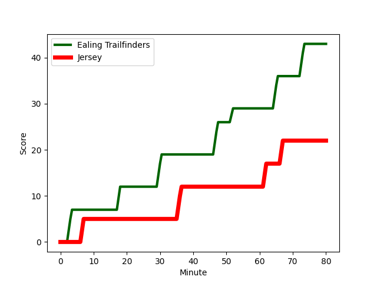
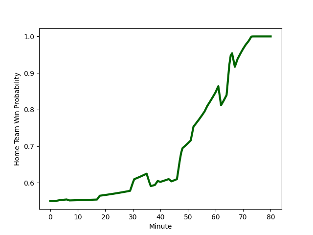

---  
layout: page  
title: Jersey at Ealing Trailfinders; 22-43  
date: 2022-12-24 13:00:00 18:00:00 -0500  
categories: match review  
---
# Jersey (1533.5) at Ealing Trailfinders (1588.8); 22-43

# Prediction: Ealing Trailfinders by 8.5

Ealing Trailfinders by 5.5 on a neutral field
## Scores over Time

## Win Probability over Time

# Pre-Match Prediction: Ealing Trailfinders by 5.0

Ealing Trailfinders by 2.0 on a neutral pitch

|   Away Minutes | Away Player                                                                          |   Away elo |   Away Percentile |   Number |   Home Percentile |   Home elo | Home Player                                                           |   Home Minutes |
|---------------:|:-------------------------------------------------------------------------------------|-----------:|------------------:|---------:|------------------:|-----------:|:----------------------------------------------------------------------|---------------:|
|             61 | [Samuel Alexander Grahamslaw](..//playerfiles//SamuelAlexanderGrahamslaw_cleaned.md) |     101    |                73 |        1 |                96 |     114.99 | [Kyle John Whyte](..//playerfiles//KyleJohnWhyte_cleaned.md)          |             40 |
|             48 | [Eoghan Clarke](..//playerfiles//EoghanClarke_cleaned.md)                            |     105.87 |                86 |        2 |                92 |     110.78 | [Shaun Malton](..//playerfiles//ShaunMalton_cleaned.md)               |             44 |
|             39 | [Steven Longwell](..//playerfiles//StevenLongwell_cleaned.md)                        |     107    |                86 |        3 |                97 |     116.82 | [Lewis Thiede](..//playerfiles//LewisThiede_cleaned.md)               |             57 |
|             80 | [Sean O'Connor](..//playerfiles//SeanO'Connor_cleaned.md)                            |     112.53 |                90 |        4 |                16 |      85.99 | [David O'Connor](..//playerfiles//DavidO'Connor_cleaned.md)           |             62 |
|             57 | [Macauley Cook](..//playerfiles//MacauleyCook_cleaned.md)                            |     146.46 |                99 |        5 |                59 |      97.58 | [Daniel Cutmore](..//playerfiles//DanielCutmore_cleaned.md)           |             80 |
|             80 | [James Dun](..//playerfiles//JamesDun_cleaned.md)                                    |      90.48 |                23 |        6 |                58 |      97.57 | [Rob Farrar](..//playerfiles//RobFarrar_cleaned.md)                   |             57 |
|             80 | [Lewis Wynne](..//playerfiles//LewisWynne_cleaned.md)                                |     101.49 |                73 |        7 |                58 |      97.58 | [Carlo Tizzano](..//playerfiles//CarloTizzano_cleaned.md)             |             74 |
|             62 | [Max Argyle](..//playerfiles//MaxArgyle_cleaned.md)                                  |     112    |                91 |        8 |                97 |     129.22 | [Ryan Smid](..//playerfiles//RyanSmid_cleaned.md)                     |             80 |
|             52 | [James Mitchell](..//playerfiles//JamesMitchell_cleaned.md)                          |      97.05 |                49 |        9 |                86 |     109.04 | [Craig Hampson](..//playerfiles//CraigHampson_cleaned.md)             |             80 |
|             80 | [Russell Bennett](..//playerfiles//RussellBennett_cleaned.md)                        |      97.98 |                57 |       10 |                99 |     137.66 | [Craig Willis](..//playerfiles//CraigWillis_cleaned.md)               |             80 |
|             80 | [Tomi Lewis](..//playerfiles//TomiLewis_cleaned.md)                                  |      98.3  |                61 |       11 |                82 |     106.17 | [Cian Kelleher](..//playerfiles//CianKelleher_cleaned.md)             |             80 |
|             80 | [Jordan Holgate](..//playerfiles//JordanHolgate_cleaned.md)                          |      93.42 |                40 |       12 |                88 |     111.21 | [Pat Howard](..//playerfiles//PatHoward_cleaned.md)                   |             68 |
|             52 | [Alex McHenry](..//playerfiles//AlexMcHenry_cleaned.md)                              |      90.47 |                24 |       13 |                 3 |      72.54 | [Reuben Bird-Tulloch](..//playerfiles//ReubenBird-Tulloch_cleaned.md) |             80 |
|             57 | [Ben Woollett](..//playerfiles//BenWoollett_cleaned.md)                              |     100.06 |                68 |       14 |                35 |      92.25 | [Luke Daniels](..//playerfiles//LukeDaniels_cleaned.md)               |             80 |
|             80 | [Brendan Owen](..//playerfiles//BrendanOwen_cleaned.md)                              |     104.4  |                74 |       15 |                85 |     110.46 | [Jonah Holmes](..//playerfiles//JonahHolmes_cleaned.md)               |             80 |
|             41 | [Adam Nicol](..//playerfiles//AdamNicol_cleaned.md)                                  |      93.58 |                34 |       16 |                93 |     112.08 | [Will Davis](..//playerfiles//WillDavis_cleaned.md)                   |             40 |
|             32 | [Antonio TJ Harris](..//playerfiles//AntonioTJHarris_cleaned.md)                     |      89.85 |                19 |       17 |                66 |     100.14 | [Cameron Terry](..//playerfiles//CameronTerry_cleaned.md)             |             36 |
|             28 | [Charlie Powell](..//playerfiles//CharliePowell_cleaned.md)                          |     113.91 |                91 |       18 |                58 |      95.33 | [Ross Kane](..//playerfiles//RossKane_cleaned.md)                     |             23 |
|             28 | [James Elliott](..//playerfiles//JamesElliott_cleaned.md)                            |      74.34 |                 2 |       19 |                72 |     100.94 | [Jack Digby](..//playerfiles//JackDigby_cleaned.md)                   |             23 |
|             23 | [Hamish Bain](..//playerfiles//HamishBain_cleaned.md)                                |      99.15 |                65 |       20 |                97 |     127    | [Bobby de Wee](..//playerfiles//BobbydeWee_cleaned.md)                |             18 |
|             23 | [Will Brown](..//playerfiles//WillBrown_cleaned.md)                                  |     119.59 |                96 |       21 |                95 |     115.83 | [Steve Shingler](..//playerfiles//SteveShingler_cleaned.md)           |             12 |
|             19 | [Greg McGrath](..//playerfiles//GregMcGrath_cleaned.md)                              |      92.42 |                25 |       22 |                79 |     103.74 | [Simon Uzokwe](..//playerfiles//SimonUzokwe_cleaned.md)               |              6 |
|             18 | [Tim Grey](..//playerfiles//TimGrey_cleaned.md)                                      |     103.36 |                74 |       23 |               nan |     nan    | nan                                                                   |            nan |

