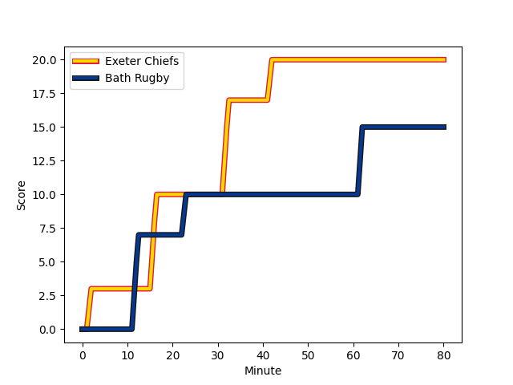
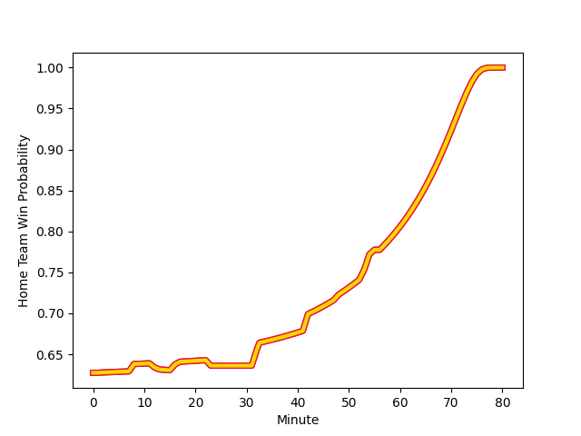

---  
layout: page  
title: Bath Rugby at Exeter Chiefs; 15-20  
date: 2022-12-24 10:00:00 18:00:00 -0500  
categories: match review  
---
# Bath Rugby (1447.91) at Exeter Chiefs (1641.82); 15-20

# Prediction: Exeter Chiefs by 22.4

Exeter Chiefs by 19.4 on a neutral field
## Scores over Time

## Win Probability over Time

# Pre-Match Prediction: Exeter Chiefs by 20.5

Exeter Chiefs by 17.5 on a neutral pitch

|   Away Minutes | Away Player                                                           |   Away elo |   Away Percentile |   Number |   Home Percentile |   Home elo | Home Player                                                             |   Home Minutes |
|---------------:|:----------------------------------------------------------------------|-----------:|------------------:|---------:|------------------:|-----------:|:------------------------------------------------------------------------|---------------:|
|             80 | [Lewis Boyce](..//playerfiles//LewisBoyce_cleaned.md)                 |      88.04 |                17 |        1 |                31 |      92.18 | [Scott Sio](..//playerfiles//ScottSio_cleaned.md)                       |             80 |
|             80 | [Tom Dunn](..//playerfiles//TomDunn_cleaned.md)                       |     108.66 |                90 |        2 |                99 |     130.38 | [Jack Yeandle](..//playerfiles//JackYeandle_cleaned.md)                 |             80 |
|             80 | [D'Arcy Rae](..//playerfiles//D'ArcyRae_cleaned.md)                   |      75.15 |                 2 |        3 |                96 |     115.81 | [Harry Williams](..//playerfiles//HarryWilliams_cleaned.md)             |             80 |
|             80 | [Will Spencer](..//playerfiles//WillSpencer_cleaned.md)               |      97.83 |                68 |        4 |                76 |     103.31 | [Dafydd Jenkins](..//playerfiles//DafyddJenkins_cleaned.md)             |             80 |
|             80 | [Fergus Lee-Warner](..//playerfiles//FergusLee-Warner_cleaned.md)     |      84.18 |                14 |        5 |                88 |     110.17 | [Jonny Gray](..//playerfiles//JonnyGray_cleaned.md)                     |             80 |
|             80 | [Ted Hill](..//playerfiles//TedHill_cleaned.md)                       |      93.99 |                46 |        6 |                97 |     127.13 | [Dave Ewers](..//playerfiles//DaveEwers_cleaned.md)                     |             80 |
|             80 | [Sam Underhill](..//playerfiles//SamUnderhill_cleaned.md)             |     101.22 |                71 |        7 |                38 |      92.82 | [Christ Tshiunza](..//playerfiles//ChristTshiunza_cleaned.md)           |             80 |
|             80 | [Josh Bayliss](..//playerfiles//JoshBayliss_cleaned.md)               |      86.96 |                20 |        8 |                92 |     118.3  | [Sam Simmonds](..//playerfiles//SamSimmonds_cleaned.md)                 |             80 |
|             80 | [Louis Schreuder](..//playerfiles//LouisSchreuder_cleaned.md)         |     104.72 |                80 |        9 |                36 |      93.02 | [Sam Maunder](..//playerfiles//SamMaunder_cleaned.md)                   |             80 |
|             80 | [Orlando Bailey](..//playerfiles//OrlandoBailey_cleaned.md)           |      88.89 |                25 |       10 |                91 |     116.64 | [Joe Simmonds](..//playerfiles//JoeSimmonds_cleaned.md)                 |             80 |
|             80 | [Ruaridh McConnochie](..//playerfiles//RuaridhMcConnochie_cleaned.md) |     106.15 |                82 |       11 |                93 |     117.43 | [Olly Woodburn](..//playerfiles//OllyWoodburn_cleaned.md)               |             80 |
|             80 | [Cameron Redpath](..//playerfiles//CameronRedpath_cleaned.md)         |     102.45 |                70 |       12 |                82 |     107.11 | [Solomone Kata](..//playerfiles//SolomoneKata_cleaned.md)               |             80 |
|             80 | [Ollie Lawrence](..//playerfiles//OllieLawrence_cleaned.md)           |      85.48 |                15 |       13 |                96 |     121.97 | [Henry Slade](..//playerfiles//HenrySlade_cleaned.md)                   |             80 |
|             80 | [Joe Cokanasiga](..//playerfiles//JoeCokanasiga_cleaned.md)           |      98.38 |                62 |       14 |                87 |     109.51 | [Jack Nowell](..//playerfiles//JackNowell_cleaned.md)                   |             80 |
|             80 | [Matt Gallagher](..//playerfiles//MattGallagher_cleaned.md)           |     125.83 |                98 |       15 |                14 |      86.03 | [Josh Hodge](..//playerfiles//JoshHodge_cleaned.md)                     |             80 |
|              0 | [Niall Annett](..//playerfiles//NiallAnnett_cleaned.md)               |      96.28 |                60 |       16 |                98 |     121.39 | [Dan Frost](..//playerfiles//DanFrost_cleaned.md)                       |              0 |
|              0 | [Valery Morozov](..//playerfiles//ValeryMorozov_cleaned.md)           |      86.51 |                14 |       17 |                65 |     100.26 | [Josh Iosefa-Scott](..//playerfiles//JoshIosefa-Scott_cleaned.md)       |              0 |
|              0 | [Archie Griffin](..//playerfiles//ArchieGriffin_cleaned.md)           |      95    |               nan |       18 |                66 |     102.28 | [Patrick Schickerling](..//playerfiles//PatrickSchickerling_cleaned.md) |              0 |
|              0 | [Dave Attwood](..//playerfiles//DaveAttwood_cleaned.md)               |     129.61 |                98 |       19 |                45 |      94.41 | [Jack Dunne](..//playerfiles//JackDunne_cleaned.md)                     |              0 |
|              0 | [Tom Ellis](..//playerfiles//TomEllis_cleaned.md)                     |      84.97 |                12 |       20 |                68 |     100.88 | [Santiago Grondona](..//playerfiles//SantiagoGrondona_cleaned.md)       |              0 |
|              0 | [Ben Spencer](..//playerfiles//BenSpencer_cleaned.md)                 |      98.02 |                59 |       21 |               nan |      95    | [Tom Cairns](..//playerfiles//TomCairns_cleaned.md)                     |              0 |
|              0 | [Max Ojomoh](..//playerfiles//MaxOjomoh_cleaned.md)                   |      90.41 |                27 |       22 |                44 |      93.04 | [Tom Hendrickson](..//playerfiles//TomHendrickson_cleaned.md)           |              0 |
|              0 | [Miles Reid](..//playerfiles//MilesReid_cleaned.md)                   |     114.99 |                93 |       23 |                85 |     110.13 | [Stuart Hogg](..//playerfiles//StuartHogg_cleaned.md)                   |              0 |

