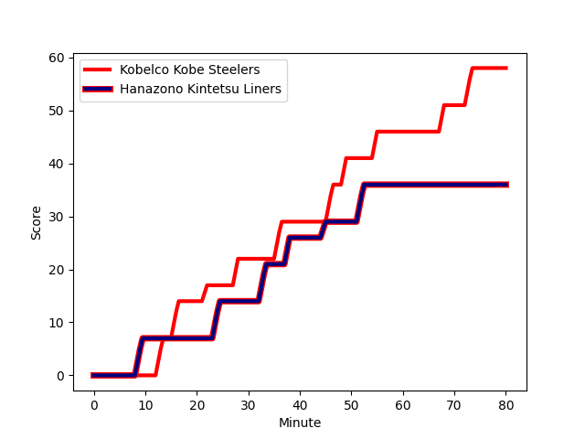
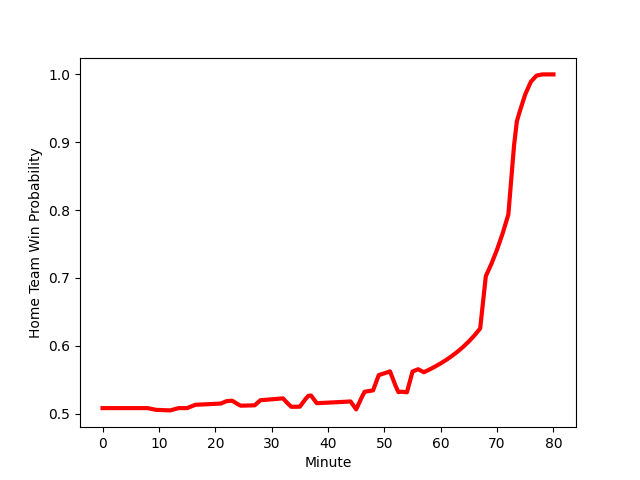

---  
layout: page  
title: Hanazono Kintetsu Liners at Kobelco Kobe Steelers; 36-58  
date: 2022-12-24 00:00:00 18:00:00 -0500  
categories: match review  
---
# Hanazono Kintetsu Liners (1516.94) at Kobelco Kobe Steelers (1524.21); 36-58

# Prediction: Kobelco Kobe Steelers by 3.7

Kobelco Kobe Steelers by 0.7 on a neutral field
## Scores over Time

## Win Probability over Time

# Pre-Match Prediction: Kobelco Kobe Steelers by 7.1

Kobelco Kobe Steelers by 4.1 on a neutral pitch

|   Away Minutes | Away Player                                                               |   Away elo |   Away Percentile |   Number |   Home Percentile |   Home elo | Home Player                                                                    |   Home Minutes |
|---------------:|:--------------------------------------------------------------------------|-----------:|------------------:|---------:|------------------:|-----------:|:-------------------------------------------------------------------------------|---------------:|
|             61 | [Shun Sasaki](..//playerfiles//ShunSasaki_cleaned.md)                     |      96.97 |                56 |        1 |                78 |     102.97 | [Shigure Takao](..//playerfiles//ShigureTakao_cleaned.md)                      |             45 |
|             61 | [Keiichi Kaneko](..//playerfiles//KeiichiKaneko_cleaned.md)               |     102.13 |                77 |        2 |                36 |      92.35 | [Kenta Matsuoka](..//playerfiles//KentaMatsuoka_cleaned.md)                    |             54 |
|             61 | [Shota Hirono](..//playerfiles//ShotaHirono_cleaned.md)                   |      95.06 |                47 |        3 |                95 |     113.58 | [Hiroshi Yamashita](..//playerfiles//HiroshiYamashita_cleaned.md)              |             57 |
|             80 | [Isamu Matsuoka](..//playerfiles//IsamuMatsuoka_cleaned.md)               |      87.91 |                21 |        4 |                93 |     117.3  | [Takara Imamura](..//playerfiles//TakaraImamura_cleaned.md)                    |             54 |
|             80 | [Ben Toolis](..//playerfiles//BenToolis_cleaned.md)                       |     124.97 |               nan |        5 |                68 |     100.11 | [JD Schickerling](..//playerfiles//JDSchickerling_cleaned.md)                  |             54 |
|             80 | [Tevita Tupou](..//playerfiles//TevitaTupou_cleaned.md)                   |     103.51 |                73 |        6 |                67 |      99.93 | [Hikaru Hashimoto](..//playerfiles//HikaruHashimoto_cleaned.md)                |             80 |
|             80 | [Shohei Nonaka](..//playerfiles//ShoheiNonaka_cleaned.md)                 |     116.76 |                94 |        7 |                83 |     107.19 | [Marcell Coetzee](..//playerfiles//MarcellCoetzee_cleaned.md)                  |             80 |
|             80 | [Daiki Miyashita](..//playerfiles//DaikiMiyashita_cleaned.md)             |      91.64 |                32 |        8 |                88 |     113.39 | [Ataata Moeakiola](..//playerfiles//AtaataMoeakiola_cleaned.md)                |             80 |
|             61 | [Will Genia](..//playerfiles//WillGenia_cleaned.md)                       |     115.1  |                93 |        9 |                12 |      85.45 | [Daiki Nakajima](..//playerfiles//DaikiNakajima_cleaned.md)                    |             57 |
|             80 | [Jackson Garden-Bachop](..//playerfiles//JacksonGarden-Bachop_cleaned.md) |      91.62 |                30 |       10 |                56 |      97.8  | [Seungsin Lee](..//playerfiles//SeungsinLee_cleaned.md)                        |             80 |
|             75 | [Semisi Masirewa](..//playerfiles//SemisiMasirewa_cleaned.md)             |     109.81 |                84 |       11 |                36 |      92.65 | [Kanta Matsunaga](..//playerfiles//KantaMatsunaga_cleaned.md)                  |             71 |
|             80 | [Koji Okamura](..//playerfiles//KojiOkamura_cleaned.md)                   |      97.48 |                58 |       12 |                92 |     116.59 | [Ngani Laumape](..//playerfiles//NganiLaumape_cleaned.md)                      |             57 |
|             71 | [Akihide Onogi](..//playerfiles//AkihideOnogi_cleaned.md)                 |      92.38 |                36 |       13 |                59 |      98.11 | [Michael Little](..//playerfiles//MichaelLittle_cleaned.md)                    |             80 |
|             80 | [Joshua Nohra](..//playerfiles//JoshuaNohra_cleaned.md)                   |     104.08 |                80 |       14 |                75 |     102.23 | [Shinsuke Iseki](..//playerfiles//ShinsukeIseki_cleaned.md)                    |             80 |
|             57 | [Yusho Takeda](..//playerfiles//YushoTakeda_cleaned.md)                   |      84.83 |                13 |       15 |                56 |      97.53 | [Ryohei Yamanaka](..//playerfiles//RyoheiYamanaka_cleaned.md)                  |             80 |
|             23 | [Liekina Kaufusi](..//playerfiles//LiekinaKaufusi_cleaned.md)             |      95    |               nan |       16 |                54 |      96.09 | [Isileli Nakajima Vakauta](..//playerfiles//IsileliNakajimaVakauta_cleaned.md) |             35 |
|             19 | [Atsushi Kashimoto](..//playerfiles//AtsushiKashimoto_cleaned.md)         |     113.23 |                94 |       17 |                55 |      96.24 | [Naohiro Kotaki](..//playerfiles//NaohiroKotaki_cleaned.md)                    |             26 |
|             19 | [Kenta Tanaka](..//playerfiles//KentaTanaka_cleaned.md)                   |     101.42 |                75 |       18 |                72 |     101.01 | [Seokhwan Jang](..//playerfiles//SeokhwanJang_cleaned.md)                      |             26 |
|             19 | [Ieremia Mataena](..//playerfiles//IeremiaMataena_cleaned.md)             |      95    |               nan |       19 |               nan |      94.93 | [Kyungmun Wang](..//playerfiles//KyungmunWang_cleaned.md)                      |             26 |
|             19 | [Keitaro Hitora](..//playerfiles//KeitaroHitora_cleaned.md)               |     101.29 |                72 |       20 |                76 |     102.52 | [Go Maeda](..//playerfiles//GoMaeda_cleaned.md)                                |             23 |
|              9 | [Ren Takano](..//playerfiles//RenTakano_cleaned.md)                       |      95    |               nan |       21 |               nan |      94.97 | [Kentaro Obata](..//playerfiles//KentaroObata_cleaned.md)                      |             23 |
|              5 | [Nesta Mahina](..//playerfiles//NestaMahina_cleaned.md)                   |      95    |               nan |       22 |                66 |     100.67 | [Timothy Lafaele](..//playerfiles//TimothyLafaele_cleaned.md)                  |             23 |
|            nan | nan                                                                       |     nan    |               nan |       23 |               nan |      99.51 | [Shintaro Hayashi](..//playerfiles//ShintaroHayashi_cleaned.md)                |              9 |

