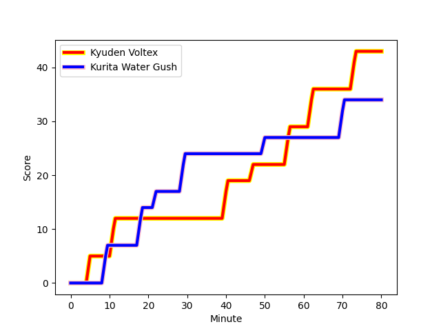
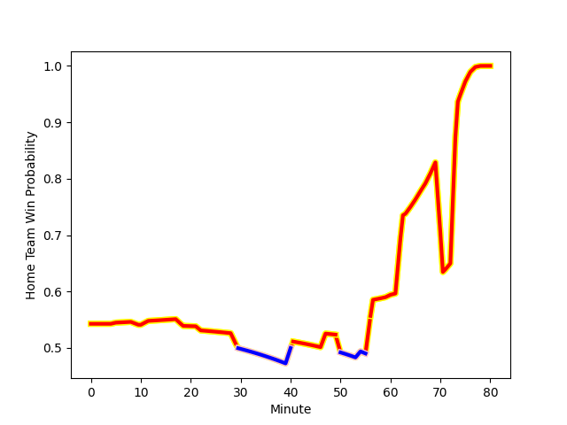

---  
layout: page  
title: Kurita Water Gush at Kyuden Voltex; 34-43  
date: 2022-12-24 00:00:00 18:00:00 -0500  
categories: match review  
---
# Kurita Water Gush (1352.14) at Kyuden Voltex (1426.07); 34-43

# Prediction: Kyuden Voltex by 14.4

Kyuden Voltex by 7.4 on a neutral field
## Scores over Time

## Win Probability over Time

# Pre-Match Prediction: Kyuden Voltex by 11.8

Kyuden Voltex by 4.8 on a neutral pitch

|   Away Minutes | Away Player                                                           |   Away elo |   Away Percentile |   Number |   Home Percentile |   Home elo | Home Player                                                            |   Home Minutes |
|---------------:|:----------------------------------------------------------------------|-----------:|------------------:|---------:|------------------:|-----------:|:-----------------------------------------------------------------------|---------------:|
|             67 | [Shoya Koyama](playerfiles//ShoyaKoyama_cleaned.md)                   |      89.37 |                20 |        1 |                72 |     100.95 | [Samuel Nozomu Faialaga](playerfiles//SamuelNozomuFaialaga_cleaned.md) |             60 |
|             67 | [Ryota Kuribara](playerfiles//RyotaKuribara_cleaned.md)               |      86.8  |                14 |        2 |                36 |      92.5  | [Daigo Asato](playerfiles//DaigoAsato_cleaned.md)                      |             63 |
|             67 | [Kuriyama Rui](playerfiles//KuriyamaRui_cleaned.md)                   |      83.45 |                 8 |        3 |                37 |      93.56 | [Yasuo Saruwatari](playerfiles//YasuoSaruwatari_cleaned.md)            |             63 |
|             67 | [Kota Nakamura](playerfiles//KotaNakamura_cleaned.md)                 |      85.09 |                18 |        4 |                19 |      87.13 | [Ray Tatafu](playerfiles//RayTatafu_cleaned.md)                        |             54 |
|             80 | [Daymon Leasuasu](playerfiles//DaymonLeasuasu_cleaned.md)             |      87.86 |                22 |        5 |                30 |      90.9  | [Tom Rowe](playerfiles//TomRowe_cleaned.md)                            |             80 |
|             60 | [Tebita Oto](playerfiles//TebitaOto_cleaned.md)                       |      95    |               nan |        6 |               nan |      95    | [Ken Nakashima](playerfiles//KenNakashima_cleaned.md)                  |             54 |
|             80 | [Yosuke Ishii](playerfiles//YosukeIshii_cleaned.md)                   |      88.48 |                21 |        7 |                68 |     100.19 | [Yuuki Yamada](playerfiles//YuukiYamada_cleaned.md)                    |             80 |
|             80 | [Feinga Kihe Lotu Fakai](playerfiles//FeingaKiheLotuFakai_cleaned.md) |      88.06 |                24 |        8 |                49 |      96.46 | [Walker Alex Takuya](playerfiles//WalkerAlexTakuya_cleaned.md)         |             80 |
|             67 | [Ryo Omasa](playerfiles//RyoOmasa_cleaned.md)                         |      93.75 |                45 |        9 |                35 |      92.91 | [Shunta Takenouchi](playerfiles//ShuntaTakenouchi_cleaned.md)          |             54 |
|             80 | [Andrew Deegan](playerfiles//AndrewDeegan_cleaned.md)                 |      97    |                53 |       10 |                89 |     113.96 | [Phil Burleigh](playerfiles//PhilBurleigh_cleaned.md)                  |             80 |
|             63 | [Keigo Hamazoe](playerfiles//KeigoHamazoe_cleaned.md)                 |      87.18 |                16 |       11 |                46 |      94.55 | [Ren Hagiwara](playerfiles//RenHagiwara_cleaned.md)                    |             80 |
|             75 | [Antonio Mikaele-Tu'u](playerfiles//AntonioMikaele-Tu'u_cleaned.md)   |      95    |               nan |       12 |                10 |      83.01 | [Noriaki Nakazuru](playerfiles//NoriakiNakazuru_cleaned.md)            |             80 |
|             80 | [Tom English](playerfiles//TomEnglish_cleaned.md)                     |      98.71 |                61 |       13 |                51 |      96.04 | [Sam Vaka](playerfiles//SamVaka_cleaned.md)                            |             80 |
|             80 | [Kentaro Sugimori](playerfiles//KentaroSugimori_cleaned.md)           |      81.44 |                 8 |       14 |                10 |      83.55 | [Naoki Takaya](playerfiles//NaokiTakaya_cleaned.md)                    |             54 |
|             80 | [Koshi Emoto](playerfiles//KoshiEmoto_cleaned.md)                     |      95    |               nan |       15 |                57 |      98.22 | [Yusuke Aramaki](playerfiles//YusukeAramaki_cleaned.md)                |             80 |
|             20 | [Kengo Nakamura](playerfiles//KengoNakamura_cleaned.md)               |      89.38 |               nan |       16 |               nan |     117.99 | [Akihito Yamada](playerfiles//AkihitoYamada_cleaned.md)                |             26 |
|             17 | [Ayato Sakamoto](playerfiles//AyatoSakamoto_cleaned.md)               |      92.78 |                39 |       17 |                39 |      93.27 | [Daisuke Kodama](playerfiles//DaisukeKodama_cleaned.md)                |             26 |
|             13 | [Kei Shibuya](playerfiles//KeiShibuya_cleaned.md)                     |      95    |               nan |       18 |                60 |      97.89 | [Tomotaka Ishimatsu](playerfiles//TomotakaIshimatsu_cleaned.md)        |             26 |
|             13 | [Kota Hojo](playerfiles//KotaHojo_cleaned.md)                         |      90.12 |                31 |       19 |               nan |      73.41 | [Kenji Hayata](playerfiles//KenjiHayata_cleaned.md)                    |             26 |
|             13 | [Aki Kajiwara](playerfiles//AkiKajiwara_cleaned.md)                   |      80.54 |                 5 |       20 |                63 |      98.16 | [Kazuto Tokunaga](playerfiles//KazutoTokunaga_cleaned.md)              |             20 |
|             13 | [Mitsuo Nakao](playerfiles//MitsuoNakao_cleaned.md)                   |      80.94 |                 8 |       21 |               nan |      85.72 | [Genki Nakamura](playerfiles//GenkiNakamura_cleaned.md)                |             17 |
|             13 | [Kakeru Sugihara](playerfiles//KakeruSugihara_cleaned.md)             |      95    |               nan |       22 |                71 |     100.64 | [Kazuma Ono](playerfiles//KazumaOno_cleaned.md)                        |             17 |
|              5 | [Takuro Hayashida](playerfiles//TakuroHayashida_cleaned.md)           |      89.47 |                24 |       23 |               nan |     nan    | nan                                                                    |            nan |

