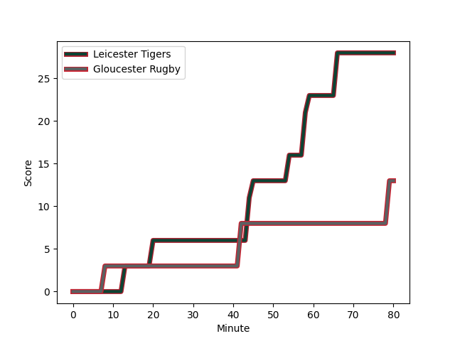
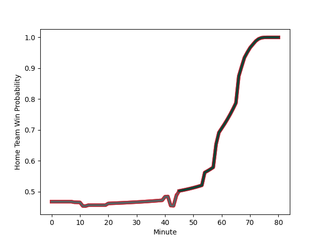

---  
layout: page  
title: Gloucester Rugby at Leicester Tigers; 13.0-28.0  
date: 2022-12-24 10:00:00 18:00:00 -0500  
categories: match review  
---
# Gloucester Rugby (1593.8) at Leicester Tigers (1536.49); 13.0-28.0

# Prediction: Gloucester Rugby by 2.7

Gloucester Rugby by 5.7 on a neutral field
## Scores over Time

## Win Probability over Time

# Pre-Match Prediction: Gloucester Rugby by 2.2

Gloucester Rugby by 5.2 on a neutral pitch

|   Away Minutes | Away Player                                                         |   Away elo |   Away Percentile |   Number |   Home Percentile |   Home elo | Home Player                                                          |   Home Minutes |
|---------------:|:--------------------------------------------------------------------|-----------:|------------------:|---------:|------------------:|-----------:|:---------------------------------------------------------------------|---------------:|
|             80 | [Val Rapava-Ruskin](..//playerfiles//ValRapava-Ruskin_cleaned.md)   |     101.7  |                75 |        1 |                39 |      93.7  | [James Whitcombe](..//playerfiles//JamesWhitcombe_cleaned.md)        |             80 |
|             80 | [Santiago Socino](..//playerfiles//SantiagoSocino_cleaned.md)       |      98.94 |                67 |        2 |                25 |      89.74 | [Charlie Clare](..//playerfiles//CharlieClare_cleaned.md)            |             80 |
|             80 | [Kirill Gotovtsev](..//playerfiles//KirillGotovtsev_cleaned.md)     |     110.29 |                93 |        3 |                39 |      93.87 | [Dan Cole](..//playerfiles//DanCole_cleaned.md)                      |             80 |
|             80 | [Freddie Clarke](..//playerfiles//FreddieClarke_cleaned.md)         |     109.16 |                88 |        4 |                95 |     119.94 | [Harry Wells](..//playerfiles//HarryWells_cleaned.md)                |             80 |
|             80 | [Matias Alemanno](..//playerfiles//MatiasAlemanno_cleaned.md)       |     115.13 |                92 |        5 |                86 |     108.27 | [Ollie Chessum](..//playerfiles//OllieChessum_cleaned.md)            |             80 |
|             80 | [Ruan Ackermann](..//playerfiles//RuanAckermann_cleaned.md)         |     122.21 |                96 |        6 |                92 |     114.62 | [Hanro Liebenberg](..//playerfiles//HanroLiebenberg_cleaned.md)      |             80 |
|             80 | [Lewis Ludlow](..//playerfiles//LewisLudlow_cleaned.md)             |     109.5  |                87 |        7 |                95 |     118.86 | [Tommy Reffell](..//playerfiles//TommyReffell_cleaned.md)            |             80 |
|             80 | [Albert Tuisue](..//playerfiles//AlbertTuisue_cleaned.md)           |     100.56 |                63 |        8 |                14 |      84.29 | [Olly Cracknell](..//playerfiles//OllyCracknell_cleaned.md)          |             80 |
|             80 | [Stephen Varney](..//playerfiles//StephenVarney_cleaned.md)         |      80.41 |                 5 |        9 |                84 |     106.92 | [Jack van Poortvliet](..//playerfiles//JackvanPoortvliet_cleaned.md) |             80 |
|             80 | [Adam Hastings](..//playerfiles//AdamHastings_cleaned.md)           |     126.85 |                96 |       10 |                92 |     118.23 | [Freddie Burns](..//playerfiles//FreddieBurns_cleaned.md)            |             80 |
|             80 | [Jonny May](..//playerfiles//JonnyMay_cleaned.md)                   |     108.16 |                85 |       11 |                43 |      93.98 | [Harry Potter](..//playerfiles//HarryPotter_cleaned.md)              |             80 |
|             80 | [Sebastien Atkinson](..//playerfiles//SebastienAtkinson_cleaned.md) |      87.19 |                25 |       12 |                94 |     119.95 | [Dan Kelly](..//playerfiles//DanKelly_cleaned.md)                    |             80 |
|             80 | [Chris Harris](..//playerfiles//ChrisHarris_cleaned.md)             |     107.72 |                81 |       13 |                46 |      94.63 | [Guy Porter](..//playerfiles//GuyPorter_cleaned.md)                  |             80 |
|             80 | [Louis Rees-Zammit](..//playerfiles//LouisRees-Zammit_cleaned.md)   |      93.73 |                41 |       14 |                20 |      88.78 | [Anthony Watson](..//playerfiles//AnthonyWatson_cleaned.md)          |             80 |
|             80 | [Santiago Carreras](..//playerfiles//SantiagoCarreras_cleaned.md)   |     122.24 |                94 |       15 |                32 |      90.72 | [Freddie Steward](..//playerfiles//FreddieSteward_cleaned.md)        |             80 |
|              0 | [George McGuigan](..//playerfiles//GeorgeMcGuigan_cleaned.md)       |     102.98 |                79 |       16 |                30 |      91.27 | [Gabriel Oghre](..//playerfiles//GabrielOghre_cleaned.md)            |              0 |
|              0 | [Alex Seville](..//playerfiles//AlexSeville_cleaned.md)             |     102.21 |                79 |       17 |               nan |      89.71 | [Nephi Leatigaga](..//playerfiles//NephiLeatigaga_cleaned.md)        |              0 |
|              0 | [Ciaran Knight](..//playerfiles//CiaranKnight_cleaned.md)           |      80.4  |                 4 |       18 |                68 |      99.59 | [Joe Heyes](..//playerfiles//JoeHeyes_cleaned.md)                    |              0 |
|              0 | [Alex Craig](..//playerfiles//AlexCraig_cleaned.md)                 |     100.65 |                72 |       19 |                46 |      94.47 | [Calum Green](..//playerfiles//CalumGreen_cleaned.md)                |              0 |
|              0 | [Ben Morgan](..//playerfiles//BenMorgan_cleaned.md)                 |     105.19 |                77 |       20 |                41 |      94.72 | [Sean Jansen](..//playerfiles//SeanJansen_cleaned.md)                |              0 |
|              0 | [Charlie Chapman](..//playerfiles//CharlieChapman_cleaned.md)       |     101.42 |                75 |       21 |                84 |     107.53 | [Ben Youngs](..//playerfiles//BenYoungs_cleaned.md)                  |              0 |
|              0 | [Giorgi Kveseladze](..//playerfiles//GiorgiKveseladze_cleaned.md)   |     103.28 |                73 |       22 |                65 |     100.19 | [Charlie Atkinson](..//playerfiles//CharlieAtkinson_cleaned.md)      |              0 |
|              0 | [Lloyd Evans](..//playerfiles//LloydEvans_cleaned.md)               |     113.69 |                90 |       23 |                98 |     126.5  | [Chris Ashton](..//playerfiles//ChrisAshton_cleaned.md)              |              0 |

