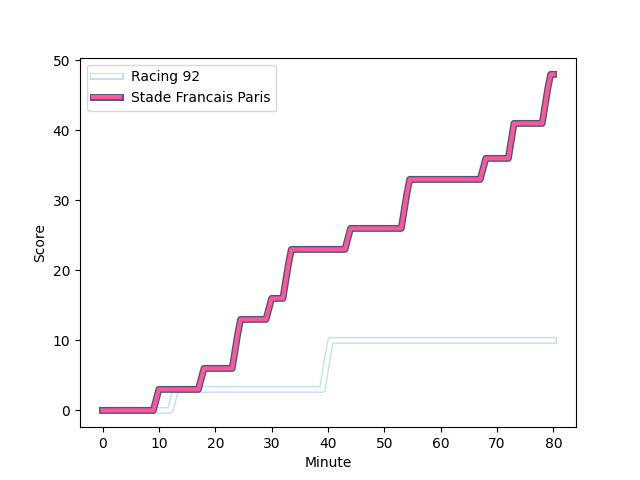
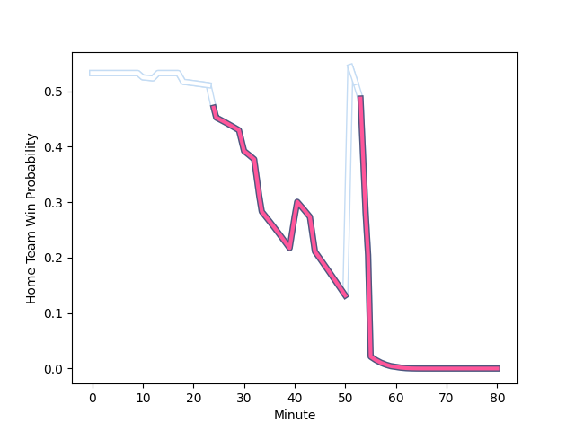

---  
layout: page  
title: Stade Francais Paris at Racing 92; 48-10  
date: 2022-12-24 15:00:00 18:00:00 -0500  
categories: match review  
---
# Stade Francais Paris (1546.4) at Racing 92 (1603.47); 48-10

# Prediction: Racing 92 by 8.7

Racing 92 by 5.7 on a neutral field
## Scores over Time

## Win Probability over Time

# Pre-Match Prediction: Racing 92 by 9.2

Racing 92 by 6.2 on a neutral pitch

|   Away Minutes | Away Player                                                                   |   Away elo |   Away Percentile |   Number |   Home Percentile |   Home elo | Home Player                                                           |   Home Minutes |
|---------------:|:------------------------------------------------------------------------------|-----------:|------------------:|---------:|------------------:|-----------:|:----------------------------------------------------------------------|---------------:|
|             80 | [Clement Castets](..//playerfiles//ClementCastets_cleaned.md)                 |     103.08 |                79 |        1 |                92 |     110.99 | [Guram Gogichashvili](..//playerfiles//GuramGogichashvili_cleaned.md) |             51 |
|             55 | [Mickael Ivaldi](..//playerfiles//MickaelIvaldi_cleaned.md)                   |      99.68 |                70 |        2 |                56 |      96.23 | [Janick Tarrit](..//playerfiles//JanickTarrit_cleaned.md)             |             51 |
|             60 | [Giorgi Melikidze](..//playerfiles//GiorgiMelikidze_cleaned.md)               |     109.78 |                91 |        3 |                78 |     101.73 | [Trevor Nyakane](..//playerfiles//TrevorNyakane_cleaned.md)           |             66 |
|             69 | [Marcos Kremer](..//playerfiles//MarcosKremer_cleaned.md)                     |      89.01 |                23 |        4 |                91 |     113.55 | [Boris Palu](..//playerfiles//BorisPalu_cleaned.md)                   |             80 |
|             13 | [Baptiste Pesenti](..//playerfiles//BaptistePesenti_cleaned.md)               |      87.94 |                21 |        5 |                 1 |      69.25 | [Fabien Sanconnie](..//playerfiles//FabienSanconnie_cleaned.md)       |             13 |
|             80 | [Romain Briatte](..//playerfiles//RomainBriatte_cleaned.md)                   |      91.15 |                30 |        6 |                45 |      94.39 | [Ibrahim Diallo](..//playerfiles//IbrahimDiallo_cleaned.md)           |             80 |
|             80 | [Sekou Macalou](..//playerfiles//SekouMacalou_cleaned.md)                     |     102.73 |                75 |        7 |                45 |      92.58 | [Baptiste Chouzenoux](..//playerfiles//BaptisteChouzenoux_cleaned.md) |             80 |
|             80 | [Giovanni Habel-Kueffner](..//playerfiles//GiovanniHabel-Kueffner_cleaned.md) |     129.02 |                97 |        8 |                62 |     100.1  | [Maxime Baudonne](..//playerfiles//MaximeBaudonne_cleaned.md)         |             45 |
|             55 | [Morgan Parra](..//playerfiles//MorganParra_cleaned.md)                       |      86.99 |                14 |        9 |                57 |      97.42 | [Nolann Le Garrec](..//playerfiles//NolannLeGarrec_cleaned.md)        |             45 |
|             80 | [Joris Segonds](..//playerfiles//JorisSegonds_cleaned.md)                     |     114.69 |                91 |       10 |                97 |     128.67 | [Finn Russell](..//playerfiles//FinnRussell_cleaned.md)               |             51 |
|             80 | [Lester Etien](..//playerfiles//LesterEtien_cleaned.md)                       |     107.46 |                84 |       11 |                96 |     121.51 | [Juan Imhoff](..//playerfiles//JuanImhoff_cleaned.md)                 |             80 |
|             70 | [Julien Delbouis](..//playerfiles//JulienDelbouis_cleaned.md)                 |     114.04 |                90 |       12 |                93 |     118.07 | [Gael Fickou](..//playerfiles//GaelFickou_cleaned.md)                 |             80 |
|             58 | [Jeremy Ward](..//playerfiles//JeremyWard_cleaned.md)                         |     102.07 |                71 |       13 |                73 |     102.44 | [Olivier Klemenczak](..//playerfiles//OlivierKlemenczak_cleaned.md)   |             45 |
|             80 | [Sione Tui](..//playerfiles//SioneTui_cleaned.md)                             |      99.42 |                62 |       14 |                85 |     108.18 | [Louis Dupichot](..//playerfiles//LouisDupichot_cleaned.md)           |             80 |
|             80 | [Leo Barre](..//playerfiles//LeoBarre_cleaned.md)                             |      95.24 |                47 |       15 |                46 |      94.87 | [Max Spring](..//playerfiles//MaxSpring_cleaned.md)                   |             80 |
|             67 | [JJ van der Mescht](..//playerfiles//JJvanderMescht_cleaned.md)               |     106.11 |                82 |       16 |                96 |     121.45 | [Anton Bresler](..//playerfiles//AntonBresler_cleaned.md)             |             67 |
|             25 | [James Hall](..//playerfiles//JamesHall_cleaned.md)                           |     118.45 |                96 |       17 |               nan |      96.97 | [Jonathan Maiau](..//playerfiles//JonathanMaiau_cleaned.md)           |             29 |
|             25 | [Laurent Panis](..//playerfiles//LaurentPanis_cleaned.md)                     |      84.51 |                10 |       18 |                96 |     121.85 | [Henry Chavancy](..//playerfiles//HenryChavancy_cleaned.md)           |             35 |
|             22 | [Paolo Odogwu](..//playerfiles//PaoloOdogwu_cleaned.md)                       |      97.49 |                56 |       19 |                96 |     119.89 | [Teddy Iribaren](..//playerfiles//TeddyIribaren_cleaned.md)           |             35 |
|             20 | [Moses Alo-Emile](..//playerfiles//MosesAlo-Emile_cleaned.md)                 |      97.22 |                68 |       20 |                28 |      90.54 | [Cameron Woki](..//playerfiles//CameronWoki_cleaned.md)               |             35 |
|             11 | [Mathieu Hirigoyen](..//playerfiles//MathieuHirigoyen_cleaned.md)             |      74.98 |                 3 |       21 |                80 |     107.65 | [Antoine Gibert](..//playerfiles//AntoineGibert_cleaned.md)           |             29 |
|             10 | [Kylan Hamdaoui](..//playerfiles//KylanHamdaoui_cleaned.md)                   |     115.05 |                90 |       22 |                89 |     108.18 | [Camille Chat](..//playerfiles//CamilleChat_cleaned.md)               |             29 |
|            nan | nan                                                                           |     nan    |               nan |       23 |                99 |     124.62 | [Biyi Alo](..//playerfiles//BiyiAlo_cleaned.md)                       |             14 |

