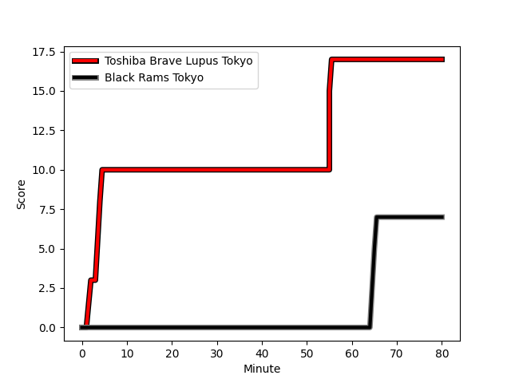
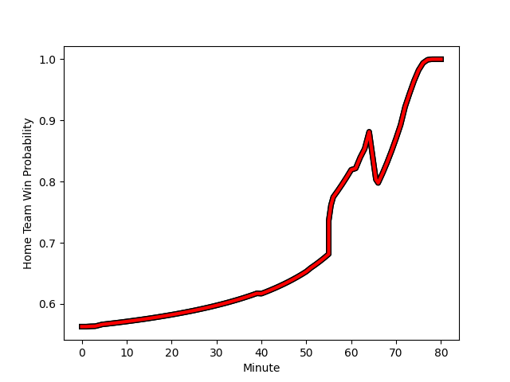

---  
layout: page  
title: Black Rams Tokyo at Toshiba Brave Lupus Tokyo; 7-17  
date: 2022-12-24 00:00:00 18:00:00 -0500  
categories: match review  
---
# Black Rams Tokyo (1430.3) at Toshiba Brave Lupus Tokyo (1562.5); 7-17

# Prediction: Toshiba Brave Lupus Tokyo by 20.2

Toshiba Brave Lupus Tokyo by 13.2 on a neutral field
## Scores over Time

## Win Probability over Time

# Pre-Match Prediction: Toshiba Brave Lupus Tokyo by 20.3

Toshiba Brave Lupus Tokyo by 13.3 on a neutral pitch

|   Away Minutes | Away Player                                                     |   Away elo |   Away Percentile |   Number |   Home Percentile |   Home elo | Home Player                                                     |   Home Minutes |
|---------------:|:----------------------------------------------------------------|-----------:|------------------:|---------:|------------------:|-----------:|:----------------------------------------------------------------|---------------:|
|             40 | [Kazuma Nishi](playerfiles//KazumaNishi_cleaned.md)             |      84.64 |                10 |        1 |                60 |      98    | [Sena Kimura](playerfiles//SenaKimura_cleaned.md)               |             51 |
|             72 | [Hinata Takei](playerfiles//HinataTakei_cleaned.md)             |     102    |                76 |        2 |                63 |      98    | [Mamoru Harada](playerfiles//MamoruHarada_cleaned.md)           |             61 |
|             40 | [Taichi Chiba](playerfiles//TaichiChiba_cleaned.md)             |      89.66 |                22 |        3 |                89 |     109.03 | [Yuta Kokaji](playerfiles//YutaKokaji_cleaned.md)               |             72 |
|             80 | [Josh Goodhue](playerfiles//JoshGoodhue_cleaned.md)             |      84.38 |                15 |        4 |                73 |     102.02 | [Warner Dearns](playerfiles//WarnerDearns_cleaned.md)           |             61 |
|             72 | [Pohiva Lotoahea](playerfiles//PohivaLotoahea_cleaned.md)       |     100.87 |               nan |        5 |                98 |     128.97 | [Jacob Pierce](playerfiles//JacobPierce_cleaned.md)             |             80 |
|             80 | [Talau Fakatava](playerfiles//TalauFakatava_cleaned.md)         |      84.81 |                16 |        6 |                50 |      95.77 | [Shin Ito](playerfiles//ShinIto_cleaned.md)                     |             80 |
|             80 | [Brodi McCurran](playerfiles//BrodiMcCurran_cleaned.md)         |     128.15 |                97 |        7 |                17 |      87.16 | [Yoshitaka Tokunaga](playerfiles//YoshitakaTokunaga_cleaned.md) |             80 |
|             64 | [Nathan Hughes](playerfiles//NathanHughes_cleaned.md)           |     119.31 |                92 |        8 |                94 |     121.55 | [Michael Leitch](playerfiles//MichaelLeitch_cleaned.md)         |             66 |
|             62 | [Syota Yamamoto](playerfiles//SyotaYamamoto_cleaned.md)         |      97.57 |                58 |        9 |                75 |     102.66 | [Takahiro Ogawa](playerfiles//TakahiroOgawa_cleaned.md)         |             80 |
|             80 | [Isaac Lucas](playerfiles//IsaacLucas_cleaned.md)               |      82.31 |                 8 |       10 |                25 |      90.05 | [Tom Taylor](playerfiles//TomTaylor_cleaned.md)                 |             80 |
|             80 | [Netani Vakayalia](playerfiles//NetaniVakayalia_cleaned.md)     |      80.63 |                 7 |       11 |                75 |     102.04 | [Masaki Hamada](playerfiles//MasakiHamada_cleaned.md)           |             80 |
|             80 | [Hadleigh Parkes](playerfiles//HadleighParkes_cleaned.md)       |     110.29 |                86 |       12 |                81 |     107.92 | [Nicholas McCurran](playerfiles//NicholasMcCurran_cleaned.md)   |             80 |
|             80 | [Ryohei Isoda](playerfiles//RyoheiIsoda_cleaned.md)             |      95.62 |               nan |       13 |                90 |     113.88 | [Seta Tamanivalu](playerfiles//SetaTamanivalu_cleaned.md)       |             56 |
|             64 | [Daisuke Nishikawa](playerfiles//DaisukeNishikawa_cleaned.md)   |      98.38 |                62 |       14 |                77 |     103.13 | [Jone Naikabula](playerfiles//JoneNaikabula_cleaned.md)         |             80 |
|             80 | [Main Taira](playerfiles//MainTaira_cleaned.md)                 |      83.76 |                13 |       15 |                82 |     108.05 | [Takuro Matsunaga](playerfiles//TakuroMatsunaga_cleaned.md)     |             78 |
|             40 | [Yuichiro Taniguchi](playerfiles//YuichiroTaniguchi_cleaned.md) |      90.83 |                30 |       16 |                62 |     100.36 | [Yuma Fujino](playerfiles//YumaFujino_cleaned.md)               |             29 |
|             40 | [Daigo Sasagawa](playerfiles//DaigoSasagawa_cleaned.md)         |      87    |                14 |       17 |                99 |     130.41 | [Burger Odendaal](playerfiles//BurgerOdendaal_cleaned.md)       |             24 |
|             18 | [Takanobu Minami](playerfiles//TakanobuMinami_cleaned.md)       |      90.91 |                39 |       18 |                 9 |      81.51 | [Kyosuke Kajikawa](playerfiles//KyosukeKajikawa_cleaned.md)     |             19 |
|             16 | [Shuhei Matsuhashi](playerfiles//ShuheiMatsuhashi_cleaned.md)   |      92.85 |                41 |       19 |                52 |      95.3  | [Daigo Hashimoto](playerfiles//DaigoHashimoto_cleaned.md)       |             19 |
|             16 | [Matt McGahan](playerfiles//MattMcGahan_cleaned.md)             |      85.99 |                23 |       20 |               nan |      95.39 | [Takeshi Sasaki](playerfiles//TakeshiSasaki_cleaned.md)         |             14 |
|              8 | [Masaaki Onishi](playerfiles//MasaakiOnishi_cleaned.md)         |      87.23 |                23 |       21 |               nan |      95.26 | [Rikyu Yamakawa](playerfiles//RikyuYamakawa_cleaned.md)         |              8 |
|              8 | [Daiki Yanagawa](playerfiles//DaikiYanagawa_cleaned.md)         |      69.78 |                 1 |       22 |                84 |     104.08 | [Futoshi Mori](playerfiles//FutoshiMori_cleaned.md)             |              2 |

