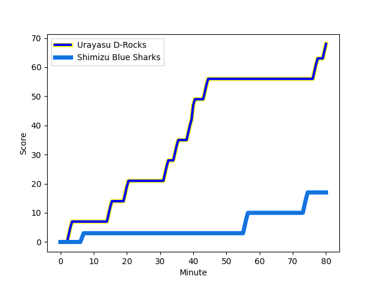
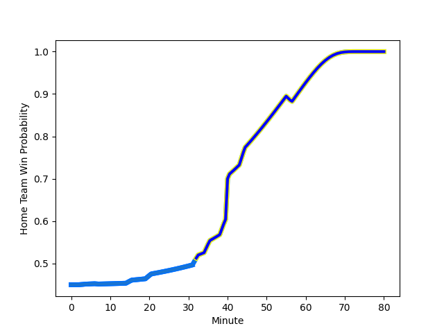

---  
layout: page  
title: Shimizu Blue Sharks at Urayasu D-Rocks; 17-68  
date: 2022-12-24 00:00:00 18:00:00 -0500  
categories: match review  
---
# Shimizu Blue Sharks (1433.97) at Urayasu D-Rocks (1346.3); 17-68

# Prediction: Shimizu Blue Sharks by 5.8

Shimizu Blue Sharks by 8.8 on a neutral field
## Scores over Time

## Win Probability over Time

# Pre-Match Prediction: Shimizu Blue Sharks by 7.3

Shimizu Blue Sharks by 10.3 on a neutral pitch

|   Away Minutes | Away Player                                                          |   Away elo |   Away Percentile |   Number |   Home Percentile |   Home elo | Home Player                                                            |   Home Minutes |
|---------------:|:---------------------------------------------------------------------|-----------:|------------------:|---------:|------------------:|-----------:|:-----------------------------------------------------------------------|---------------:|
|             53 | [Fumiyake Mato](..//playerfiles//FumiyakeMato_cleaned.md)            |      95.24 |                47 |        1 |                 3 |      76.17 | [Kazuma Nishikawa](..//playerfiles//KazumaNishikawa_cleaned.md)        |             55 |
|             53 | [Kaito Tamori](..//playerfiles//KaitoTamori_cleaned.md)              |      96.77 |                58 |        2 |                 1 |      73.09 | [Franco Marais](..//playerfiles//FrancoMarais_cleaned.md)              |             45 |
|             65 | [Ryota Saitou](..//playerfiles//RyotaSaitou_cleaned.md)              |      95    |               nan |        3 |                10 |      84.65 | [Syuhei Takeuchi](..//playerfiles//SyuheiTakeuchi_cleaned.md)          |             45 |
|             40 | [Ryota Sakino](..//playerfiles//RyotaSakino_cleaned.md)              |      95.4  |                50 |        4 |                77 |     103.6  | [Wimpie van der Walt](..//playerfiles//WimpievanderWalt_cleaned.md)    |             40 |
|             80 | [Yutaro Shirako](..//playerfiles//YutaroShirako_cleaned.md)          |      81.63 |                10 |        5 |                 8 |      80.7  | [Ryeongji Kim](..//playerfiles//RyeongjiKim_cleaned.md)                |             80 |
|             64 | [Haruki Matsudo](..//playerfiles//HarukiMatsudo_cleaned.md)          |      96.44 |                52 |        6 |                29 |      91.1  | [Jimmy Tupou](..//playerfiles//JimmyTupou_cleaned.md)                  |             80 |
|             80 | [Ginjiro Hase](..//playerfiles//GinjiroHase_cleaned.md)              |      97.85 |                59 |        7 |                13 |      85.54 | [Shinya Osugi](..//playerfiles//ShinyaOsugi_cleaned.md)                |             80 |
|             80 | [Murphy Taramai](..//playerfiles//MurphyTaramai_cleaned.md)          |      88.61 |                23 |        8 |                36 |      92.29 | [Liam Gill](..//playerfiles//LiamGill_cleaned.md)                      |             64 |
|             40 | [Reijiro Usui](..//playerfiles//ReijiroUsui_cleaned.md)              |      97.41 |                57 |        9 |                27 |      91.37 | [Ren Iinuma](..//playerfiles//RenIinuma_cleaned.md)                    |             75 |
|             80 | [Masashi Fujitaka](..//playerfiles//MasashiFujitaka_cleaned.md)      |      95.44 |               nan |       10 |               nan |     101.83 | [Hayden Cripps](..//playerfiles//HaydenCripps_cleaned.md)              |             80 |
|             56 | [Shuhei Sasaki](..//playerfiles//ShuheiSasaki_cleaned.md)            |      93.97 |                44 |       11 |                60 |      97.68 | [Takuhei Yasuda](..//playerfiles//TakuheiYasuda_cleaned.md)            |             80 |
|             80 | [Michael Va'a Toloke](..//playerfiles//MichaelVa'aToloke_cleaned.md) |     103.33 |                74 |       12 |               nan |      78.3  | [Samisoni Ahokovi Tua](..//playerfiles//SamisoniAhokoviTua_cleaned.md) |             56 |
|             40 | [John-Ben Kotze](..//playerfiles//John-BenKotze_cleaned.md)          |     115.11 |                91 |       13 |                 1 |      69.08 | [Shane Gates](..//playerfiles//ShaneGates_cleaned.md)                  |             80 |
|             80 | [Tatsuhiro Ozaki](..//playerfiles//TatsuhiroOzaki_cleaned.md)        |      93.44 |                39 |       14 |                18 |      85.72 | [Larry Steven Sulunga](..//playerfiles//LarryStevenSulunga_cleaned.md) |             80 |
|             80 | [Coenie van Wyk](..//playerfiles//CoenievanWyk_cleaned.md)           |     101.81 |                69 |       15 |                92 |     116.07 | [Israel Folau](..//playerfiles//IsraelFolau_cleaned.md)                |             53 |
|             40 | [Thomas Nowlan](..//playerfiles//ThomasNowlan_cleaned.md)            |      94.92 |               nan |       16 |                32 |      91.48 | [Shingo Nakashima](..//playerfiles//ShingoNakashima_cleaned.md)        |             40 |
|             40 | [Kayne Hammington](..//playerfiles//KayneHammington_cleaned.md)      |      99.65 |               nan |       17 |                16 |      87.71 | [Ryuji Fujimura](..//playerfiles//RyujiFujimura_cleaned.md)            |             35 |
|             40 | [Siale Piutau](..//playerfiles//SialePiutau_cleaned.md)              |     100.95 |                66 |       18 |               nan |     102.87 | [Sekonaia Pole](..//playerfiles//SekonaiaPole_cleaned.md)              |             35 |
|             27 | [Takatoshi Sugawara](..//playerfiles//TakatoshiSugawara_cleaned.md)  |      85.79 |                11 |       19 |                81 |     105.27 | [Tian Meyer](..//playerfiles//TianMeyer_cleaned.md)                    |             27 |
|             27 | [Naomichi Tatekawa](..//playerfiles//NaomichiTatekawa_cleaned.md)    |      91.16 |                26 |       20 |               nan |      95    | [Masahide Yanagikawa](..//playerfiles//MasahideYanagikawa_cleaned.md)  |             25 |
|             24 | [Naoki Moriya](..//playerfiles//NaokiMoriya_cleaned.md)              |      78.31 |                 6 |       21 |                90 |     113.77 | [Tone Tukufuka](..//playerfiles//ToneTukufuka_cleaned.md)              |             24 |
|             16 | [Taiyo Ando](..//playerfiles//TaiyoAndo_cleaned.md)                  |     111.95 |                87 |       22 |                13 |      84.06 | [James Moore](..//playerfiles//JamesMoore_cleaned.md)                  |             16 |
|             15 | [Ryo Jinnohara](..//playerfiles//RyoJinnohara_cleaned.md)            |      91.82 |                28 |       23 |                10 |      84.23 | [Tetta Shigemitsu](..//playerfiles//TettaShigemitsu_cleaned.md)        |              5 |

