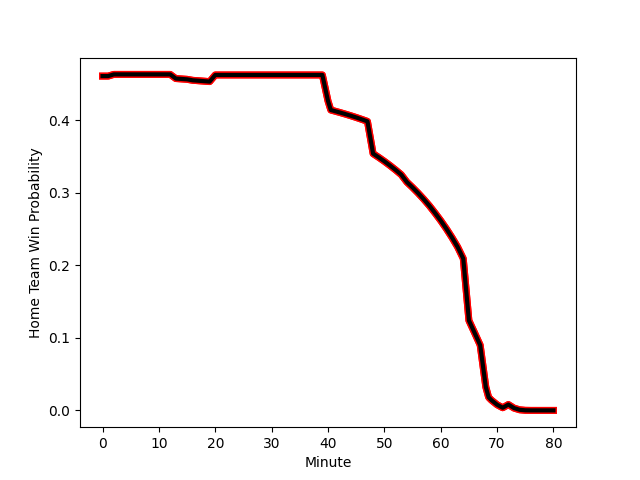

---  
layout: page  
title: NTT Docomo Red Hurricanes Osaka at Chugoku Red Regulions; 34-10  
date: 2022-12-25 00:00:00 18:00:00 -0500  
categories: match review  
---
# NTT Docomo Red Hurricanes Osaka (1345.05) at Chugoku Red Regulions (1277.32); 34-10

# Prediction: NTT Docomo Red Hurricanes Osaka by 3.8

NTT Docomo Red Hurricanes Osaka by 6.8 on a neutral field
## Scores over Time

## Win Probability over Time

# Pre-Match Prediction: NTT Docomo Red Hurricanes Osaka by 7.9

NTT Docomo Red Hurricanes Osaka by 10.9 on a neutral pitch

|   Away Minutes | Away Player                                                             |   Away elo |   Away Percentile |   Number |   Home Percentile |   Home elo | Home Player                                                       |   Home Minutes |
|---------------:|:------------------------------------------------------------------------|-----------:|------------------:|---------:|------------------:|-----------:|:------------------------------------------------------------------|---------------:|
|             59 | [Shosuke Fukasawa](..//playerfiles//ShosukeFukasawa_cleaned.md)         |      94.52 |                40 |        1 |                14 |      87.23 | [Kojiro Arito](..//playerfiles//KojiroArito_cleaned.md)           |             40 |
|             16 | [Hisamitsu Shimada](..//playerfiles//HisamitsuShimada_cleaned.md)       |      97.47 |                60 |        2 |                 6 |      82.98 | [Kentaro Iwanaga](..//playerfiles//KentaroIwanaga_cleaned.md)     |             80 |
|             54 | [Munekata Sashida](..//playerfiles//MunekataSashida_cleaned.md)         |      93.1  |                36 |        3 |                17 |      90.52 | [Kento Miyata](..//playerfiles//KentoMiyata_cleaned.md)           |             40 |
|             80 | [Willie Britz](..//playerfiles//WillieBritz_cleaned.md)                 |      97.57 |                54 |        4 |                 1 |      66.81 | [Taro Nishikawa](..//playerfiles//TaroNishikawa_cleaned.md)       |             80 |
|             80 | [Tom Jeffries](..//playerfiles//TomJeffries_cleaned.md)                 |      96.76 |                56 |        5 |                32 |      91.17 | [Noriyuki Kureyama](..//playerfiles//NoriyukiKureyama_cleaned.md) |             40 |
|             80 | [Toru Sugishita](..//playerfiles//ToruSugishita_cleaned.md)             |      71.65 |                 1 |        6 |                66 |      99.89 | [Shintaro Matsuda](..//playerfiles//ShintaroMatsuda_cleaned.md)   |             80 |
|             65 | [Daisuke Kurihara](..//playerfiles//DaisukeKurihara_cleaned.md)         |     100.29 |                68 |        7 |                 7 |      81.53 | [Kohei Matsunaga](..//playerfiles//KoheiMatsunaga_cleaned.md)     |             80 |
|             80 | [Colin Bourke](..//playerfiles//ColinBourke_cleaned.md)                 |      85.54 |                15 |        8 |                 0 |      67.97 | [Ed Quirk](..//playerfiles//EdQuirk_cleaned.md)                   |             80 |
|             65 | [Tatsuya Hamano](..//playerfiles//TatsuyaHamano_cleaned.md)             |      96.94 |                55 |        9 |                14 |      86.62 | [Rintaro Kawashima](..//playerfiles//RintaroKawashima_cleaned.md) |             80 |
|             80 | [Ei Kawamuko](..//playerfiles//EiKawamuko_cleaned.md)                   |      89.08 |                23 |       10 |                21 |      88.18 | [Hashizo Yoshida](..//playerfiles//HashizoYoshida_cleaned.md)     |             80 |
|             80 | [Masaki Kobayashi](..//playerfiles//MasakiKobayashi_cleaned.md)         |      81.56 |                 8 |       11 |                67 |      99.89 | [Kentaro Fujii](..//playerfiles//KentaroFujii_cleaned.md)         |             80 |
|             64 | [Yonhi Kimu](..//playerfiles//YonhiKimu_cleaned.md)                     |      82.07 |                 8 |       12 |                60 |      98.79 | [Shinya Hirayama](..//playerfiles//ShinyaHirayama_cleaned.md)     |             80 |
|             80 | [Benjamin Saunders](..//playerfiles//BenjaminSaunders_cleaned.md)       |     100.61 |                65 |       13 |                 1 |      74.43 | [Shun Kawaguchi](..//playerfiles//ShunKawaguchi_cleaned.md)       |             75 |
|             54 | [Kenta Komura](..//playerfiles//KentaKomura_cleaned.md)                 |      95.9  |               nan |       14 |                 4 |      77.07 | [Masaaki Morita](..//playerfiles//MasaakiMorita_cleaned.md)       |             80 |
|             80 | [Taichi Yoshizawa](..//playerfiles//TaichiYoshizawa_cleaned.md)         |      59.65 |                 0 |       15 |                15 |      84.84 | [Motoki Arai](..//playerfiles//MotokiArai_cleaned.md)             |              2 |
|             64 | [Mitsumasa Harayama](..//playerfiles//MitsumasaHarayama_cleaned.md)     |      98.78 |               nan |       16 |               nan |      88.72 | [Ippei Yamada](..//playerfiles//IppeiYamada_cleaned.md)           |             78 |
|             26 | [Yuichiro Hosono](..//playerfiles//YuichiroHosono_cleaned.md)           |      99.22 |               nan |       17 |               nan |      95.22 | [Keisuke Maeda](..//playerfiles//KeisukeMaeda_cleaned.md)         |             40 |
|             26 | [Kouki Shigeno](..//playerfiles//KoukiShigeno_cleaned.md)               |      95.9  |                51 |       18 |                57 |      97.44 | [Daiki Ishida](..//playerfiles//DaikiIshida_cleaned.md)           |             40 |
|             21 | [Wataru Furuya](..//playerfiles//WataruFuruya_cleaned.md)               |      95    |               nan |       19 |                 0 |      64.82 | [Kouta Moriyama](..//playerfiles//KoutaMoriyama_cleaned.md)       |             40 |
|             16 | [Mifiposeti Paea](..//playerfiles//MifiposetiPaea_cleaned.md)           |      86.42 |                16 |       20 |                51 |      95.82 | [Syouhei Kurokawa](..//playerfiles//SyouheiKurokawa_cleaned.md)   |              5 |
|             15 | [Tsukasa Yasuda](..//playerfiles//TsukasaYasuda_cleaned.md)             |      93.21 |                40 |       21 |               nan |     nan    | nan                                                               |            nan |
|             15 | [Toshihiro Yamamouchi](..//playerfiles//ToshihiroYamamouchi_cleaned.md) |      95    |               nan |       22 |               nan |     nan    | nan                                                               |            nan |

