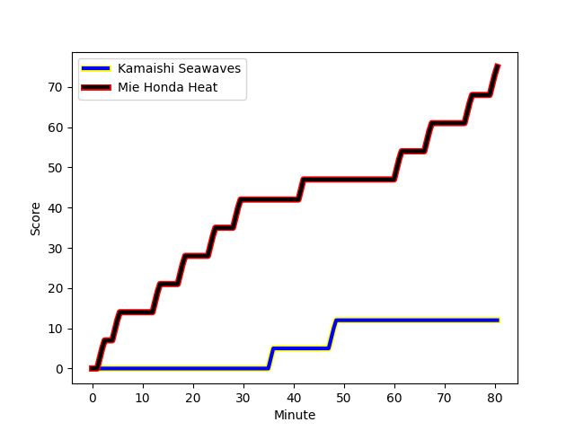
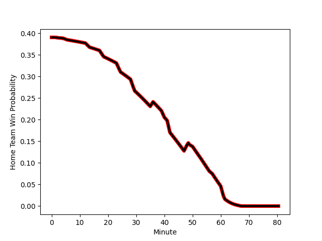

---  
layout: page  
title: Mie Honda Heat at Kamaishi Seawaves; 75-12  
date: 2022-12-25 00:00:00 18:00:00 -0500  
categories: match review  
---
# Mie Honda Heat (1501.71) at Kamaishi Seawaves (1308.23); 75-12

# Prediction: Mie Honda Heat by 16.3

Mie Honda Heat by 19.3 on a neutral field
## Scores over Time

## Win Probability over Time

# Pre-Match Prediction: Mie Honda Heat by 15.4

Mie Honda Heat by 18.4 on a neutral pitch

|   Away Minutes | Away Player                                                           |   Away elo |   Away Percentile |   Number |   Home Percentile |   Home elo | Home Player                                                        |   Home Minutes |
|---------------:|:----------------------------------------------------------------------|-----------:|------------------:|---------:|------------------:|-----------:|:-------------------------------------------------------------------|---------------:|
|             57 | [Tatsuhiko Tsurukawa](..//playerfiles//TatsuhikoTsurukawa_cleaned.md) |      89.75 |                22 |        1 |                37 |      93.42 | [Shoichiro Inada](..//playerfiles//ShoichiroInada_cleaned.md)      |             40 |
|             63 | [Lee Seung Hyok](..//playerfiles//LeeSeungHyok_cleaned.md)            |      87.08 |                10 |        2 |                 3 |      78.74 | [Daiki Ito](..//playerfiles//DaikiIto_cleaned.md)                  |             50 |
|             57 | [Taiki Yoshioka](..//playerfiles//TaikiYoshioka_cleaned.md)           |      95    |               nan |        3 |                37 |      93.42 | [Taiki Noguchi](..//playerfiles//TaikiNoguchi_cleaned.md)          |             53 |
|             80 | [Tetuhi Roberts](..//playerfiles//TetuhiRoberts_cleaned.md)           |      94.55 |                46 |        4 |               nan |      93.64 | [Sergio Moreira](..//playerfiles//SergioMoreira_cleaned.md)        |             40 |
|             80 | [Franco Mostert](..//playerfiles//FrancoMostert_cleaned.md)           |     134.11 |                99 |        5 |                12 |      83.12 | [Ben Nee Nee](..//playerfiles//BenNeeNee_cleaned.md)               |             80 |
|             68 | [Atsuro Tsuji](..//playerfiles//AtsuroTsuji_cleaned.md)               |      95    |               nan |        6 |                23 |      89.01 | [Shoji Misaki](..//playerfiles//ShojiMisaki_cleaned.md)            |             40 |
|             80 | [Ryo Furuta](..//playerfiles//RyoFuruta_cleaned.md)                   |      86.67 |                16 |        7 |                69 |     100.56 | [Daisuke Musya](..//playerfiles//DaisukeMusya_cleaned.md)          |             59 |
|             57 | [Pablo Matera](..//playerfiles//PabloMatera_cleaned.md)               |     117.61 |                92 |        8 |                23 |      89    | [Dallas Tatana](..//playerfiles//DallasTatana_cleaned.md)          |             80 |
|             68 | [Kenta Yamaji](..//playerfiles//KentaYamaji_cleaned.md)               |     104.46 |                79 |        9 |                 6 |      81.28 | [Youhei Murakami](..//playerfiles//YouheiMurakami_cleaned.md)      |             40 |
|             57 | [Kaleb Trask](..//playerfiles//KalebTrask_cleaned.md)                 |     101.93 |                69 |       10 |                51 |      96.38 | [Joshua Stander](..//playerfiles//JoshuaStander_cleaned.md)        |             80 |
|             80 | [Naoki Motomura](..//playerfiles//NaokiMotomura_cleaned.md)           |      97.4  |               nan |       11 |                 2 |      72.43 | [Kodai Ono](..//playerfiles//KodaiOno_cleaned.md)                  |             80 |
|             57 | [Fraser Quirk](..//playerfiles//FraserQuirk_cleaned.md)               |      95    |               nan |       12 |                13 |      84.4  | [Osuka Lloyd Murata](..//playerfiles//OsukaLloydMurata_cleaned.md) |             80 |
|             80 | [Kanta Watanabe](..//playerfiles//KantaWatanabe_cleaned.md)           |      92.63 |                37 |       13 |               nan |      95    | [Darius Thomas](..//playerfiles//DariusThomas_cleaned.md)          |             68 |
|             80 | [Yoshizaku Fujita](..//playerfiles//YoshizakuFujita_cleaned.md)       |     103.14 |                78 |       14 |                41 |      93.42 | [Ryuji Abe](..//playerfiles//RyujiAbe_cleaned.md)                  |             80 |
|             80 | [Tom Banks](..//playerfiles//TomBanks_cleaned.md)                     |     114.08 |                90 |       15 |                 2 |      70.64 | [Ryoma Nakamura](..//playerfiles//RyomaNakamura_cleaned.md)        |             80 |
|             23 | [Takumi Fuji](..//playerfiles//TakumiFuji_cleaned.md)                 |      87.64 |               nan |       16 |                 7 |      81.49 | [Takuya Takahashi](..//playerfiles//TakuyaTakahashi_cleaned.md)    |             40 |
|             23 | [Masahiro Hibino](..//playerfiles//MasahiroHibino_cleaned.md)         |      89.18 |                31 |       17 |               nan |      95    | [Seta Koroitamana](..//playerfiles//SetaKoroitamana_cleaned.md)    |             40 |
|             23 | [Paddy Butler](..//playerfiles//PaddyButler_cleaned.md)               |      94.4  |                43 |       18 |                15 |      87.62 | [Atsushi Minami](..//playerfiles//AtsushiMinami_cleaned.md)        |             40 |
|             23 | [Dawid Kellerman](..//playerfiles//DawidKellerman_cleaned.md)         |      87.81 |                17 |       19 |                 3 |      74.9  | [Ryunosuke Yamada](..//playerfiles//RyunosukeYamada_cleaned.md)    |             40 |
|             23 | [Gwangtee Oh](..//playerfiles//GwangteeOh_cleaned.md)                 |      95.74 |                40 |       20 |                54 |      95.68 | [Kota Kumamoto](..//playerfiles//KotaKumamoto_cleaned.md)          |             30 |
|             17 | [Tateo Kanai](..//playerfiles//TateoKanai_cleaned.md)                 |     116.88 |               nan |       21 |               nan |      95    | [Shun Terawaki](..//playerfiles//ShunTerawaki_cleaned.md)          |             27 |
|             12 | [Masaki Kondo](..//playerfiles//MasakiKondo_cleaned.md)               |     104.4  |                79 |       22 |                13 |      85.55 | [Ryota Kano](..//playerfiles//RyotaKano_cleaned.md)                |             21 |
|             12 | [Shogo Nezuka](..//playerfiles//ShogoNezuka_cleaned.md)               |      93.52 |                30 |       23 |               nan |      95    | [Shuta Fukushi](..//playerfiles//ShutaFukushi_cleaned.md)          |             12 |

