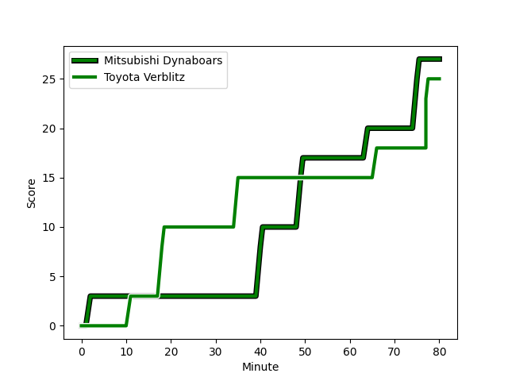
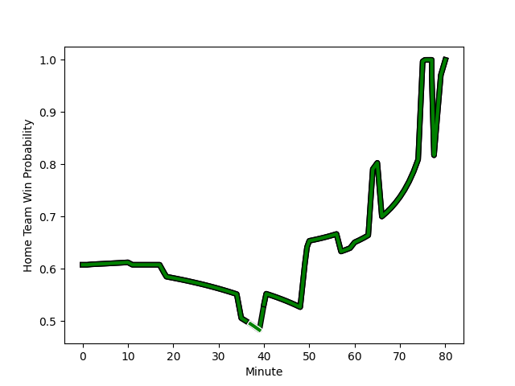

---  
layout: page  
title: Toyota Verblitz at Mitsubishi Dynaboars; 25-27  
date: 2022-12-25 04:00:00 18:00:00 -0500  
categories: match review  
---
# Toyota Verblitz (1388.0) at Mitsubishi Dynaboars (1578.4); 25-27

# Prediction: Mitsubishi Dynaboars by 26.0

Mitsubishi Dynaboars by 19.0 on a neutral field
## Scores over Time

## Win Probability over Time

# Pre-Match Prediction: Mitsubishi Dynaboars by 16.2

Mitsubishi Dynaboars by 9.2 on a neutral pitch

|   Away Minutes | Away Player                                                                        |   Away elo |   Away Percentile |   Number |   Home Percentile |   Home elo | Home Player                                                             |   Home Minutes |
|---------------:|:-----------------------------------------------------------------------------------|-----------:|------------------:|---------:|------------------:|-----------:|:------------------------------------------------------------------------|---------------:|
|             50 | [Shogo Miura](playerfiles//ShogoMiura_cleaned.md)                                  |      96.57 |                54 |        1 |                96 |     114.96 | [Naoki Kawamata](playerfiles//NaokiKawamata_cleaned.md)                 |             50 |
|             50 | [Yoshikatsu Hikosaka](playerfiles//YoshikatsuHikosaka_cleaned.md)                  |     105.08 |                85 |        2 |                26 |      90.46 | [Yuki Miyazato](playerfiles//YukiMiyazato_cleaned.md)                   |             64 |
|             50 | [Shunsuke Asaoka](playerfiles//ShunsukeAsaoka_cleaned.md)                          |      91.74 |                29 |        3 |                64 |      98.78 | [Jun Morimoto](playerfiles//JunMorimoto_cleaned.md)                     |             50 |
|             80 | [Ryoma Nishimura](playerfiles//RyomaNishimura_cleaned.md)                          |     111.7  |                90 |        4 |                84 |     107.3  | [Daniel Linde](playerfiles//DanielLinde_cleaned.md)                     |             80 |
|             57 | [Daichi Akiyama](playerfiles//DaichiAkiyama_cleaned.md)                            |      93.67 |                43 |        5 |                85 |     107.42 | [Walt Steenkamp](playerfiles//WaltSteenkamp_cleaned.md)                 |             76 |
|             80 | [Pieter-Steph du Toit](playerfiles//Pieter-StephduToit_cleaned.md)                 |      95.7  |                50 |        6 |                96 |     120.27 | [Masataka Tsuruya](playerfiles//MasatakaTsuruya_cleaned.md)             |             57 |
|             80 | [Kyo Yoshida](playerfiles//KyoYoshida_cleaned.md)                                  |     104.24 |                79 |        7 |                63 |      98.71 | [Yusuke Sakamoto](playerfiles//YusukeSakamoto_cleaned.md)               |             80 |
|             50 | [Lautaimi Fetuani](playerfiles//LautaimiFetuani_cleaned.md)                        |      95.7  |                47 |        8 |                90 |     115.77 | [Jackson Hemopo](playerfiles//JacksonHemopo_cleaned.md)                 |             80 |
|             60 | [Kenta Fukuda](playerfiles//KentaFukuda_cleaned.md)                                |      95.74 |                48 |        9 |                94 |     116.83 | [Kota Iwamura](playerfiles//KotaIwamura_cleaned.md)                     |             77 |
|             80 | [Tiaan Falcon](playerfiles//TiaanFalcon_cleaned.md)                                |      83.81 |                10 |       10 |                71 |     103.67 | [James Shillcock](playerfiles//JamesShillcock_cleaned.md)               |             80 |
|             57 | [Jone Turaganivalu Nabetelevu](playerfiles//JoneTuraganivaluNabetelevu_cleaned.md) |      89.77 |                24 |       11 |                89 |     111.53 | [Honeti Taumoha'apai](playerfiles//HonetiTaumoha'apai_cleaned.md)       |             80 |
|             80 | [Rob Thompson](playerfiles//RobThompson_cleaned.md)                                |     120.85 |                95 |       12 |                35 |      92.87 | [Brackin Karauria-Henry](playerfiles//BrackinKarauria-Henry_cleaned.md) |             77 |
|             80 | [Dick Wilson](playerfiles//DickWilson_cleaned.md)                                  |      95.08 |                47 |       13 |                34 |      91.75 | [Curtis Rona](playerfiles//CurtisRona_cleaned.md)                       |             60 |
|              3 | [Taichi Takahashi](playerfiles//TaichiTakahashi_cleaned.md)                        |     100.08 |                68 |       14 |                63 |      98.71 | [Tomoyuki Ochiai](playerfiles//TomoyukiOchiai_cleaned.md)               |             80 |
|             77 | [Vatiliai Tuidraki](playerfiles//VatiliaiTuidraki_cleaned.md)                      |      96.65 |                52 |       15 |                73 |     103.79 | [Roland Alaiasa](playerfiles//RolandAlaiasa_cleaned.md)                 |             80 |
|             30 | [Gaku Shimizu](playerfiles//GakuShimizu_cleaned.md)                                |      94.06 |                34 |       16 |               nan |      95.93 | [Shunsuke Sakamoto](playerfiles//ShunsukeSakamoto_cleaned.md)           |             30 |
|             30 | [Ryusei Kato](playerfiles//RyuseiKato_cleaned.md)                                  |      93.33 |                33 |       17 |                99 |     131.32 | [Tomoaki Ishii](playerfiles//TomoakiIshii_cleaned.md)                   |             30 |
|             30 | [Yusuke Kizu](playerfiles//YusukeKizu_cleaned.md)                                  |     102.25 |                78 |       18 |                88 |     110.22 | [Sam Chongkit](playerfiles//SamChongkit_cleaned.md)                     |             23 |
|             30 | [Kazuki Himeno](playerfiles//KazukiHimeno_cleaned.md)                              |     102.42 |                69 |       19 |                58 |      98.1  | [Matt Vaega](playerfiles//MattVaega_cleaned.md)                         |             20 |
|             23 | [Joe Launchbury](playerfiles//JoeLaunchbury_cleaned.md)                            |     111.52 |                89 |       20 |                87 |     107.97 | [Yoshimitsu Yasue](playerfiles//YoshimitsuYasue_cleaned.md)             |             16 |
|             23 | [Yuki Okada](playerfiles//YukiOkada_cleaned.md)                                    |      96.36 |                51 |       21 |                14 |      85.19 | [Epineri Uluiviti](playerfiles//EpineriUluiviti_cleaned.md)             |              4 |
|             20 | [Kaito Shigeno](playerfiles//KaitoShigeno_cleaned.md)                              |      95.15 |                48 |       22 |                56 |      99.78 | [Kazuki Ishida](playerfiles//KazukiIshida_cleaned.md)                   |              3 |
|              3 | [Rintaro Maruyama](playerfiles//RintaroMaruyama_cleaned.md)                        |      95.08 |               nan |       23 |               nan |      95    | [Taichi Takahashi](playerfiles//TaichiTakahashi_cleaned.md)             |              3 |

