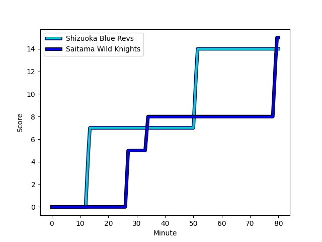
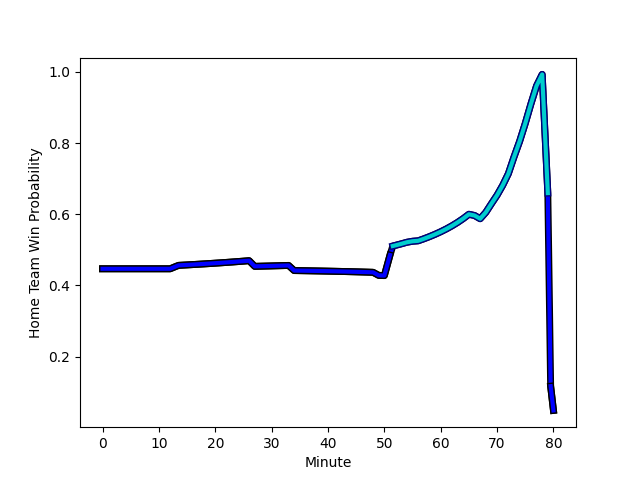

---  
layout: page  
title: Saitama Wild Knights at Shizuoka Blue Revs; 15-14  
date: 2022-12-25 06:30:00 18:00:00 -0500  
categories: match review  
---
# Saitama Wild Knights (1568.56) at Shizuoka Blue Revs (1483.26); 15-14

# Prediction: Saitama Wild Knights by 5.5

Saitama Wild Knights by 8.5 on a neutral field
## Scores over Time

## Win Probability over Time

# Pre-Match Prediction: Saitama Wild Knights by 7.7

Saitama Wild Knights by 10.7 on a neutral pitch

|   Away Minutes | Away Player                                                      |   Away elo |   Away Percentile |   Number |   Home Percentile |   Home elo | Home Player                                                         |   Home Minutes |
|---------------:|:-----------------------------------------------------------------|-----------:|------------------:|---------:|------------------:|-----------:|:--------------------------------------------------------------------|---------------:|
|             49 | [Keita Inagaki](..//playerfiles//KeitaInagaki_cleaned.md)        |     106.99 |                86 |        1 |                45 |      94.1  | [Kazuhiro Kawata](..//playerfiles//KazuhiroKawata_cleaned.md)       |             80 |
|             49 | [Atsushi Sakate](..//playerfiles//AtsushiSakate_cleaned.md)      |     101.36 |                75 |        2 |                92 |     110.99 | [Takeshi Hino](..//playerfiles//TakeshiHino_cleaned.md)             |             79 |
|             80 | [Shohei Hirano](..//playerfiles//ShoheiHirano_cleaned.md)        |     113.15 |                95 |        3 |                59 |      97.72 | [Heiichiro Ito](..//playerfiles//HeiichiroIto_cleaned.md)           |             55 |
|             67 | [Mark Abbott](..//playerfiles//MarkAbbott_cleaned.md)            |      91.88 |                35 |        4 |                83 |     106.35 | [Yuya Odo](..//playerfiles//YuyaOdo_cleaned.md)                     |             80 |
|             80 | [Liam Mitchell](..//playerfiles//LiamMitchell_cleaned.md)        |      82.21 |                 7 |        5 |                83 |     106.71 | [Eishin Kuwano](..//playerfiles//EishinKuwano_cleaned.md)           |             56 |
|             80 | [Shota Fukui](..//playerfiles//ShotaFukui_cleaned.md)            |      98.22 |                60 |        6 |                43 |      93.68 | [Riki Sugihara](..//playerfiles//RikiSugihara_cleaned.md)           |             56 |
|             69 | [Lachlan Boshier](..//playerfiles//LachlanBoshier_cleaned.md)    |     100.25 |                68 |        7 |                30 |      91.14 | [Takuma Shoji](..//playerfiles//TakumaShoji_cleaned.md)             |             80 |
|             80 | [Jack Cornelsen](..//playerfiles//JackCornelsen_cleaned.md)      |     108.75 |                84 |        8 |                82 |     107.64 | [Kwagga Smith](..//playerfiles//KwaggaSmith_cleaned.md)             |             80 |
|             66 | [Keisuke Uchida](..//playerfiles//KeisukeUchida_cleaned.md)      |     102.71 |                75 |        9 |                89 |     110.95 | [Bryn Hall](..//playerfiles//BrynHall_cleaned.md)                   |             79 |
|             66 | [Rikiya Matsuda](..//playerfiles//RikiyaMatsuda_cleaned.md)      |     102.67 |                70 |       10 |                13 |      85.37 | [Sam Greene](..//playerfiles//SamGreene_cleaned.md)                 |             80 |
|             80 | [Marika Koroibete](..//playerfiles//MarikaKoroibete_cleaned.md)  |      96.58 |                53 |       11 |                13 |      85.14 | [Hironori Yatomi](..//playerfiles//HironoriYatomi_cleaned.md)       |             80 |
|             73 | [Damian de Allende](..//playerfiles//DamiandeAllende_cleaned.md) |     120.99 |                95 |       12 |                48 |      95.17 | [Jonathan Faauli](..//playerfiles//JonathanFaauli_cleaned.md)       |             79 |
|             80 | [Dylan Riley](..//playerfiles//DylanRiley_cleaned.md)            |     108.06 |                82 |       13 |                89 |     111.73 | [Malo Tuitama](..//playerfiles//MaloTuitama_cleaned.md)             |             80 |
|             80 | [Koki Takeyama](..//playerfiles//KokiTakeyama_cleaned.md)        |     128.82 |                98 |       14 |                64 |      98.63 | [Keagan Faria](..//playerfiles//KeaganFaria_cleaned.md)             |             80 |
|             80 | [Ryuji Noguchi](..//playerfiles//RyujiNoguchi_cleaned.md)        |      91.49 |                36 |       15 |                32 |      90.44 | [Kakeru Okumura](..//playerfiles//KakeruOkumura_cleaned.md)         |             80 |
|             31 | [Craig Millar](..//playerfiles//CraigMillar_cleaned.md)          |      95.33 |                56 |       16 |               nan |      94.69 | [Takayoshi Mohara](..//playerfiles//TakayoshiMohara_cleaned.md)     |             25 |
|             31 | [Shota Horie](..//playerfiles//ShotaHorie_cleaned.md)            |     127.37 |                99 |       17 |                11 |      82.74 | [Samuela Anise](..//playerfiles//SamuelaAnise_cleaned.md)           |             24 |
|             14 | [Takuya Yamasawa](..//playerfiles//TakuyaYamasawa_cleaned.md)    |     121.76 |                94 |       18 |                92 |     113.36 | [Ryosuke Funahashi](..//playerfiles//RyosukeFunahashi_cleaned.md)   |             24 |
|             14 | [Taiki Koyama](..//playerfiles//TaikiKoyama_cleaned.md)          |     111.07 |                89 |       19 |               nan |      94.1  | [Clinton Swart](..//playerfiles//ClintonSwart_cleaned.md)           |              1 |
|             13 | [Ryota Hasegawa](..//playerfiles//RyotaHasegawa_cleaned.md)      |     127.91 |                97 |       20 |               nan |      94.67 | [Richmond Tongatama](..//playerfiles//RichmondTongatama_cleaned.md) |              1 |
|             11 | [Itsuki Onishi](..//playerfiles//ItsukiOnishi_cleaned.md)        |      95.9  |                52 |       21 |                82 |     106.08 | [Minoru Tanoue](..//playerfiles//MinoruTanoue_cleaned.md)           |              1 |
|              7 | [Vince Aso](..//playerfiles//VinceAso_cleaned.md)                |     107.53 |                81 |       22 |               nan |     nan    | nan                                                                 |            nan |

