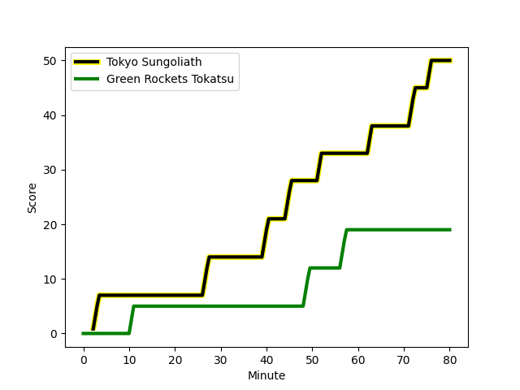
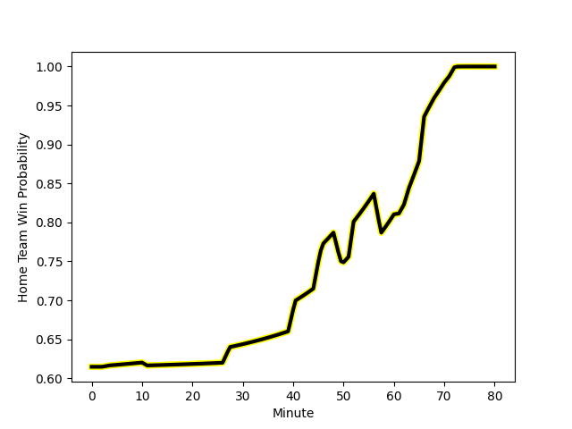

---  
layout: page  
title: Green Rockets Tokatsu at Tokyo Sungoliath; 19-50  
date: 2022-12-25 06:30:00 18:00:00 -0500  
categories: match review  
---
# Green Rockets Tokatsu (1390.38) at Tokyo Sungoliath (1593.39); 19-50

# Prediction: Tokyo Sungoliath by 23.3

Tokyo Sungoliath by 20.3 on a neutral field
## Scores over Time

## Win Probability over Time

# Pre-Match Prediction: Tokyo Sungoliath by 22.8

Tokyo Sungoliath by 19.8 on a neutral pitch

|   Away Minutes | Away Player                                                         |   Away elo |   Away Percentile |   Number |   Home Percentile |   Home elo | Home Player                                                           |   Home Minutes |
|---------------:|:--------------------------------------------------------------------|-----------:|------------------:|---------:|------------------:|-----------:|:----------------------------------------------------------------------|---------------:|
|             46 | [Suguru Kubo](..//playerfiles//SuguruKubo_cleaned.md)               |      93.55 |                36 |        1 |                86 |     105.36 | [Shintaro Ishihara](..//playerfiles//ShintaroIshihara_cleaned.md)     |             63 |
|             61 | [Myuu Arai](..//playerfiles//MyuuArai_cleaned.md)                   |      94.2  |                46 |        2 |                77 |     101.34 | [Kosuke Horikoshi](..//playerfiles//KosukeHorikoshi_cleaned.md)       |             63 |
|             46 | [Takahiro Doi](..//playerfiles//TakahiroDoi_cleaned.md)             |      77.28 |                 2 |        3 |                69 |      98.14 | [Shinnosuke Kakinaga](..//playerfiles//ShinnosukeKakinaga_cleaned.md) |             50 |
|             69 | [Daiki Yamagiwa](..//playerfiles//DaikiYamagiwa_cleaned.md)         |      85.48 |                16 |        4 |                53 |      95.52 | [Hendrik Tui](..//playerfiles//HendrikTui_cleaned.md)                 |             61 |
|             80 | [Jake Ball](..//playerfiles//JakeBall_cleaned.md)                   |     102.5  |                74 |        5 |                94 |     118.98 | [Harry Hockings](..//playerfiles//HarryHockings_cleaned.md)           |             80 |
|             80 | [Kavaia Tagivetaua](..//playerfiles//KavaiaTagivetaua_cleaned.md)   |      88.15 |                16 |        6 |                64 |      99.05 | [Kanji Shimokawa](..//playerfiles//KanjiShimokawa_cleaned.md)         |             61 |
|             80 | [Ryoi Kamei](..//playerfiles//RyoiKamei_cleaned.md)                 |      88.57 |                21 |        7 |                58 |      97.08 | [Ryuga Hashimoto](..//playerfiles//RyugaHashimoto_cleaned.md)         |             80 |
|             61 | [Whetu Douglas](..//playerfiles//WhetuDouglas_cleaned.md)           |     102.17 |                74 |        8 |                67 |     101.44 | [Tevita Tatafu](..//playerfiles//TevitaTatafu_cleaned.md)             |             80 |
|             71 | [Nick Phipps](..//playerfiles//NickPhipps_cleaned.md)               |     102.9  |                76 |        9 |                42 |      94.42 | [Naoto Saito](..//playerfiles//NaotoSaito_cleaned.md)                 |             50 |
|             80 | [Taisetsu Kanai](..//playerfiles//TaisetsuKanai_cleaned.md)         |     104.45 |                74 |       10 |                96 |     123.87 | [Keisuke Moriya](..//playerfiles//KeisukeMoriya_cleaned.md)           |             50 |
|             80 | [Lomano Lemeki](..//playerfiles//LomanoLemeki_cleaned.md)           |      93.89 |                44 |       11 |                96 |     119.74 | [Tevita Li](..//playerfiles//TevitaLi_cleaned.md)                     |             80 |
|             51 | [Christian Laui](..//playerfiles//ChristianLaui_cleaned.md)         |      98.43 |                60 |       12 |                88 |     111.25 | [Ryoto Nakamura](..//playerfiles//RyotoNakamura_cleaned.md)           |             80 |
|             80 | [Koichi Matsura](..//playerfiles//KoichiMatsura_cleaned.md)         |      81.5  |                 8 |       13 |                36 |      92.1  | [Shogo Nakano](..//playerfiles//ShogoNakano_cleaned.md)               |             80 |
|             80 | [Yuma Sugimoto](..//playerfiles//YumaSugimoto_cleaned.md)           |      94.76 |                47 |       14 |                82 |     108.38 | [Seiya Ozaki](..//playerfiles//SeiyaOzaki_cleaned.md)                 |             80 |
|             66 | [Tom Marshall](..//playerfiles//TomMarshall_cleaned.md)             |      82.64 |                11 |       15 |                96 |     124.71 | [Kotaro Matsushima](..//playerfiles//KotaroMatsushima_cleaned.md)     |             71 |
|             34 | [Sunao Takizawa](..//playerfiles//SunaoTakizawa_cleaned.md)         |      60.8  |                 0 |       16 |               nan |      95    | [Ryosuke Iwaihara](..//playerfiles//RyosukeIwaihara_cleaned.md)       |             30 |
|             34 | [Keisuke Kikuta](..//playerfiles//KeisukeKikuta_cleaned.md)         |      97.67 |                58 |       17 |                80 |     107.04 | [Hikaru Tamura](..//playerfiles//HikaruTamura_cleaned.md)             |             30 |
|             29 | [Tim Bennetts](..//playerfiles//TimBennetts_cleaned.md)             |      96.93 |                52 |       18 |                79 |     104.84 | [Yutaka Nagare](..//playerfiles//YutakaNagare_cleaned.md)             |             30 |
|             19 | [Ren Osawa](..//playerfiles//RenOsawa_cleaned.md)                   |      95    |               nan |       19 |                98 |     132.47 | [Tom Savage](..//playerfiles//TomSavage_cleaned.md)                   |             19 |
|             19 | [Ash Dixon](..//playerfiles//AshDixon_cleaned.md)                   |     110.63 |                91 |       20 |                32 |      91.48 | [Kai Yamamoto](..//playerfiles//KaiYamamoto_cleaned.md)               |             19 |
|             14 | [Taqele Naiyaravoro](..//playerfiles//TaqeleNaiyaravoro_cleaned.md) |      98.17 |               nan |       21 |                95 |     115.79 | [Shunta Nakamura](..//playerfiles//ShuntaNakamura_cleaned.md)         |             17 |
|             11 | [Yoshida Hosoda](..//playerfiles//YoshidaHosoda_cleaned.md)         |      96.39 |                53 |       22 |               nan |      95    | [Kenta Kobayashi](..//playerfiles//KentaKobayashi_cleaned.md)         |             17 |
|              9 | [Tatsuya Fujii](..//playerfiles//TatsuyaFujii_cleaned.md)           |      96.45 |                52 |       23 |                82 |     104.8  | [Hideto Niguma](..//playerfiles//HidetoNiguma_cleaned.md)             |              9 |

