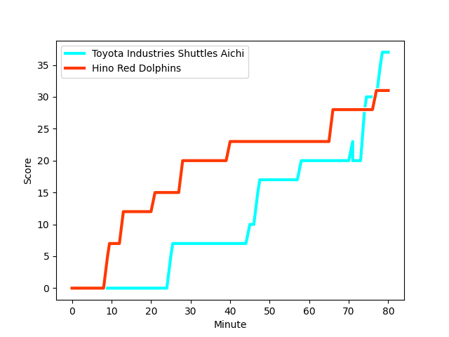

---  
layout: page  
title: Hino Red Dolphins at Toyota Industries Shuttles Aichi; 31-37  
date: 2022-12-25 00:00:00 18:00:00 -0500  
categories: match review  
---
# Hino Red Dolphins (1494.25) at Toyota Industries Shuttles Aichi (1507.32); 31-37

# Prediction: Toyota Industries Shuttles Aichi by 4.3

Toyota Industries Shuttles Aichi by 1.3 on a neutral field
## Scores over Time

## Win Probability over Time

# Pre-Match Prediction: Toyota Industries Shuttles Aichi by 9.9

Toyota Industries Shuttles Aichi by 6.9 on a neutral pitch

|   Away Minutes | Away Player                                                   |   Away elo |   Away Percentile |   Number |   Home Percentile |   Home elo | Home Player                                                                 |   Home Minutes |
|---------------:|:--------------------------------------------------------------|-----------:|------------------:|---------:|------------------:|-----------:|:----------------------------------------------------------------------------|---------------:|
|             46 | [Yuichi Hisatomi](..//playerfiles//YuichiHisatomi_cleaned.md) |      79.74 |                 4 |        1 |                94 |     112.09 | [Tomoki Yamaguchi](..//playerfiles//TomokiYamaguchi_cleaned.md)             |             58 |
|             80 | [Yuki Go](..//playerfiles//YukiGo_cleaned.md)                 |      90.46 |                26 |        2 |                69 |      99.4  | [Akito Fujinami](..//playerfiles//AkitoFujinami_cleaned.md)                 |             32 |
|             67 | [Takuma Asahara](..//playerfiles//TakumaAsahara_cleaned.md)   |      68.7  |                 0 |        3 |                42 |      93.27 | [Ryota Fukamura](..//playerfiles//RyotaFukamura_cleaned.md)                 |             68 |
|             80 | [Rory Arnold](..//playerfiles//RoryArnold_cleaned.md)         |     113.45 |                91 |        4 |                84 |     107.02 | [Taishi Nakamura](..//playerfiles//TaishiNakamura_cleaned.md)               |             70 |
|             40 | [Yuta Kasahara](..//playerfiles//YutaKasahara_cleaned.md)     |     113.3  |               nan |        5 |                86 |     108.12 | [Ryuichiro Fukutsubo](..//playerfiles//RyuichiroFukutsubo_cleaned.md)       |             63 |
|             80 | [Ash Parker](..//playerfiles//AshParker_cleaned.md)           |      85.67 |                14 |        6 |                84 |     107.52 | [Talifolofola Tangipa](..//playerfiles//TalifolofolaTangipa_cleaned.md)     |             80 |
|             80 | [Noah Tovio](..//playerfiles//NoahTovio_cleaned.md)           |      96.76 |                53 |        7 |                58 |      97.71 | [Toshiki Fujii](..//playerfiles//ToshikiFujii_cleaned.md)                   |             80 |
|             80 | [Shun Nakashika](..//playerfiles//ShunNakashika_cleaned.md)   |      95    |               nan |        8 |                60 |      99.43 | [Taumua Lui Sanft Naeata](..//playerfiles//TaumuaLuiSanftNaeata_cleaned.md) |             80 |
|             71 | [Augustine Pulu](..//playerfiles//AugustinePulu_cleaned.md)   |     112.83 |                91 |        9 |                87 |     109.9  | [Keita Fujiwara](..//playerfiles//KeitaFujiwara_cleaned.md)                 |             68 |
|             80 | [Riku Kitahara](..//playerfiles//RikuKitahara_cleaned.md)     |     111.04 |                86 |       10 |                68 |     100.95 | [Akihiro Shimizu](..//playerfiles//AkihiroShimizu_cleaned.md)               |             80 |
|             80 | [Chance Peni](..//playerfiles//ChancePeni_cleaned.md)         |     107.42 |                84 |       11 |                63 |      99.44 | [Tom Haddad](..//playerfiles//TomHaddad_cleaned.md)                         |             80 |
|             80 | [TJ Faiane](..//playerfiles//TJFaiane_cleaned.md)             |     106.13 |                79 |       12 |                71 |     102.76 | [Josh Matavesi](..//playerfiles//JoshMatavesi_cleaned.md)                   |             80 |
|             79 | [Taiki Kawai](..//playerfiles//TaikiKawai_cleaned.md)         |     106.56 |                80 |       13 |                70 |     102.11 | [Hitoshi Matsumoto](..//playerfiles//HitoshiMatsumoto_cleaned.md)           |             74 |
|             80 | [Ryo Kikkawa](..//playerfiles//RyoKikkawa_cleaned.md)         |      95.78 |                51 |       14 |                 8 |      82.09 | [Joe Kamana](..//playerfiles//JoeKamana_cleaned.md)                         |             68 |
|             71 | [Taroma Togo](..//playerfiles//TaromaTogo_cleaned.md)         |     103.49 |                72 |       15 |                40 |      93.11 | [Tim Swiel](..//playerfiles//TimSwiel_cleaned.md)                           |             80 |
|             40 | [Kyosuke Horie](..//playerfiles//KyosukeHorie_cleaned.md)     |     101.96 |                68 |       16 |                49 |      94.61 | [Hiroshi Murakawa](..//playerfiles//HiroshiMurakawa_cleaned.md)             |             48 |
|             34 | [Motoki Yamazaki](..//playerfiles//MotokiYamazaki_cleaned.md) |     108.65 |                90 |       17 |               nan |     106.2  | [Hyosuke Watanabe](..//playerfiles//HyosukeWatanabe_cleaned.md)             |             22 |
|             13 | [Shosuke Funaki](..//playerfiles//ShosukeFunaki_cleaned.md)   |      89.69 |               nan |       18 |                76 |     103.21 | [Itaru Taniguchi](..//playerfiles//ItaruTaniguchi_cleaned.md)               |             17 |
|              9 | [Motoki Tanaka](..//playerfiles//MotokiTanaka_cleaned.md)     |      95    |               nan |       19 |                33 |      92.35 | [Harumoto Kodera](..//playerfiles//HarumotoKodera_cleaned.md)               |             12 |
|              9 | [Simon Hickey](..//playerfiles//SimonHickey_cleaned.md)       |     104.11 |                74 |       20 |                46 |      95.87 | [Atsushi Yumoto](..//playerfiles//AtsushiYumoto_cleaned.md)                 |             12 |
|              1 | [Kuniya Sonoki](..//playerfiles//KuniyaSonoki_cleaned.md)     |      93.58 |                41 |       21 |                54 |      97.17 | [Hiroaki Saito](..//playerfiles//HiroakiSaito_cleaned.md)                   |             12 |
|            nan | nan                                                           |     nan    |               nan |       22 |               nan |      94.68 | [Tama Kapene](..//playerfiles//TamaKapene_cleaned.md)                       |             10 |
|            nan | nan                                                           |     nan    |               nan |       23 |               nan |      95    | [Keita Ichikawa](..//playerfiles//KeitaIchikawa_cleaned.md)                 |              6 |

