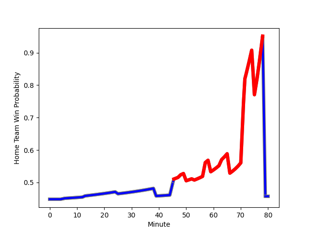

---  
layout: page  
title: Kubota Spears Funabashi Tokyo-Bay at Yokohama Canon Eagles; 27-27  
date: 2022-12-25 04:00:00 18:00:00 -0500  
categories: match review  
---
# Kubota Spears Funabashi Tokyo-Bay (1671.37) at Yokohama Canon Eagles (1575.83); 27-27

# Prediction: Kubota Spears Funabashi Tokyo-Bay by 6.6

Kubota Spears Funabashi Tokyo-Bay by 9.6 on a neutral field
## Scores over Time

## Win Probability over Time

# Pre-Match Prediction: Kubota Spears Funabashi Tokyo-Bay by 18.4

Kubota Spears Funabashi Tokyo-Bay by 21.4 on a neutral pitch

|   Away Minutes | Away Player                                                               |   Away elo |   Away Percentile |   Number |   Home Percentile |   Home elo | Home Player                                                     |   Home Minutes |
|---------------:|:--------------------------------------------------------------------------|-----------:|------------------:|---------:|------------------:|-----------:|:----------------------------------------------------------------|---------------:|
|             63 | [Kota Kaishi](..//playerfiles//KotaKaishi_cleaned.md)                     |     108.16 |                88 |        1 |                96 |     116.78 | [Takato Okabe](..//playerfiles//TakatoOkabe_cleaned.md)         |             77 |
|             72 | [Malcolm Marx](..//playerfiles//MalcolmMarx_cleaned.md)                   |     127.54 |                99 |        2 |                 3 |      78.79 | [Shin Kawamura](..//playerfiles//ShinKawamura_cleaned.md)       |             80 |
|             48 | [Shoya Matsunami](..//playerfiles//ShoyaMatsunami_cleaned.md)             |     107.94 |                88 |        3 |                 5 |      81.07 | [Tatsuro Sugimoto](..//playerfiles//TatsuroSugimoto_cleaned.md) |             57 |
|             80 | [Ruan Botha](..//playerfiles//RuanBotha_cleaned.md)                       |     135.38 |                99 |        4 |                99 |     134.24 | [Cory Hill](..//playerfiles//CoryHill_cleaned.md)               |             80 |
|             48 | [David Bulbring](..//playerfiles//DavidBulbring_cleaned.md)               |     103.16 |                76 |        5 |                 2 |      73.18 | [Liaki Moli](..//playerfiles//LiakiMoli_cleaned.md)             |             80 |
|             80 | [Lappies Labuschagne](..//playerfiles//LappiesLabuschagne_cleaned.md)     |     109.42 |                87 |        6 |               nan |      95.66 | [Sione Halasili](..//playerfiles//SioneHalasili_cleaned.md)     |             80 |
|             48 | [Takeo Suenaga](..//playerfiles//TakeoSuenaga_cleaned.md)                 |     107.98 |                85 |        7 |                81 |     105.2  | [Mitch Brown](..//playerfiles//MitchBrown_cleaned.md)           |             51 |
|             80 | [Faulua Makisi](..//playerfiles//FauluaMakisi_cleaned.md)                 |     100.37 |                63 |        8 |                91 |     117.17 | [Amanaki Mafi](..//playerfiles//AmanakiMafi_cleaned.md)         |             80 |
|             53 | [Shinobu Fujiwara](..//playerfiles//ShinobuFujiwara_cleaned.md)           |     100.72 |                70 |        9 |                96 |     120.77 | [Faf de Klerk](..//playerfiles//FafdeKlerk_cleaned.md)          |             80 |
|             80 | [Bernard Foley](..//playerfiles//BernardFoley_cleaned.md)                 |     144.88 |                99 |       10 |                52 |      96.96 | [Yu Tamura](..//playerfiles//YuTamura_cleaned.md)               |             80 |
|             72 | [Haruto Kida](..//playerfiles//HarutoKida_cleaned.md)                     |      98.34 |                62 |       11 |                87 |     109.61 | [Viliame Takayawa](..//playerfiles//ViliameTakayawa_cleaned.md) |             80 |
|             80 | [Harumichi Tatekawa](..//playerfiles//HarumichiTatekawa_cleaned.md)       |     113.31 |                90 |       12 |                77 |     104.89 | [Yusuke Kajimura](..//playerfiles//YusukeKajimura_cleaned.md)   |             80 |
|             72 | [Sione Teaupa](..//playerfiles//SioneTeaupa_cleaned.md)                   |     102.86 |                72 |       13 |                98 |     128.5  | [Jesse Kriel](..//playerfiles//JesseKriel_cleaned.md)           |             80 |
|             80 | [Koga Nezuka](..//playerfiles//KogaNezuka_cleaned.md)                     |      99.38 |                66 |       14 |                58 |      97.52 | [Inoke Burua](..//playerfiles//InokeBurua_cleaned.md)           |             80 |
|             80 | [Gerhard van den Heever](..//playerfiles//GerhardvandenHeever_cleaned.md) |     116.24 |                92 |       15 |                88 |     112.15 | [Jumpei Ogura](..//playerfiles//JumpeiOgura_cleaned.md)         |             80 |
|             32 | [Uwe Helu](..//playerfiles//UweHelu_cleaned.md)                           |      98.28 |                58 |       16 |                60 |      99.17 | [Kobus Van Dyk](..//playerfiles//KobusVanDyk_cleaned.md)        |             29 |
|             32 | [Opeti Helu](..//playerfiles//OpetiHelu_cleaned.md)                       |     105.5  |                77 |       17 |                77 |     103.33 | [Rento Tsukayama](..//playerfiles//RentoTsukayama_cleaned.md)   |             23 |
|             32 | [Finau Tupa](..//playerfiles//FinauTupa_cleaned.md)                       |     114.12 |                91 |       18 |               nan |      93.66 | [Chang Ho Ahn](..//playerfiles//ChangHoAhn_cleaned.md)          |              3 |
|             27 | [Kazuhiro Taniguchi](..//playerfiles//KazuhiroTaniguchi_cleaned.md)       |     107.78 |                82 |       19 |               nan |     nan    | nan                                                             |            nan |
|             17 | [Kazuki Kato](..//playerfiles//KazukiKato_cleaned.md)                     |      87.59 |                14 |       20 |               nan |     nan    | nan                                                             |            nan |
|              8 | [Yuhei Shimada](..//playerfiles//YuheiShimada_cleaned.md)                 |      95.22 |               nan |       21 |               nan |     nan    | nan                                                             |            nan |
|              8 | [Ryan Crotty](..//playerfiles//RyanCrotty_cleaned.md)                     |     119.44 |                94 |       22 |               nan |     nan    | nan                                                             |            nan |
|              8 | [Kentaro Otsuka](..//playerfiles//KentaroOtsuka_cleaned.md)               |      95.62 |               nan |       23 |               nan |     nan    | nan                                                             |            nan |

