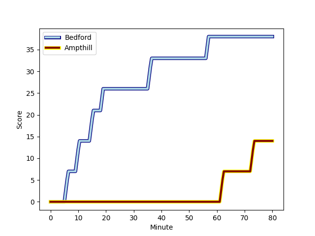
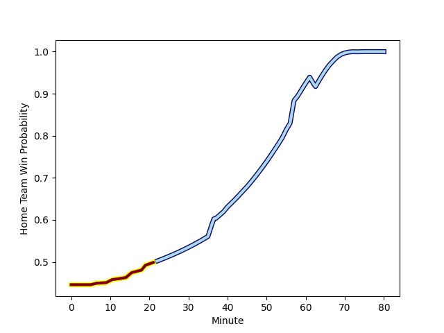

---  
layout: page  
title: Ampthill at Bedford; 14-38  
date: 2022-12-26 16:00:00 18:00:00 -0500  
categories: match review  
---
# Ampthill (1441.82) at Bedford (1347.27); 14-38

# Prediction: Ampthill by 6.5

Ampthill by 9.5 on a neutral field
## Scores over Time

## Win Probability over Time

# Pre-Match Prediction: Ampthill by 6.0

Ampthill by 9.0 on a neutral pitch

|   Away Minutes | Away Player                                                                     |   Away elo |   Away Percentile |   Number |   Home Percentile |   Home elo | Home Player                                                            |   Home Minutes |
|---------------:|:--------------------------------------------------------------------------------|-----------:|------------------:|---------:|------------------:|-----------:|:-----------------------------------------------------------------------|---------------:|
|             45 | [Zac Nearchou](..//playerfiles//ZacNearchou_cleaned.md)                         |      93.82 |                39 |        1 |                15 |      87.56 | [Joey Conway](..//playerfiles//JoeyConway_cleaned.md)                  |             55 |
|             68 | [Beck Cutting](..//playerfiles//BeckCutting_cleaned.md)                         |      91.06 |                28 |        2 |                18 |      88.44 | [Jack Hughes](..//playerfiles//JackHughes_cleaned.md)                  |             67 |
|             40 | [Dominic Hardman](..//playerfiles//DominicHardman_cleaned.md)                   |      96.24 |                52 |        3 |                57 |      95.78 | [Osman Dimen](..//playerfiles//OsmanDimen_cleaned.md)                  |             37 |
|             68 | [Charlie Beckett](..//playerfiles//CharlieBeckett_cleaned.md)                   |     112.2  |                90 |        4 |                19 |      87.11 | [Luke Frost](..//playerfiles//LukeFrost_cleaned.md)                    |             80 |
|             58 | [Harry Wilson](..//playerfiles//HarryWilson_cleaned.md)                         |      91.01 |                31 |        5 |                49 |      95.08 | [Robin Williams](..//playerfiles//RobinWilliams_cleaned.md)            |             55 |
|             80 | [Caleb Montgomery](..//playerfiles//CalebMontgomery_cleaned.md)                 |      99.96 |                67 |        6 |                 5 |      79.33 | [Karl Wilkins](..//playerfiles//KarlWilkins_cleaned.md)                |             80 |
|             40 | [Paddy Ryan](..//playerfiles//PaddyRyan_cleaned.md)                             |     101.54 |                72 |        7 |                 5 |      78.97 | [Jac Arthur](..//playerfiles//JacArthur_cleaned.md)                    |             67 |
|             80 | [Morgan Strong](..//playerfiles//MorganStrong_cleaned.md)                       |      90.92 |                29 |        8 |                12 |      83.42 | [Tui Uru](..//playerfiles//TuiUru_cleaned.md)                          |             80 |
|             37 | [Lewis Finlay](..//playerfiles//LewisFinlay_cleaned.md)                         |      98.22 |                60 |        9 |                76 |     102.75 | [Alex Day](..//playerfiles//AlexDay_cleaned.md)                        |             58 |
|             37 | [Gwyn Parks](..//playerfiles//GwynParks_cleaned.md)                             |     101.45 |                67 |       10 |                90 |     112.96 | [William Maisey](..//playerfiles//WilliamMaisey_cleaned.md)            |             67 |
|             80 | [Brandon Jackson-Richards](..//playerfiles//BrandonJackson-Richards_cleaned.md) |      94.15 |               nan |       11 |                 5 |      77.19 | [Dean Adamson](..//playerfiles//DeanAdamson_cleaned.md)                |             80 |
|             80 | [Thomas Hitchcock](..//playerfiles//ThomasHitchcock_cleaned.md)                 |      96.47 |                51 |       12 |                15 |      85.21 | [Michael Le Bourgeois](..//playerfiles//MichaelLeBourgeois_cleaned.md) |             80 |
|             80 | [George Worth](..//playerfiles//GeorgeWorth_cleaned.md)                         |      84.7  |                14 |       13 |                37 |      92.58 | [Jamie Elliott](..//playerfiles//JamieElliott_cleaned.md)              |             53 |
|             80 | [Conor Rankin](..//playerfiles//ConorRankin_cleaned.md)                         |      99.29 |                66 |       14 |                16 |      84.91 | [Matthew Worley](..//playerfiles//MatthewWorley_cleaned.md)            |             80 |
|             80 | [Tomas Bacon](..//playerfiles//TomasBacon_cleaned.md)                           |      92.48 |                39 |       15 |                60 |      98.92 | [George Hendy](..//playerfiles//GeorgeHendy_cleaned.md)                |             80 |
|             43 | [Peter White](..//playerfiles//PeterWhite_cleaned.md)                           |     110.66 |                88 |       16 |                40 |      93.6  | [Corrie Barrett](..//playerfiles//CorrieBarrett_cleaned.md)            |             43 |
|             43 | [Tom Hardwick](..//playerfiles//TomHardwick_cleaned.md)                         |      91.54 |                41 |       17 |                37 |      91.54 | [Tom Litchfield](..//playerfiles//TomLitchfield_cleaned.md)            |             27 |
|             40 | [Rob Hardwick](..//playerfiles//RobHardwick_cleaned.md)                         |      97.54 |                47 |       18 |                50 |      95.96 | [Lewis Holsey](..//playerfiles//LewisHolsey_cleaned.md)                |             25 |
|             40 | [Toby Knight](..//playerfiles//TobyKnight_cleaned.md)                           |      95.23 |                48 |       19 |               nan |      95.15 | [Tom Lockett](..//playerfiles//TomLockett_cleaned.md)                  |             25 |
|             35 | [Michael Jones](..//playerfiles//MichaelJones_cleaned.md)                       |      95    |                46 |       20 |                47 |      93.31 | [Jake Garside](..//playerfiles//JakeGarside_cleaned.md)                |             22 |
|             22 | [Cameron Boon](..//playerfiles//CameronBoon_cleaned.md)                         |      93.9  |               nan |       21 |               nan |      93.56 | [Callum Burns](..//playerfiles//CallumBurns_cleaned.md)                |             13 |
|             12 | [Matt Gallagher](..//playerfiles//MattGallagher_cleaned.md)                     |      96.47 |               nan |       22 |                 9 |      83.73 | [Louis Grimoldby](..//playerfiles//LouisGrimoldby_cleaned.md)          |             13 |
|             12 | [Fyn Brown](..//playerfiles//FynBrown_cleaned.md)                               |      94.48 |                37 |       23 |               nan |      93.9  | [Kieran Curran](..//playerfiles//KieranCurran_cleaned.md)              |             13 |

