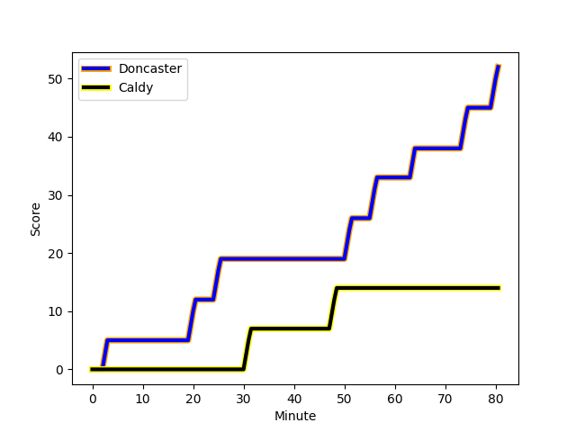
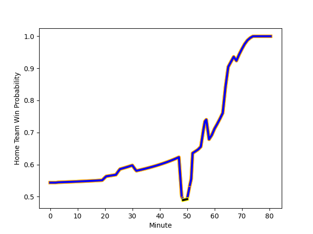

---  
layout: page  
title: Caldy at Doncaster; 14-52  
date: 2022-12-26 15:30:00 18:00:00 -0500  
categories: match review  
---
# Caldy (1347.09) at Doncaster (1423.0); 14-52

# Prediction: Doncaster by 14.6

Doncaster by 7.6 on a neutral field
## Scores over Time

## Win Probability over Time

# Pre-Match Prediction: Doncaster by 15.1

Doncaster by 8.1 on a neutral pitch

|   Away Minutes | Away Player                                                      |   Away elo |   Away Percentile |   Number |   Home Percentile |   Home elo | Home Player                                                         |   Home Minutes |
|---------------:|:-----------------------------------------------------------------|-----------:|------------------:|---------:|------------------:|-----------:|:--------------------------------------------------------------------|---------------:|
|             59 | [Nathan Rushton](playerfiles//NathanRushton_cleaned.md)          |      91.56 |                28 |        1 |                16 |      87.84 | [Ben Carlile](playerfiles//BenCarlile_cleaned.md)                   |             48 |
|             65 | [Oliver Hearn](playerfiles//OliverHearn_cleaned.md)              |      90.06 |                23 |        2 |                32 |      91.83 | [George Roberts](playerfiles//GeorgeRoberts_cleaned.md)             |             60 |
|             40 | [Andy Darlington](playerfiles//AndyDarlington_cleaned.md)        |      70.27 |                 0 |        3 |                67 |      99.54 | [Jake Armstrong](playerfiles//JakeArmstrong_cleaned.md)             |             60 |
|             65 | [Sam Dickinson](playerfiles//SamDickinson_cleaned.md)            |     102.83 |                75 |        4 |                 1 |      70.21 | [Ehize Ehizode](playerfiles//EhizeEhizode_cleaned.md)               |             80 |
|             80 | [Thomas Sanders](playerfiles//ThomasSanders_cleaned.md)          |      87.72 |                20 |        5 |                57 |      98.24 | [Evan Mintern](playerfiles//EvanMintern_cleaned.md)                 |             80 |
|             55 | [Martin Gerrard](playerfiles//MartinGerrard_cleaned.md)          |      97.36 |                57 |        6 |                52 |      95.9  | [Ben Murphy](playerfiles//BenMurphy_cleaned.md)                     |             80 |
|             80 | [Rouben Birch](playerfiles//RoubenBirch_cleaned.md)              |      77.01 |               nan |        7 |                22 |      88.63 | [Thom Smith](playerfiles//ThomSmith_cleaned.md)                     |             58 |
|             80 | [Josiah Dickinson](playerfiles//JosiahDickinson_cleaned.md)      |      88.31 |                21 |        8 |                74 |     104.21 | [John Kelly](playerfiles//JohnKelly_cleaned.md)                     |             70 |
|             59 | [Anerin (Nye) Thomas](playerfiles//Anerin(Nye)Thomas_cleaned.md) |      96.72 |                47 |        9 |                83 |     106.85 | [Alex Dolly](playerfiles//AlexDolly_cleaned.md)                     |             65 |
|             59 | [Ezra Hinchcliffe](playerfiles//EzraHinchcliffe_cleaned.md)      |      92.14 |                31 |       10 |                35 |      92.72 | [Sam Olver](playerfiles//SamOlver_cleaned.md)                       |             80 |
|             52 | [Benjamin Jones](playerfiles//BenjaminJones_cleaned.md)          |      90.33 |                26 |       11 |                94 |     117.75 | [Maliq Holden](playerfiles//MaliqHolden_cleaned.md)                 |             80 |
|             80 | [Michael Cartmill](playerfiles//MichaelCartmill_cleaned.md)      |      90.35 |                27 |       12 |                34 |      91.72 | [Connor Edwards](playerfiles//ConnorEdwards_cleaned.md)             |             68 |
|             80 | [Dan Bibby](playerfiles//DanBibby_cleaned.md)                    |      87.93 |                20 |       13 |                49 |      95.53 | [Joe Margetts](playerfiles//JoeMargetts_cleaned.md)                 |             80 |
|             80 | [Nick Royle](playerfiles//NickRoyle_cleaned.md)                  |      88.88 |                20 |       14 |                44 |      91.79 | [George Simpson](playerfiles//GeorgeSimpson_cleaned.md)             |             80 |
|             80 | [Elliott Gourlay](playerfiles//ElliottGourlay_cleaned.md)        |      92.48 |                39 |       15 |                65 |     100.33 | [Billy McBryde](playerfiles//BillyMcBryde_cleaned.md)               |             48 |
|             40 | [William Sanderson](playerfiles//WilliamSanderson_cleaned.md)    |      94.16 |               nan |       16 |               nan |      96.48 | [James Wayland](playerfiles//JamesWayland_cleaned.md)               |             32 |
|             28 | [Michael Barlow](playerfiles//MichaelBarlow_cleaned.md)          |      91.95 |                35 |       17 |               nan |      73.41 | [Robbie Smith](playerfiles//RobbieSmith_cleaned.md)                 |             32 |
|             25 | [Harrison Crowe](playerfiles//HarrisonCrowe_cleaned.md)          |      85.41 |                13 |       18 |                51 |      94.93 | [Martin Molina](playerfiles//MartinMolina_cleaned.md)               |             22 |
|             21 | [Joseph Murray](playerfiles//JosephMurray_cleaned.md)            |      90.53 |                28 |       19 |                60 |      95.78 | [Mak Wilson](playerfiles//MakWilson_cleaned.md)                     |             20 |
|             21 | [Rhys Hayes](playerfiles//RhysHayes_cleaned.md)                  |      86.99 |                25 |       20 |                50 |      91.3  | [Will Holling](playerfiles//WillHolling_cleaned.md)                 |             20 |
|             21 | [James Harper](playerfiles//JamesHarper_cleaned.md)              |      88.92 |               nan |       21 |                36 |      95.1  | [Joe Green](playerfiles//JoeGreen_cleaned.md)                       |             15 |
|             15 | [Thomas Clarke](playerfiles//ThomasClarke_cleaned.md)            |      94.08 |               nan |       22 |               nan |      95.14 | [Alexander Lloyd-Seed](playerfiles//AlexanderLloyd-Seed_cleaned.md) |             12 |
|             15 | [Callum Ridgway](playerfiles//CallumRidgway_cleaned.md)          |      88.36 |                20 |       23 |                27 |      90.34 | [Jared Cardew](playerfiles//JaredCardew_cleaned.md)                 |             10 |

