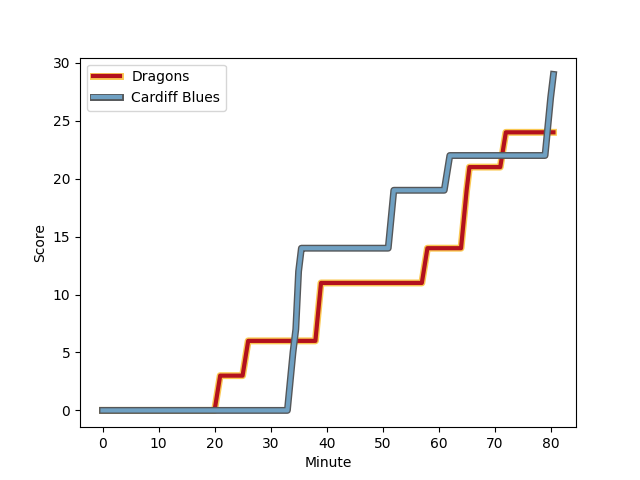
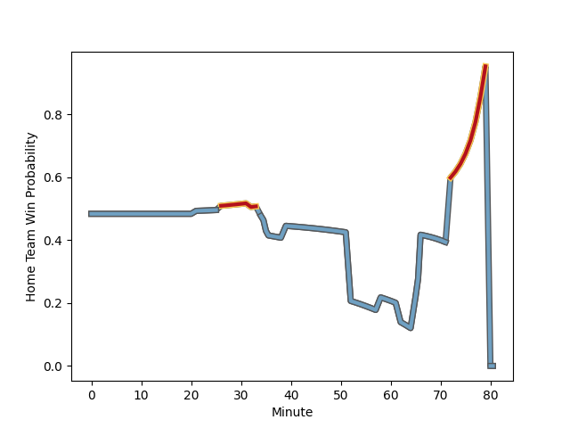

---  
layout: page  
title: Cardiff Blues at Dragons; 29-24  
date: 2022-12-26 15:15:00 18:00:00 -0500  
categories: match review  
---
# Cardiff Blues (1490.06) at Dragons (1461.29); 29-24

# Prediction: Dragons by 0.1

Cardiff Blues by 2.9 on a neutral field
## Scores over Time

## Win Probability over Time

# Pre-Match Prediction: Cardiff Blues by 2.0

Cardiff Blues by 5.0 on a neutral pitch

|   Away Minutes | Away Player                                                           |   Away elo |   Away Percentile |   Number |   Home Percentile |   Home elo | Home Player                                                       |   Home Minutes |
|---------------:|:----------------------------------------------------------------------|-----------:|------------------:|---------:|------------------:|-----------:|:------------------------------------------------------------------|---------------:|
|             66 | [Rhys Carré](..//playerfiles//RhysCarré_cleaned.md)                   |      90.71 |                24 |        1 |                22 |      90.17 | [Rhodri Jones](..//playerfiles//RhodriJones_cleaned.md)           |             52 |
|             80 | [Liam Belcher](..//playerfiles//LiamBelcher_cleaned.md)               |      90.12 |                19 |        2 |                45 |      93.92 | [Bradley Roberts](..//playerfiles//BradleyRoberts_cleaned.md)     |             80 |
|             40 | [Dimitri Arhip](..//playerfiles//DimitriArhip_cleaned.md)             |      97.61 |                59 |        3 |                44 |      94.66 | [Chris Coleman](..//playerfiles//ChrisColeman_cleaned.md)         |             52 |
|             80 | [Lopeti Timani](..//playerfiles//LopetiTimani_cleaned.md)             |      94.3  |                46 |        4 |                15 |      85.47 | [Joseph Davies](..//playerfiles//JosephDavies_cleaned.md)         |             57 |
|             57 | [Rory Thornton](..//playerfiles//RoryThornton_cleaned.md)             |      86.31 |                17 |        5 |                10 |      83.9  | [George Nott](..//playerfiles//GeorgeNott_cleaned.md)             |             80 |
|             80 | [Josh Turnbull](..//playerfiles//JoshTurnbull_cleaned.md)             |      98    |                60 |        6 |                72 |     103.23 | [Aaron Wainwright](..//playerfiles//AaronWainwright_cleaned.md)   |             80 |
|             66 | [Thomas Young](..//playerfiles//ThomasYoung_cleaned.md)               |     109.83 |                88 |        7 |                 2 |      73.36 | [Harrison Keddie](..//playerfiles//HarrisonKeddie_cleaned.md)     |             71 |
|             80 | [Taulupe Faletau](..//playerfiles//TaulupeFaletau_cleaned.md)         |      97.21 |                52 |        8 |                85 |     109.1  | [Ross Moriarty](..//playerfiles//RossMoriarty_cleaned.md)         |             80 |
|             80 | [Tomos Williams](..//playerfiles//TomosWilliams_cleaned.md)           |     113.1  |                91 |        9 |                86 |     108.82 | [Rhodri Williams](..//playerfiles//RhodriWilliams_cleaned.md)     |             74 |
|             32 | [Rhys Priestland](..//playerfiles//RhysPriestland_cleaned.md)         |      94.44 |                43 |       10 |                96 |     125.83 | [JJ Hanrahan](..//playerfiles//JJHanrahan_cleaned.md)             |             80 |
|             66 | [Theo Cabango](..//playerfiles//TheoCabango_cleaned.md)               |     103.24 |                72 |       11 |                64 |      99.07 | [Ashton Hewitt](..//playerfiles//AshtonHewitt_cleaned.md)         |             80 |
|             80 | [Ben Thomas](..//playerfiles//BenThomas_cleaned.md)                   |      96.28 |                51 |       12 |                90 |     113.48 | [Jack Dixon](..//playerfiles//JackDixon_cleaned.md)               |             60 |
|             80 | [Rey Lee-Lo](..//playerfiles//ReyLee-Lo_cleaned.md)                   |     136.31 |                99 |       13 |                98 |     127    | [Steffan Hughes](..//playerfiles//SteffanHughes_cleaned.md)       |             80 |
|             80 | [Owen Lane](..//playerfiles//OwenLane_cleaned.md)                     |      70.73 |                 2 |       14 |                 1 |      69.42 | [Rio Dyer](..//playerfiles//RioDyer_cleaned.md)                   |             80 |
|             55 | [Josh Adams](..//playerfiles//JoshAdams_cleaned.md)                   |     103.86 |                79 |       15 |                19 |      86.18 | [Angus O'Brien](..//playerfiles//AngusO'Brien_cleaned.md)         |             80 |
|             48 | [Jarrod Evans](..//playerfiles//JarrodEvans_cleaned.md)               |     109.34 |                83 |       16 |                59 |      97.63 | [Aki Seiuli](..//playerfiles//AkiSeiuli_cleaned.md)               |             28 |
|             40 | [William Davies-King](..//playerfiles//WilliamDavies-King_cleaned.md) |      96.9  |               nan |       17 |                12 |      85.75 | [Lloyd Fairbrother](..//playerfiles//LloydFairbrother_cleaned.md) |             28 |
|             25 | [Mason Grady](..//playerfiles//MasonGrady_cleaned.md)                 |      89.83 |                19 |       18 |                 8 |      79.96 | [Matthew Screech](..//playerfiles//MatthewScreech_cleaned.md)     |             23 |
|             23 | [Seb Davies](..//playerfiles//SebDavies_cleaned.md)                   |      96.77 |                56 |       19 |                84 |     109.45 | [Sio Tomkinson](..//playerfiles//SioTomkinson_cleaned.md)         |             20 |
|             14 | [Ellis Jenkins](..//playerfiles//EllisJenkins_cleaned.md)             |     107.67 |                84 |       20 |                24 |      89.48 | [Sean Lonsdale](..//playerfiles//SeanLonsdale_cleaned.md)         |              9 |
|             14 | [Lloyd Williams](..//playerfiles//LloydWilliams_cleaned.md)           |     111.97 |                90 |       21 |                40 |      95.11 | [Lewis Jones](..//playerfiles//LewisJones_cleaned.md)             |              6 |
|             14 | [Corey Domachowski](..//playerfiles//CoreyDomachowski_cleaned.md)     |      88.69 |                24 |       22 |               nan |     nan    | nan                                                               |            nan |

