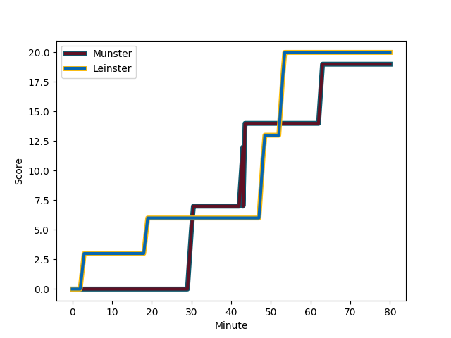
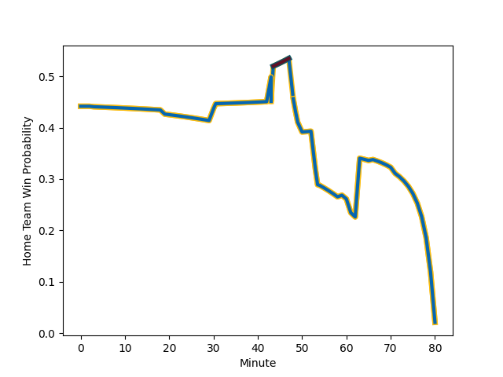

---  
layout: page  
title: Leinster at Munster; 20-19  
date: 2022-12-26 20:35:00 18:00:00 -0500  
categories: match review  
---
# Leinster (1686.44) at Munster (1588.73); 20-19

# Prediction: Leinster by 6.8

Leinster by 9.8 on a neutral field
## Scores over Time

## Win Probability over Time

# Pre-Match Prediction: Leinster by 2.2

Leinster by 0.8 on a neutral pitch

|   Away Minutes | Away Player                                                 |   Away elo |   Away Percentile |   Number |   Home Percentile |   Home elo | Home Player                                                     |   Home Minutes |
|---------------:|:------------------------------------------------------------|-----------:|------------------:|---------:|------------------:|-----------:|:----------------------------------------------------------------|---------------:|
|             80 | [Andrew Porter](..//playerfiles//AndrewPorter_cleaned.md)   |     102.06 |                76 |        1 |                98 |     121.39 | [Dave Kilcoyne](..//playerfiles//DaveKilcoyne_cleaned.md)       |             61 |
|             80 | [Dan Sheehan](..//playerfiles//DanSheehan_cleaned.md)       |     101.46 |                73 |        2 |                78 |     102.67 | [Niall Scannell](..//playerfiles//NiallScannell_cleaned.md)     |             59 |
|             59 | [Cian Healy](..//playerfiles//CianHealy_cleaned.md)         |     118.65 |                97 |        3 |                78 |     102.77 | [John Ryan](..//playerfiles//JohnRyan_cleaned.md)               |             61 |
|             49 | [Ryan Baird](..//playerfiles//RyanBaird_cleaned.md)         |     109.39 |                87 |        4 |                80 |     104.44 | [Jean Kleyn](..//playerfiles//JeanKleyn_cleaned.md)             |             71 |
|             80 | [Joe McCarthy](..//playerfiles//JoeMcCarthy_cleaned.md)     |     102.2  |                72 |        5 |                93 |     117.09 | [Tadhg Beirne](..//playerfiles//TadhgBeirne_cleaned.md)         |             80 |
|             54 | [Rhys Ruddock](..//playerfiles//RhysRuddock_cleaned.md)     |     129.24 |                98 |        6 |                90 |     111.2  | [Jack O'Donoghue](..//playerfiles//JackO'Donoghue_cleaned.md)   |             80 |
|             80 | [Scott Penny](..//playerfiles//ScottPenny_cleaned.md)       |     105.55 |                81 |        7 |                11 |      84.75 | [Peter O'Mahony](..//playerfiles//PeterO'Mahony_cleaned.md)     |             66 |
|             80 | [Max Deegan](..//playerfiles//MaxDeegan_cleaned.md)         |     111.15 |                86 |        8 |                86 |     111.64 | [Gavin Coombes](..//playerfiles//GavinCoombes_cleaned.md)       |             80 |
|             48 | [Nick McCarthy](..//playerfiles//NickMcCarthy_cleaned.md)   |      94.9  |                44 |        9 |                99 |     130.3  | [Conor Murray](..//playerfiles//ConorMurray_cleaned.md)         |             50 |
|             80 | [Ross Byrne](..//playerfiles//RossByrne_cleaned.md)         |     108.61 |                82 |       10 |                40 |      93.97 | [Joey Carbery](..//playerfiles//JoeyCarbery_cleaned.md)         |             80 |
|             80 | [James Lowe](..//playerfiles//JamesLowe_cleaned.md)         |     158.15 |               100 |       11 |                86 |     108.28 | [Keith Earls](..//playerfiles//KeithEarls_cleaned.md)           |             59 |
|             80 | [Jamie Osborne](..//playerfiles//JamieOsborne_cleaned.md)   |     101.39 |                67 |       12 |                74 |     103.63 | [Jack Crowley](..//playerfiles//JackCrowley_cleaned.md)         |             80 |
|             80 | [Garry Ringrose](..//playerfiles//GarryRingrose_cleaned.md) |     106.62 |                80 |       13 |                61 |      99.01 | [Antoine Frisch](..//playerfiles//AntoineFrisch_cleaned.md)     |             80 |
|             80 | [Jordan Larmour](..//playerfiles//JordanLarmour_cleaned.md) |     105.94 |                81 |       14 |                93 |     116.74 | [Calvin Nash](..//playerfiles//CalvinNash_cleaned.md)           |             80 |
|             80 | [Hugo Keenan](..//playerfiles//HugoKeenan_cleaned.md)       |     120.18 |                93 |       15 |                66 |     100.68 | [Jack Daly](..//playerfiles//JackDaly_cleaned.md)               |             80 |
|             32 | [Luke McGrath](..//playerfiles//LukeMcGrath_cleaned.md)     |     115.84 |                94 |       16 |                74 |     101.97 | [Craig Casey](..//playerfiles//CraigCasey_cleaned.md)           |             30 |
|             31 | [Ross Molony](..//playerfiles//RossMolony_cleaned.md)       |     134.54 |                98 |       17 |                89 |     109.9  | [Diarmuid Barron](..//playerfiles//DiarmuidBarron_cleaned.md)   |             21 |
|             26 | [Jack Conan](..//playerfiles//JackConan_cleaned.md)         |     124.98 |                95 |       18 |                29 |      93.44 | [Patrick Campbell](..//playerfiles//PatrickCampbell_cleaned.md) |             21 |
|             21 | [Vakh Abdaladze](..//playerfiles//VakhAbdaladze_cleaned.md) |      96.53 |               nan |       19 |                43 |      94.6  | [Fineen Wycherley](..//playerfiles//FineenWycherley_cleaned.md) |             19 |
|            nan | nan                                                         |     nan    |               nan |       20 |                43 |      95.42 | [Roman Salanoa](..//playerfiles//RomanSalanoa_cleaned.md)       |             19 |
|            nan | nan                                                         |     nan    |               nan |       21 |                44 |      94.15 | [Kiran McDonald](..//playerfiles//KiranMcDonald_cleaned.md)     |              9 |
|            nan | nan                                                         |     nan    |               nan |       22 |                44 |      96.56 | [Alex Kendellen](..//playerfiles//AlexKendellen_cleaned.md)     |             14 |

