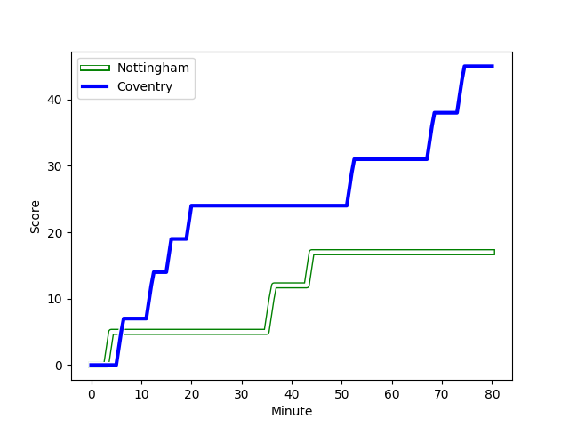
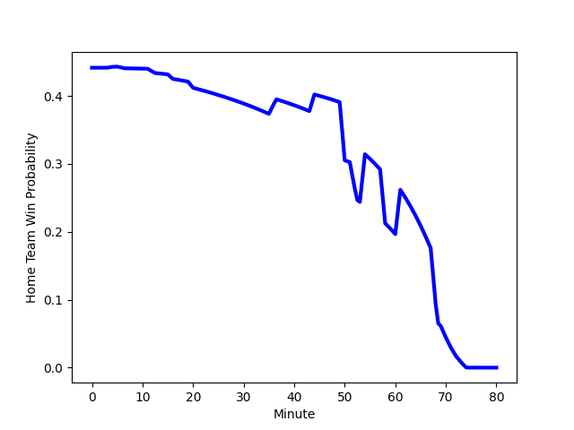

---  
layout: page  
title: Coventry at Nottingham; 45-17  
date: 2022-12-26 16:00:00 18:00:00 -0500  
categories: match review  
---
# Coventry (1538.5) at Nottingham (1437.96); 45-17

# Prediction: Coventry by 3.1

Coventry by 10.1 on a neutral field
## Scores over Time

## Win Probability over Time

# Pre-Match Prediction: Coventry by 1.6

Coventry by 8.6 on a neutral pitch

|   Away Minutes | Away Player                                                           |   Away elo |   Away Percentile |   Number |   Home Percentile |   Home elo | Home Player                                                                 |   Home Minutes |
|---------------:|:----------------------------------------------------------------------|-----------:|------------------:|---------:|------------------:|-----------:|:----------------------------------------------------------------------------|---------------:|
|             61 | [Toby Trinder](playerfiles//TobyTrinder_cleaned.md)                   |      94.65 |                44 |        1 |                81 |     103.9  | [Dan Richardson](playerfiles//DanRichardson_cleaned.md)                     |             59 |
|             59 | [Jordon Poole](playerfiles//JordonPoole_cleaned.md)                   |     104.09 |                82 |        2 |                61 |      97.48 | [Harry Clayton](playerfiles//HarryClayton_cleaned.md)                       |             59 |
|             54 | [Harry Seward](playerfiles//HarrySeward_cleaned.md)                   |     107.44 |                87 |        3 |                31 |      92.1  | [Xavier Valentine](playerfiles//XavierValentine_cleaned.md)                 |             52 |
|             80 | [James Tyas](playerfiles//JamesTyas_cleaned.md)                       |      89.07 |                23 |        4 |                77 |     103.23 | [Thomas Manz](playerfiles//ThomasManz_cleaned.md)                           |             80 |
|             80 | [Adam Peters](playerfiles//AdamPeters_cleaned.md)                     |     101.99 |                73 |        5 |                76 |     103.49 | [Iosefa Danny Wayne Fiaola](playerfiles//IosefaDannyWayneFiaola_cleaned.md) |             50 |
|             42 | [Thomas Dodd](playerfiles//ThomasDodd_cleaned.md)                     |     115.42 |                93 |        6 |                 8 |      82.12 | [Scott Hall](playerfiles//ScottHall_cleaned.md)                             |             50 |
|             80 | [Josh Bainbridge](playerfiles//JoshBainbridge_cleaned.md)             |     106.32 |                82 |        7 |                81 |     105.75 | [Nathan Tweedy](playerfiles//NathanTweedy_cleaned.md)                       |             80 |
|             61 | [Senitiki Nayalo](playerfiles//SenitikiNayalo_cleaned.md)             |     103.06 |                71 |        8 |                75 |     104.41 | [Josh Poullet](playerfiles//JoshPoullet_cleaned.md)                         |             80 |
|             69 | [Will Chudley](playerfiles//WillChudley_cleaned.md)                   |     131.6  |                99 |        9 |                15 |      87.61 | [Micheal Stronge](playerfiles//MichealStronge_cleaned.md)                   |             58 |
|             80 | [Patrick Pellegrini](playerfiles//PatrickPellegrini_cleaned.md)       |     104.78 |                75 |       10 |                27 |      90.78 | [Morgan Bunting](playerfiles//MorganBunting_cleaned.md)                     |             80 |
|             59 | [James Martin](playerfiles//JamesMartin_cleaned.md)                   |      93.93 |                44 |       11 |                37 |      92.72 | [Harry Graham](playerfiles//HarryGraham_cleaned.md)                         |             50 |
|             80 | [Will Rigg](playerfiles//WillRigg_cleaned.md)                         |     102.69 |                72 |       12 |                54 |      97.23 | [Jack Neville](playerfiles//JackNeville_cleaned.md)                         |             80 |
|             80 | [Will Wand](playerfiles//WillWand_cleaned.md)                         |      97.04 |                54 |       13 |                45 |      93.87 | [Marcus Alexander Ramage](playerfiles//MarcusAlexanderRamage_cleaned.md)    |             67 |
|             80 | [William Talbot-Davies](playerfiles//WilliamTalbot-Davies_cleaned.md) |      98.32 |                62 |       14 |                13 |      85.32 | [David Williams](playerfiles//DavidWilliams_cleaned.md)                     |             80 |
|             80 | [Louis Brown](playerfiles//LouisBrown_cleaned.md)                     |     107.84 |                81 |       15 |                64 |      98.97 | [Ryan Olowofela](playerfiles//RyanOlowofela_cleaned.md)                     |             80 |
|             38 | [Tom Ball](playerfiles//TomBall_cleaned.md)                           |     101.1  |                62 |       16 |                79 |     102.13 | [George Cox](playerfiles//GeorgeCox_cleaned.md)                             |             30 |
|             26 | [Ollie Andrews](playerfiles//OllieAndrews_cleaned.md)                 |      97.18 |                56 |       17 |                36 |      91.98 | [Lewis Chessum](playerfiles//LewisChessum_cleaned.md)                       |             30 |
|             21 | [Suva Ma'asi](playerfiles//SuvaMa'asi_cleaned.md)                     |     101.66 |                73 |       18 |                 4 |      76.61 | [Javiah Pohe](playerfiles//JaviahPohe_cleaned.md)                           |             30 |
|             21 | [Louis James](playerfiles//LouisJames_cleaned.md)                     |      82.84 |                 8 |       19 |                48 |      94.62 | [Ben Betts](playerfiles//BenBetts_cleaned.md)                               |             28 |
|             19 | [Danny Southworth](playerfiles//DannySouthworth_cleaned.md)           |      96.11 |               nan |       20 |                23 |      90.71 | [Sam Edwards](playerfiles//SamEdwards_cleaned.md)                           |             22 |
|             19 | [T.Rhys Thomas](playerfiles//T.RhysThomas_cleaned.md)                 |      95.81 |               nan |       21 |                59 |      97.77 | [Aniseko Sio](playerfiles//AnisekoSio_cleaned.md)                           |             21 |
|             11 | [Will Lane](playerfiles//WillLane_cleaned.md)                         |      97.43 |                49 |       22 |                79 |     103.24 | [Jack Dickinson](playerfiles//JackDickinson_cleaned.md)                     |             21 |
|            nan | nan                                                                   |     nan    |               nan |       23 |               nan |      95    | [Michael Green](playerfiles//MichaelGreen_cleaned.md)                       |             13 |

