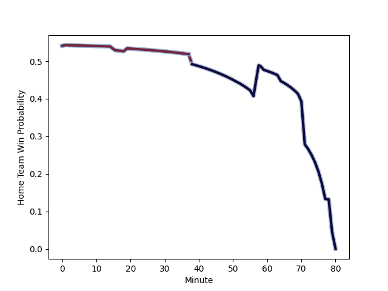

---  
layout: page  
title: Bristol Rugby at Harlequins; 15-12  
date: 2022-12-27 11:15:00 18:00:00 -0500  
categories: match review  
---
# Bristol Rugby (1506.58) at Harlequins (1578.32); 15-12

# Prediction: Harlequins by 10.2

Harlequins by 7.2 on a neutral field
## Scores over Time

## Win Probability over Time

# Pre-Match Prediction: Harlequins by 9.2

Harlequins by 6.2 on a neutral pitch

|   Away Minutes | Away Player                                                   |   Away elo |   Away Percentile |   Number |   Home Percentile |   Home elo | Home Player                                                       |   Home Minutes |
|---------------:|:--------------------------------------------------------------|-----------:|------------------:|---------:|------------------:|-----------:|:------------------------------------------------------------------|---------------:|
|             80 | [Yann Thomas](..//playerfiles//YannThomas_cleaned.md)         |      99.66 |                73 |        1 |                85 |     106.11 | [Joe Marler](..//playerfiles//JoeMarler_cleaned.md)               |             80 |
|             80 | [Harry Thacker](..//playerfiles//HarryThacker_cleaned.md)     |      97.4  |                60 |        2 |                83 |     104.41 | [Jack Walker](..//playerfiles//JackWalker_cleaned.md)             |             80 |
|             80 | [Max Lahiff](..//playerfiles//MaxLahiff_cleaned.md)           |      86.12 |                15 |        3 |                97 |     118.16 | [Wilco Louw](..//playerfiles//WilcoLouw_cleaned.md)               |             80 |
|             80 | [Joe Batley](..//playerfiles//JoeBatley_cleaned.md)           |     102.6  |                74 |        4 |                21 |      88.23 | [George Hammond](..//playerfiles//GeorgeHammond_cleaned.md)       |             80 |
|             80 | [Chris Vui](..//playerfiles//ChrisVui_cleaned.md)             |     109.51 |                88 |        5 |                85 |     107.89 | [Irne Herbst](..//playerfiles//IrneHerbst_cleaned.md)             |             80 |
|             80 | [Steven Luatua](..//playerfiles//StevenLuatua_cleaned.md)     |     117.81 |                95 |        6 |                73 |     104.25 | [Archie White](..//playerfiles//ArchieWhite_cleaned.md)           |             80 |
|             80 | [Jake Heenan](..//playerfiles//JakeHeenan_cleaned.md)         |      83.33 |                 9 |        7 |                26 |      89.96 | [Will Evans](..//playerfiles//WillEvans_cleaned.md)               |             80 |
|             80 | [Magnus Bradbury](..//playerfiles//MagnusBradbury_cleaned.md) |      88.13 |                21 |        8 |                91 |     117.64 | [Alex Dombrandt](..//playerfiles//AlexDombrandt_cleaned.md)       |             80 |
|             80 | [Andy Uren](..//playerfiles//AndyUren_cleaned.md)             |      78.77 |                 5 |        9 |                97 |     124.61 | [Danny Care](..//playerfiles//DannyCare_cleaned.md)               |             80 |
|             80 | [AJ MacGinty](..//playerfiles//AJMacGinty_cleaned.md)         |     102.24 |                69 |       10 |                72 |     103.39 | [Tommaso Allan](..//playerfiles//TommasoAllan_cleaned.md)         |             80 |
|             80 | [Gabriel Ibitoye](..//playerfiles//GabrielIbitoye_cleaned.md) |      99.87 |                67 |       11 |                93 |     117.26 | [Josh Bassett](..//playerfiles//JoshBassett_cleaned.md)           |             80 |
|             80 | [Sam Bedlow](..//playerfiles//SamBedlow_cleaned.md)           |      94.45 |                45 |       12 |                68 |     101.67 | [Andre Esterhuizen](..//playerfiles//AndreEsterhuizen_cleaned.md) |             80 |
|             80 | [Semi Radradra](..//playerfiles//SemiRadradra_cleaned.md)     |     112.84 |                89 |       13 |                74 |     103.59 | [Joe Marchant](..//playerfiles//JoeMarchant_cleaned.md)           |             80 |
|             80 | [Luke Morahan](..//playerfiles//LukeMorahan_cleaned.md)       |     141.07 |                99 |       14 |                34 |      92.12 | [Cadan Murley](..//playerfiles//CadanMurley_cleaned.md)           |             80 |
|             80 | [Richard Lane](..//playerfiles//RichardLane_cleaned.md)       |      92.79 |                37 |       15 |                60 |      99.03 | [Nick David](..//playerfiles//NickDavid_cleaned.md)               |             80 |
|              0 | [Jake Kerr](..//playerfiles//JakeKerr_cleaned.md)             |      85.77 |                13 |       16 |                31 |      91.45 | [George Head](..//playerfiles//GeorgeHead_cleaned.md)             |              0 |
|              0 | [Jake Woolmore](..//playerfiles//JakeWoolmore_cleaned.md)     |     107.03 |                86 |       17 |                28 |      91.52 | [Fin Baxter](..//playerfiles//FinBaxter_cleaned.md)               |              0 |
|              0 | [Jay Tyack](..//playerfiles//JayTyack_cleaned.md)             |     106.2  |                85 |       18 |                66 |      99    | [Simon Kerrod](..//playerfiles//SimonKerrod_cleaned.md)           |              0 |
|              0 | [Elliott Stooke](..//playerfiles//ElliottStooke_cleaned.md)   |     105.72 |                82 |       19 |                48 |      94.57 | [Charlie Matthews](..//playerfiles//CharlieMatthews_cleaned.md)   |              0 |
|              0 | [Daniel Thomas](..//playerfiles//DanielThomas_cleaned.md)     |     104.68 |                78 |       20 |                44 |      93.14 | [Tom Lawday](..//playerfiles//TomLawday_cleaned.md)               |              0 |
|              0 | [Tom Whiteley](..//playerfiles//TomWhiteley_cleaned.md)       |      99.03 |                63 |       21 |                60 |      97.48 | [Lewis Gjaltema](..//playerfiles//LewisGjaltema_cleaned.md)       |              0 |
|              0 | [Piers O'Conor](..//playerfiles//PiersO'Conor_cleaned.md)     |      87.16 |                19 |       22 |                84 |     109.43 | [Will Edwards](..//playerfiles//WillEdwards_cleaned.md)           |              0 |
|              0 | [Ioan Lloyd](..//playerfiles//IoanLloyd_cleaned.md)           |      87.23 |                18 |       23 |                69 |     101.92 | [Oscar Beard](..//playerfiles//OscarBeard_cleaned.md)             |              0 |

