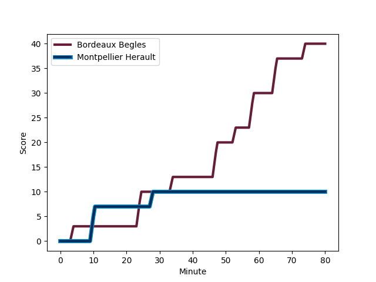
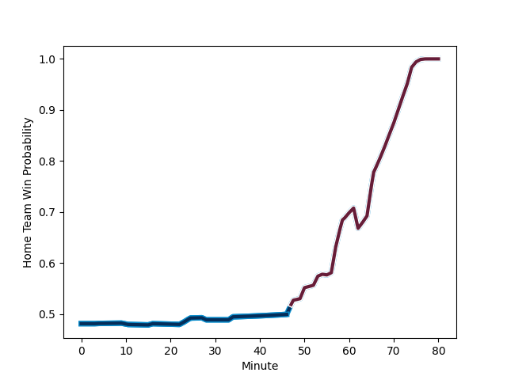

---  
layout: page  
title: Montpellier Herault at Bordeaux Begles; 10-40  
date: 2022-12-30 21:00:00 18:00:00 -0500  
categories: match review  
---
# Montpellier Herault (1579.5) at Bordeaux Begles (1564.4); 10-40

# Prediction: Bordeaux Begles by 1.5

Montpellier Herault by 1.5 on a neutral field
## Scores over Time

## Win Probability over Time

# Pre-Match Prediction: Montpellier Herault by 3.4

Bordeaux Begles by 0.4 on a neutral pitch

|   Away Minutes | Away Player                                                                     |   Away elo |   Away Percentile |   Number |   Home Percentile |   Home elo | Home Player                                                                      |   Home Minutes |
|---------------:|:--------------------------------------------------------------------------------|-----------:|------------------:|---------:|------------------:|-----------:|:---------------------------------------------------------------------------------|---------------:|
|             55 | [Titi Lamositele](..//playerfiles//TitiLamositele_cleaned.md)                   |      95.89 |                46 |        1 |                84 |     105.68 | [Lekso Kaulashvili](..//playerfiles//LeksoKaulashvili_cleaned.md)                |             57 |
|             55 | [Brandon Paenga-Amosa](..//playerfiles//BrandonPaenga-Amosa_cleaned.md)         |      93.88 |                43 |        2 |                28 |      91.8  | [Maxime Lamothe](..//playerfiles//MaximeLamothe_cleaned.md)                      |             62 |
|             57 | [Mohamed Haouas](..//playerfiles//MohamedHaouas_cleaned.md)                     |      94.31 |                42 |        3 |                80 |     103.67 | [Sipili Falatea](..//playerfiles//SipiliFalatea_cleaned.md)                      |             50 |
|             80 | [Yacouba Camara](..//playerfiles//YacoubaCamara_cleaned.md)                     |     116.2  |                93 |        4 |                95 |     119.92 | [Cyril Cazeaux](..//playerfiles//CyrilCazeaux_cleaned.md)                        |             57 |
|             80 | [Paul Willemse](..//playerfiles//PaulWillemse_cleaned.md)                       |     123.93 |                96 |        5 |                94 |     118.82 | [Jandré Marais](..//playerfiles//JandréMarais_cleaned.md)                        |             80 |
|             55 | [Lenni Nouchi](..//playerfiles//LenniNouchi_cleaned.md)                         |      97.04 |                55 |        6 |                51 |      95.96 | [Antoine Miquel](..//playerfiles//AntoineMiquel_cleaned.md)                      |             80 |
|             60 | [Alexandre Becognee](..//playerfiles//AlexandreBecognee_cleaned.md)             |      88.09 |                20 |        7 |                73 |     103.59 | [Bastien Vergnes Taillefer](..//playerfiles//BastienVergnesTaillefer_cleaned.md) |             80 |
|             80 | [Marco Tauleigne](..//playerfiles//MarcoTauleigne_cleaned.md)                   |     104.16 |                78 |        8 |                61 |      99.91 | [Tom Willis](..//playerfiles//TomWillis_cleaned.md)                              |             16 |
|             80 | [Léo Coly](..//playerfiles//LéoColy_cleaned.md)                                 |     105.02 |                80 |        9 |                 6 |      81.13 | [Jules Gimbert](..//playerfiles//JulesGimbert_cleaned.md)                        |             50 |
|             23 | [Paolo Garbisi](..//playerfiles//PaoloGarbisi_cleaned.md)                       |     110.57 |                86 |       10 |                77 |     106.3  | [Matthieu Jalibert](..//playerfiles//MatthieuJalibert_cleaned.md)                |             70 |
|             80 | [Vincent Rattez](..//playerfiles//VincentRattez_cleaned.md)                     |     131.7  |                98 |       11 |                85 |     107.6  | [Santiago Cordero](..//playerfiles//SantiagoCordero_cleaned.md)                  |             80 |
|             60 | [Jan Serfontein](..//playerfiles//JanSerfontein_cleaned.md)                     |     109.13 |                83 |       12 |                67 |     101.28 | [Jean-Baptiste Dubie](..//playerfiles//Jean-BaptisteDubie_cleaned.md)            |             62 |
|             80 | [Pierre Lucas](..//playerfiles//PierreLucas_cleaned.md)                         |      92.94 |                38 |       13 |                65 |     100.59 | [Tani Vili](..//playerfiles//TaniVili_cleaned.md)                                |             80 |
|             80 | [Julien Tisseron](..//playerfiles//JulienTisseron_cleaned.md)                   |     119.39 |                95 |       14 |                37 |      92.6  | [Louis Bielle-Biarrey](..//playerfiles//LouisBielle-Biarrey_cleaned.md)          |             80 |
|             80 | [Anthony Bouthier](..//playerfiles//AnthonyBouthier_cleaned.md)                 |     106.44 |                79 |       15 |                90 |     113.97 | [Romain Buros](..//playerfiles//RomainBuros_cleaned.md)                          |             80 |
|             57 | [Louis Foursans-Bourdette](..//playerfiles//LouisFoursans-Bourdette_cleaned.md) |      91.2  |                28 |       16 |                75 |     102.55 | [Renato Giammarioli](..//playerfiles//RenatoGiammarioli_cleaned.md)              |             64 |
|             25 | [Jeremie Maurouard](..//playerfiles//JeremieMaurouard_cleaned.md)               |      82.97 |                 6 |       17 |                94 |     113.95 | [Vadim Cobilas](..//playerfiles//VadimCobilas_cleaned.md)                        |             30 |
|             25 | [Karl Tu'inukuafe](..//playerfiles//KarlTu'inukuafe_cleaned.md)                 |     104.62 |               nan |       18 |               100 |     140.42 | [Maxime Lucu](..//playerfiles//MaximeLucu_cleaned.md)                            |             30 |
|             25 | [Bastien Chalureau](..//playerfiles//BastienChalureau_cleaned.md)               |     121.6  |                95 |       19 |                69 |     100.81 | [Christopher Vaotoa](..//playerfiles//ChristopherVaotoa_cleaned.md)              |             23 |
|             23 | [Henry Thomas](..//playerfiles//HenryThomas_cleaned.md)                         |      90.64 |                24 |       20 |                12 |      83.86 | [Thomas Jolmes](..//playerfiles//ThomasJolmes_cleaned.md)                        |             23 |
|             20 | [Gabriel Ngandebe](..//playerfiles//GabrielNgandebe_cleaned.md)                 |      96.36 |                53 |       21 |                92 |     110.84 | [Clement Maynadier](..//playerfiles//ClementMaynadier_cleaned.md)                |             18 |
|             20 | [Clément Doumenc](..//playerfiles//ClémentDoumenc_cleaned.md)                   |      95.58 |                47 |       22 |                57 |      97.84 | [Yoram Moefana](..//playerfiles//YoramMoefana_cleaned.md)                        |             18 |
|            nan | nan                                                                             |     nan    |               nan |       23 |                92 |     119.39 | [Zack Holmes](..//playerfiles//ZackHolmes_cleaned.md)                            |             10 |

