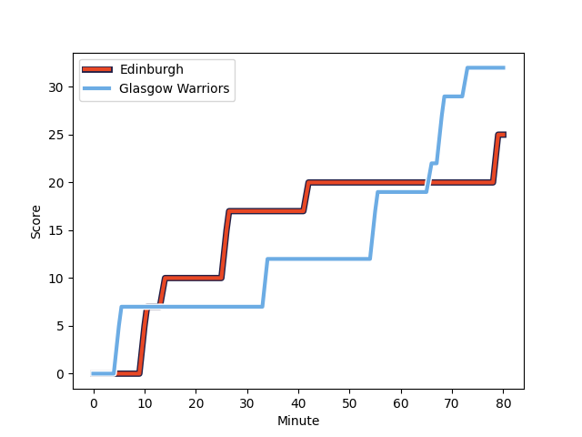
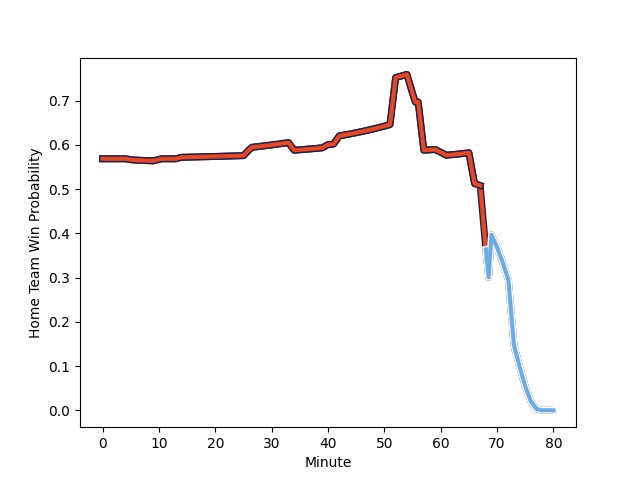

---  
layout: page  
title: Glasgow Warriors at Edinburgh; 32-25  
date: 2022-12-30 20:35:00 18:00:00 -0500  
categories: match review  
---
# Glasgow Warriors (1634.55) at Edinburgh (1747.69); 32-25

# Prediction: Edinburgh by 15.3

Edinburgh by 11.3 on a neutral field
## Scores over Time

## Win Probability over Time

# Pre-Match Prediction: Edinburgh by 13.6

Edinburgh by 9.6 on a neutral pitch

|   Away Minutes | Away Player                                                               |   Away elo |   Away Percentile |   Number |   Home Percentile |   Home elo | Home Player                                                         |   Home Minutes |
|---------------:|:--------------------------------------------------------------------------|-----------:|------------------:|---------:|------------------:|-----------:|:--------------------------------------------------------------------|---------------:|
|             61 | [Jamie Bhatti](..//playerfiles//JamieBhatti_cleaned.md)                   |     114.81 |                86 |        1 |                80 |     109    | [Boan Venter](..//playerfiles//BoanVenter_cleaned.md)               |             51 |
|             52 | [Fraser Brown](..//playerfiles//FraserBrown_cleaned.md)                   |     130.28 |                98 |        2 |                12 |      93.58 | [Tom Cruse](..//playerfiles//TomCruse_cleaned.md)                   |             60 |
|             52 | [Lucio Sordoni](..//playerfiles//LucioSordoni_cleaned.md)                 |     112.9  |                83 |        3 |                98 |     130.43 | [WP Nel](..//playerfiles//WPNel_cleaned.md)                         |             69 |
|             40 | [Sintu Manjezi](..//playerfiles//SintuManjezi_cleaned.md)                 |     103.46 |                50 |        4 |                92 |     123.15 | [Sam Skinner](..//playerfiles//SamSkinner_cleaned.md)               |             60 |
|             61 | [Richie Gray](..//playerfiles//RichieGray_cleaned.md)                     |      99.97 |                34 |        5 |                95 |     131.56 | [Grant Gilchrist](..//playerfiles//GrantGilchrist_cleaned.md)       |             80 |
|             80 | [Matt Fagerson](..//playerfiles//MattFagerson_cleaned.md)                 |     130.77 |                96 |        6 |                98 |     136.96 | [Jamie Ritchie](..//playerfiles//JamieRitchie_cleaned.md)           |             80 |
|             76 | [Sione Vailanu](..//playerfiles//SioneVailanu_cleaned.md)                 |      97.89 |                25 |        7 |                96 |     128.5  | [Luke Crosbie](..//playerfiles//LukeCrosbie_cleaned.md)             |             80 |
|             80 | [Jack Dempsey](..//playerfiles//JackDempsey_cleaned.md)                   |      83.99 |                 3 |        8 |                19 |      94.81 | [Viliame Mata](..//playerfiles//ViliameMata_cleaned.md)             |             57 |
|             61 | [Ali Price](..//playerfiles//AliPrice_cleaned.md)                         |     113.55 |                79 |        9 |                67 |     108.32 | [Henry Pyrgos](..//playerfiles//HenryPyrgos_cleaned.md)             |             69 |
|             80 | [Tom Jordan](..//playerfiles//TomJordan_cleaned.md)                       |      99.47 |                31 |       10 |                98 |     144.03 | [Blair Kinghorn](..//playerfiles//BlairKinghorn_cleaned.md)         |             80 |
|             80 | [Kyle Steyn](..//playerfiles//KyleSteyn_cleaned.md)                       |     111.32 |                77 |       11 |                82 |     114.15 | [Duhan van der Merwe](..//playerfiles//DuhanvanderMerwe_cleaned.md) |             63 |
|             80 | [Stafford McDowall](..//playerfiles//StaffordMcDowall_cleaned.md)         |     119.79 |                87 |       12 |                81 |     115.11 | [James Lang](..//playerfiles//JamesLang_cleaned.md)                 |             71 |
|             80 | [Sione Tuipulotu](..//playerfiles//SioneTuipulotu_cleaned.md)             |      89.42 |                 8 |       13 |                89 |     120.78 | [Mark Bennett](..//playerfiles//MarkBennett_cleaned.md)             |             80 |
|             80 | [Sebastian Cancelliere](..//playerfiles//SebastianCancelliere_cleaned.md) |     126.11 |                94 |       14 |                50 |     103.99 | [Emiliano Boffelli](..//playerfiles//EmilianoBoffelli_cleaned.md)   |             80 |
|             76 | [Ollie Smith](..//playerfiles//OllieSmith_cleaned.md)                     |     101.85 |                44 |       15 |                51 |     104.39 | [Harry Paterson](..//playerfiles//HarryPaterson_cleaned.md)         |             80 |
|             28 | [Simon Berghan](..//playerfiles//SimonBerghan_cleaned.md)                 |      99.23 |                25 |       16 |                 8 |      91.18 | [Pierre Schoeman](..//playerfiles//PierreSchoeman_cleaned.md)       |             29 |
|             40 | [Lewis Bean](..//playerfiles//LewisBean_cleaned.md)                       |     104.25 |                54 |       17 |                52 |     104.29 | [Connor Boyle](..//playerfiles//ConnorBoyle_cleaned.md)             |             23 |
|             28 | [George Turner](..//playerfiles//GeorgeTurner_cleaned.md)                 |     130.19 |                98 |       18 |                30 |      99.35 | [Patrick Harrison](..//playerfiles//PatrickHarrison_cleaned.md)     |             20 |
|             19 | [George Horne](..//playerfiles//GeorgeHorne_cleaned.md)                   |     139.74 |                99 |       19 |                60 |     105.46 | [Marshall Sykes](..//playerfiles//MarshallSykes_cleaned.md)         |             20 |
|             19 | [JP du Preez](..//playerfiles//JPduPreez_cleaned.md)                      |      98.56 |                29 |       20 |                48 |     103.23 | [Charlie Savala](..//playerfiles//CharlieSavala_cleaned.md)         |             17 |
|             19 | [Nathan McBeth](..//playerfiles//NathanMcBeth_cleaned.md)                 |     100.01 |               nan |       21 |                88 |     119.27 | [Charlie Shiel](..//playerfiles//CharlieShiel_cleaned.md)           |             11 |
|              4 | [Domingo Miotti](..//playerfiles//DomingoMiotti_cleaned.md)               |     115.5  |                80 |       22 |                65 |     106.32 | [Angus Williams](..//playerfiles//AngusWilliams_cleaned.md)         |             11 |
|              4 | [Cameron Neild](..//playerfiles//CameronNeild_cleaned.md)                 |     104.55 |                54 |       23 |                76 |     112.99 | [Cameron Hutchison](..//playerfiles//CameronHutchison_cleaned.md)   |              9 |

