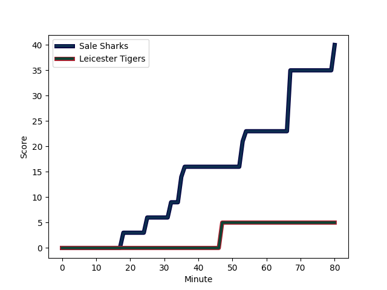
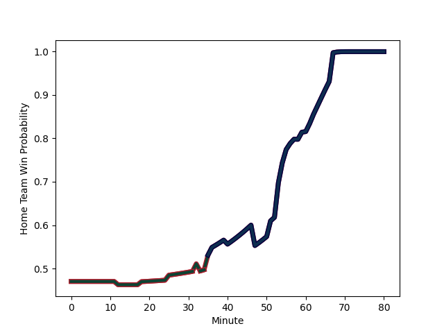

---  
layout: page  
title: Leicester Tigers at Sale Sharks; 5-40  
date: 2022-12-30 14:45:00 18:00:00 -0500  
categories: match review  
---
# Leicester Tigers (1591.45) at Sale Sharks (1546.57); 5-40

# Prediction: Leicester Tigers by 1.5

Leicester Tigers by 4.5 on a neutral field
## Scores over Time

## Win Probability over Time

# Pre-Match Prediction: Leicester Tigers by 0.9

Leicester Tigers by 2.1 on a neutral pitch

|   Away Minutes | Away Player                                                          |   Away elo |   Away Percentile |   Number |   Home Percentile |   Home elo | Home Player                                                         |   Home Minutes |
|---------------:|:---------------------------------------------------------------------|-----------:|------------------:|---------:|------------------:|-----------:|:--------------------------------------------------------------------|---------------:|
|             54 | [James Whitcombe](..//playerfiles//JamesWhitcombe_cleaned.md)        |      96.17 |                51 |        1 |                90 |     108.84 | [Simon McIntyre](..//playerfiles//SimonMcIntyre_cleaned.md)         |             62 |
|             80 | [Charlie Clare](..//playerfiles//CharlieClare_cleaned.md)            |      95.14 |                51 |        2 |                97 |     120.07 | [Akker van der Merwe](..//playerfiles//AkkervanderMerwe_cleaned.md) |             58 |
|             55 | [Dan Cole](..//playerfiles//DanCole_cleaned.md)                      |      95.09 |                46 |        3 |                11 |      85.78 | [Nic Schonert](..//playerfiles//NicSchonert_cleaned.md)             |             57 |
|             69 | [Harry Wells](..//playerfiles//HarryWells_cleaned.md)                |     120.03 |                95 |        4 |                41 |      93.21 | [Cobus Wiese](..//playerfiles//CobusWiese_cleaned.md)               |             80 |
|             80 | [Ollie Chessum](..//playerfiles//OllieChessum_cleaned.md)            |     111.8  |                90 |        5 |                17 |      86.13 | [Jonny Hill](..//playerfiles//JonnyHill_cleaned.md)                 |             68 |
|             80 | [Hanro Liebenberg](..//playerfiles//HanroLiebenberg_cleaned.md)      |     117.04 |                94 |        6 |                76 |     103.04 | [Tom Curry](..//playerfiles//TomCurry_cleaned.md)                   |             80 |
|             80 | [Tommy Reffell](..//playerfiles//TommyReffell_cleaned.md)            |     120.45 |                96 |        7 |                41 |      93.39 | [Ben Curry](..//playerfiles//BenCurry_cleaned.md)                   |             80 |
|             12 | [Olly Cracknell](..//playerfiles//OllyCracknell_cleaned.md)          |      89.48 |                25 |        8 |                97 |     126.1  | [Jean-Luc du Preez](..//playerfiles//Jean-LucduPreez_cleaned.md)    |             57 |
|             80 | [Jack van Poortvliet](..//playerfiles//JackvanPoortvliet_cleaned.md) |     108.87 |                86 |        9 |                14 |      86.34 | [Gus Warr](..//playerfiles//GusWarr_cleaned.md)                     |             57 |
|             51 | [Handre Pollard](..//playerfiles//HandrePollard_cleaned.md)          |     121.69 |                94 |       10 |                 7 |      81.85 | [Robert du Preez](..//playerfiles//RobertduPreez_cleaned.md)        |             80 |
|             80 | [Harry Potter](..//playerfiles//HarryPotter_cleaned.md)              |      97.35 |                57 |       11 |                86 |     108.47 | [Arron Reed](..//playerfiles//ArronReed_cleaned.md)                 |             51 |
|             80 | [Dan Kelly](..//playerfiles//DanKelly_cleaned.md)                    |     121.99 |                96 |       12 |                92 |     115.41 | [Manu Tuilagi](..//playerfiles//ManuTuilagi_cleaned.md)             |             60 |
|             33 | [Guy Porter](..//playerfiles//GuyPorter_cleaned.md)                  |      96.82 |                53 |       13 |                96 |     123.66 | [Sam James](..//playerfiles//SamJames_cleaned.md)                   |             80 |
|             40 | [Anthony Watson](..//playerfiles//AnthonyWatson_cleaned.md)          |      92.62 |                37 |       14 |                93 |     116.19 | [Tom O'Flaherty](..//playerfiles//TomO'Flaherty_cleaned.md)         |             80 |
|             80 | [Freddie Steward](..//playerfiles//FreddieSteward_cleaned.md)        |      90.77 |                33 |       15 |                69 |     102.14 | [Luke James](..//playerfiles//LukeJames_cleaned.md)                 |             80 |
|             25 | [Gabriel Oghre](..//playerfiles//GabrielOghre_cleaned.md)            |      91.65 |                29 |       16 |                39 |      92.94 | [Ewan Ashman](..//playerfiles//EwanAshman_cleaned.md)               |             22 |
|             26 | [Nephi Leatigaga](..//playerfiles//NephiLeatigaga_cleaned.md)        |      91.01 |               nan |       17 |                96 |     116.14 | [Ross Harrison](..//playerfiles//RossHarrison_cleaned.md)           |             18 |
|             25 | [Joe Heyes](..//playerfiles//JoeHeyes_cleaned.md)                    |     100.55 |                71 |       18 |               nan |      97.11 | [James Harper](..//playerfiles//JamesHarper_cleaned.md)             |             23 |
|             11 | [Calum Green](..//playerfiles//CalumGreen_cleaned.md)                |      90.93 |                31 |       19 |                84 |     107.29 | [Josh Beaumont](..//playerfiles//JoshBeaumont_cleaned.md)           |             12 |
|             68 | [Sean Jansen](..//playerfiles//SeanJansen_cleaned.md)                |      94.69 |                43 |       20 |                33 |      91.75 | [Jono Ross](..//playerfiles//JonoRoss_cleaned.md)                   |             23 |
|             29 | [Ben Youngs](..//playerfiles//BenYoungs_cleaned.md)                  |     107.43 |                84 |       21 |               nan |     104.35 | [Joe Simpson](..//playerfiles//JoeSimpson_cleaned.md)               |             23 |
|             15 | [Freddie Burns](..//playerfiles//FreddieBurns_cleaned.md)            |     124.14 |                95 |       22 |               nan |      92.64 | [Tom Curtis](..//playerfiles//TomCurtis_cleaned.md)                 |             20 |
|             47 | [Chris Ashton](..//playerfiles//ChrisAshton_cleaned.md)              |     122.76 |                97 |       23 |                96 |     124.27 | [Byron McGuigan](..//playerfiles//ByronMcGuigan_cleaned.md)         |             29 |

