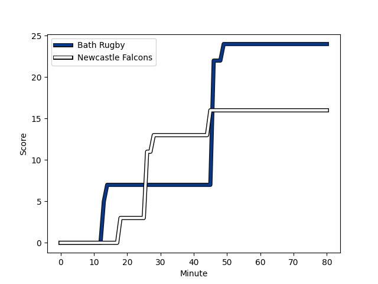
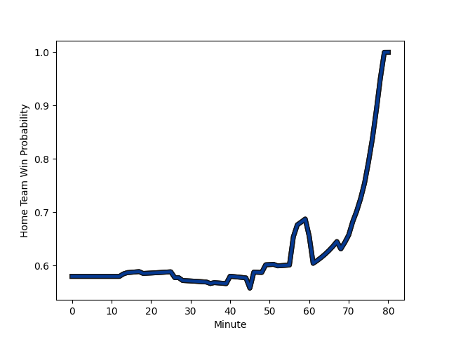

---  
layout: page  
title: Newcastle Falcons at Bath Rugby; 16-24  
date: 2022-12-31 10:00:00 18:00:00 -0500  
categories: match review  
---
# Newcastle Falcons (1328.59) at Bath Rugby (1505.26); 16-24

# Prediction: Bath Rugby by 24.7

Bath Rugby by 17.7 on a neutral field
## Scores over Time

## Win Probability over Time

# Pre-Match Prediction: Bath Rugby by 21.5

Bath Rugby by 14.5 on a neutral pitch

|   Away Minutes | Away Player                                                      |   Away elo |   Away Percentile |   Number |   Home Percentile |   Home elo | Home Player                                                       |   Home Minutes |
|---------------:|:-----------------------------------------------------------------|-----------:|------------------:|---------:|------------------:|-----------:|:------------------------------------------------------------------|---------------:|
|             80 | [Adam Brocklebank](playerfiles//AdamBrocklebank_cleaned.md)      |      83.73 |                 9 |        1 |                37 |      93.26 | [Lewis Boyce](playerfiles//LewisBoyce_cleaned.md)                 |             80 |
|             80 | [Jamie Blamire](playerfiles//JamieBlamire_cleaned.md)            |      96.61 |                57 |        2 |                60 |      96.28 | [Niall Annett](playerfiles//NiallAnnett_cleaned.md)               |             80 |
|             80 | [Trevor Davison](playerfiles//TrevorDavison_cleaned.md)          |      71.97 |                 1 |        3 |                 4 |      80.37 | [D'Arcy Rae](playerfiles//D'ArcyRae_cleaned.md)                   |             80 |
|             80 | [Greg Peterson](playerfiles//GregPeterson_cleaned.md)            |      74.29 |                 3 |        4 |                98 |     129.61 | [Dave Attwood](playerfiles//DaveAttwood_cleaned.md)               |             80 |
|             80 | [Sebastian de Chaves](playerfiles//SebastiandeChaves_cleaned.md) |      90.96 |                31 |        5 |                24 |      89.4  | [Fergus Lee-Warner](playerfiles//FergusLee-Warner_cleaned.md)     |             80 |
|             80 | [Gary Graham](playerfiles//GaryGraham_cleaned.md)                |      87.08 |                17 |        6 |                53 |      96.6  | [Ted Hill](playerfiles//TedHill_cleaned.md)                       |             80 |
|             80 | [Callum Chick](playerfiles//CallumChick_cleaned.md)              |      95.87 |                51 |        7 |                78 |     103.83 | [Sam Underhill](playerfiles//SamUnderhill_cleaned.md)             |             40 |
|             80 | [Carl Fearns](playerfiles//CarlFearns_cleaned.md)                |     106    |                78 |        8 |                25 |      89.57 | [Josh Bayliss](playerfiles//JoshBayliss_cleaned.md)               |             80 |
|             80 | [Sam Stuart](playerfiles//SamStuart_cleaned.md)                  |      70.04 |                 0 |        9 |                59 |      98.02 | [Ben Spencer](playerfiles//BenSpencer_cleaned.md)                 |             80 |
|             80 | [Brett Connon](playerfiles//BrettConnon_cleaned.md)              |      78.62 |                 5 |       10 |                41 |      94.11 | [Orlando Bailey](playerfiles//OrlandoBailey_cleaned.md)           |             80 |
|             80 | [Mateo Carreras](playerfiles//MateoCarreras_cleaned.md)          |      94.56 |                46 |       11 |                86 |     108.76 | [Ruaridh McConnochie](playerfiles//RuaridhMcConnochie_cleaned.md) |             80 |
|             80 | [Tom Penny](playerfiles//TomPenny_cleaned.md)                    |     120.5  |                95 |       12 |                28 |      90.41 | [Max Ojomoh](playerfiles//MaxOjomoh_cleaned.md)                   |             80 |
|             80 | [Matias Orlando](playerfiles//MatiasOrlando_cleaned.md)          |      72.35 |                 2 |       13 |                20 |      88.09 | [Ollie Lawrence](playerfiles//OllieLawrence_cleaned.md)           |             80 |
|             80 | [Ben Stevenson](playerfiles//BenStevenson_cleaned.md)            |      91.17 |                31 |       14 |                72 |     100.99 | [Joe Cokanasiga](playerfiles//JoeCokanasiga_cleaned.md)           |             80 |
|             80 | [Elliott Obatoyinbo](playerfiles//ElliottObatoyinbo_cleaned.md)  |      94.85 |                46 |       15 |                98 |     131.05 | [Matt Gallagher](playerfiles//MattGallagher_cleaned.md)           |             80 |
|              0 | [Ollie Fletcher](playerfiles//OllieFletcher_cleaned.md)          |      95    |               nan |       16 |               nan |      96.32 | [John Stewart](playerfiles//JohnStewart_cleaned.md)               |              0 |
|              0 | [Logovi'i Mulipola](playerfiles//Logovi'iMulipola_cleaned.md)    |     111.63 |                93 |       17 |                14 |      86.51 | [Valery Morozov](playerfiles//ValeryMorozov_cleaned.md)           |              0 |
|              0 | [Richard Palframan](playerfiles//RichardPalframan_cleaned.md)    |      97.27 |                65 |       18 |               nan |      90.59 | [Johannes Jonker](playerfiles//JohannesJonker_cleaned.md)         |              0 |
|              0 | [Matthew Dalton](playerfiles//MatthewDalton_cleaned.md)          |      85.94 |                17 |       19 |                76 |     103.05 | [Will Spencer](playerfiles//WillSpencer_cleaned.md)               |              0 |
|              0 | [Tom Marshall](playerfiles//TomMarshall_cleaned.md)              |      87.49 |               nan |       20 |                93 |     114.99 | [Miles Reid](playerfiles//MilesReid_cleaned.md)                   |              0 |
|              0 | [Michael Young](playerfiles//MichaelYoung_cleaned.md)            |     119.52 |                96 |       21 |                84 |     107.33 | [Louis Schreuder](playerfiles//LouisSchreuder_cleaned.md)         |              0 |
|              0 | [Matias Moroni](playerfiles//MatiasMoroni_cleaned.md)            |     113.61 |                90 |       22 |                89 |     113.19 | [Jonathan Joseph](playerfiles//JonathanJoseph_cleaned.md)         |              0 |
|              0 | [Adam Radwan](playerfiles//AdamRadwan_cleaned.md)                |     119.13 |                95 |       23 |                99 |     133.68 | [Chris Cloete](playerfiles//ChrisCloete_cleaned.md)               |             40 |

