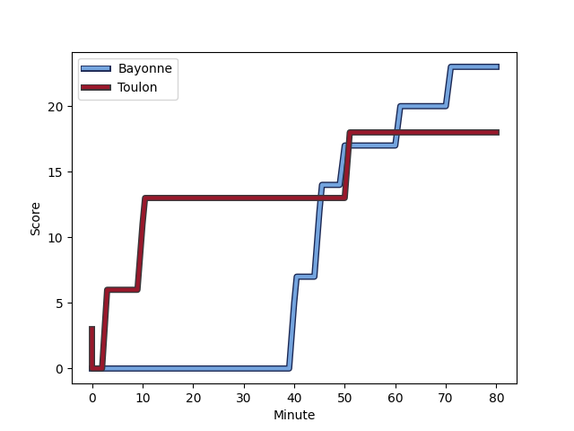
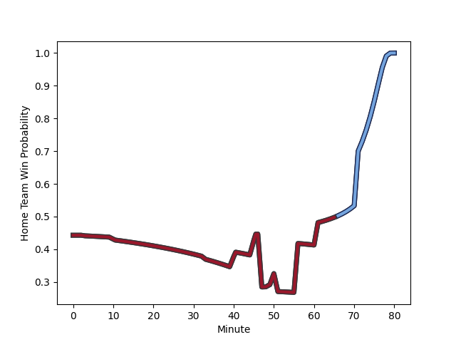

---  
layout: page  
title: Toulon at Bayonne; 18-23  
date: 2022-12-31 15:00:00 18:00:00 -0500  
categories: match review  
---
# Toulon (1677.64) at Bayonne (1558.99); 18-23

# Prediction: Toulon by 7.9

Toulon by 11.9 on a neutral field
## Scores over Time

## Win Probability over Time

# Pre-Match Prediction: Toulon by 10.0

Toulon by 14.0 on a neutral pitch

|   Away Minutes | Away Player                                                           |   Away elo |   Away Percentile |   Number |   Home Percentile |   Home elo | Home Player                                                                  |   Home Minutes |
|---------------:|:----------------------------------------------------------------------|-----------:|------------------:|---------:|------------------:|-----------:|:-----------------------------------------------------------------------------|---------------:|
|             33 | [Bruce Devaux](..//playerfiles//BruceDevaux_cleaned.md)               |      94.92 |                41 |        1 |                53 |      96.29 | [Swan Cormenier](..//playerfiles//SwanCormenier_cleaned.md)                  |             62 |
|             47 | [Anthony Etrillard](..//playerfiles//AnthonyEtrillard_cleaned.md)     |     107.29 |                80 |        2 |                76 |     104.92 | [Facundo Bosch](..//playerfiles//FacundoBosch_cleaned.md)                    |             68 |
|             80 | [Beka Gigashvili](..//playerfiles//BekaGigashvili_cleaned.md)         |     108.85 |                84 |        3 |                18 |      85.64 | [Pascal Cotet](..//playerfiles//PascalCotet_cleaned.md)                      |             80 |
|             49 | [Matthias Halagahu](..//playerfiles//MatthiasHalagahu_cleaned.md)     |      95.17 |                48 |        4 |                99 |     153.23 | [Denis Marchois](..//playerfiles//DenisMarchois_cleaned.md)                  |             80 |
|             80 | [Brian Alainu'uese](..//playerfiles//BrianAlainu'uese_cleaned.md)     |     110.98 |                82 |        5 |                97 |     132.94 | [Thomas Ceyte](..//playerfiles//ThomasCeyte_cleaned.md)                      |             44 |
|             56 | [Jules Coulon](..//playerfiles//JulesCoulon_cleaned.md)               |     105.97 |                75 |        6 |                 6 |      74.56 | [Pierre Huguet](..//playerfiles//PierreHuguet_cleaned.md)                    |             80 |
|             80 | [Charles Ollivon](..//playerfiles//CharlesOllivon_cleaned.md)         |     139.78 |                98 |        7 |                72 |     104.74 | [Baptiste Heguy](..//playerfiles//BaptisteHeguy_cleaned.md)                  |             80 |
|             80 | [Facundo Isa](..//playerfiles//FacundoIsa_cleaned.md)                 |     107.54 |                74 |        8 |                63 |     102.86 | [Uzair Cassiem](..//playerfiles//UzairCassiem_cleaned.md)                    |             57 |
|             60 | [Baptiste Serin](..//playerfiles//BaptisteSerin_cleaned.md)           |      98    |                53 |        9 |                84 |     110.6  | [Guillaume Rouet Piffard](..//playerfiles//GuillaumeRouetPiffard_cleaned.md) |             52 |
|             80 | [Dan Biggar](..//playerfiles//DanBiggar_cleaned.md)                   |     149.02 |                99 |       10 |                98 |     140.38 | [Camille Lopez](..//playerfiles//CamilleLopez_cleaned.md)                    |             80 |
|             80 | [Jiuta Wainiqolo](..//playerfiles//JiutaWainiqolo_cleaned.md)         |      98.73 |                58 |       11 |                63 |     100.1  | [Remy Baget](..//playerfiles//RemyBaget_cleaned.md)                          |             80 |
|             80 | [Jérémy Sinzelle](..//playerfiles//JérémySinzelle_cleaned.md)         |      95.54 |                48 |       12 |                37 |      91.17 | [Yann David](..//playerfiles//YannDavid_cleaned.md)                          |             56 |
|             70 | [Duncan Paia'aua](..//playerfiles//DuncanPaia'aua_cleaned.md)         |     114.95 |                86 |       13 |                20 |      84.17 | [Sireli Maqala](..//playerfiles//SireliMaqala_cleaned.md)                    |             80 |
|             80 | [Cheslin Kolbe](..//playerfiles//CheslinKolbe_cleaned.md)             |     152.28 |                99 |       14 |                59 |      98.88 | [Arnaud Erbinartegaray](..//playerfiles//ArnaudErbinartegaray_cleaned.md)    |             80 |
|             62 | [Aymeric Luc](..//playerfiles//AymericLuc_cleaned.md)                 |     113.03 |                82 |       15 |                79 |     110.27 | [Martin Bogado](..//playerfiles//MartinBogado_cleaned.md)                    |             80 |
|             12 | [Dany Priso](..//playerfiles//DanyPriso_cleaned.md)                   |      96.27 |                53 |       16 |                19 |      84.55 | [Kote Mikautadze](..//playerfiles//KoteMikautadze_cleaned.md)                |             36 |
|             35 | [Kieran Brookes](..//playerfiles//KieranBrookes_cleaned.md)           |      74.97 |                 6 |       17 |                85 |     111.88 | [Maxime Machenaud](..//playerfiles//MaximeMachenaud_cleaned.md)              |             28 |
|             33 | [Christopher Tolofua](..//playerfiles//ChristopherTolofua_cleaned.md) |      93.99 |                44 |       18 |                 4 |      70.19 | [Guillaume Martocq](..//playerfiles//GuillaumeMartocq_cleaned.md)            |             24 |
|             31 | [Mathieu Tanguy](..//playerfiles//MathieuTanguy_cleaned.md)           |      97.3  |                52 |       19 |                23 |      86.68 | [Geoff Cridge](..//playerfiles//GeoffCridge_cleaned.md)                      |             23 |
|             24 | [Raphael Lakafia](..//playerfiles//RaphaelLakafia_cleaned.md)         |     115.18 |                87 |       20 |                32 |      90.78 | [Pieter Scholtz](..//playerfiles//PieterScholtz_cleaned.md)                  |             18 |
|             20 | [Benoit Paillaugue](..//playerfiles//BenoitPaillaugue_cleaned.md)     |      95.78 |                48 |       21 |                90 |     116.73 | [Thomas Acquier](..//playerfiles//ThomasAcquier_cleaned.md)                  |             12 |
|             18 | [Thomas Salles](..//playerfiles//ThomasSalles_cleaned.md)             |     107.03 |                73 |       22 |               nan |     nan    | nan                                                                          |            nan |
|             10 | [Mathieu Smaili](..//playerfiles//MathieuSmaili_cleaned.md)           |      98.4  |                54 |       23 |               nan |     nan    | nan                                                                          |            nan |

