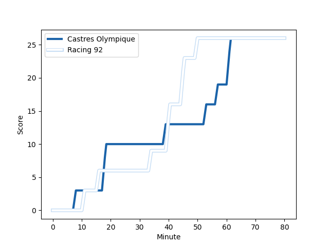
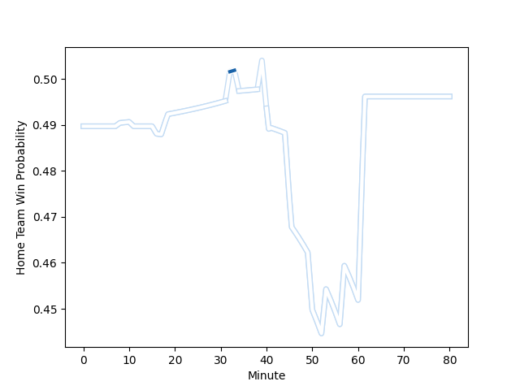

---  
layout: page  
title: Racing 92 at Castres Olympique; 26-26  
date: 2022-12-31 17:00:00 18:00:00 -0500  
categories: match review  
---
# Racing 92 (1687.1) at Castres Olympique (1668.0); 26-26

# Prediction: Castres Olympique by 2.1

Racing 92 by 1.9 on a neutral field
## Scores over Time

## Win Probability over Time

# Pre-Match Prediction: Racing 92 by 0.1

Racing 92 by 3.9 on a neutral pitch

|   Away Minutes | Away Player                                                           |   Away elo |   Away Percentile |   Number |   Home Percentile |   Home elo | Home Player                                                                       |   Home Minutes |
|---------------:|:----------------------------------------------------------------------|-----------:|------------------:|---------:|------------------:|-----------:|:----------------------------------------------------------------------------------|---------------:|
|             56 | [Guram Gogichashvili](..//playerfiles//GuramGogichashvili_cleaned.md) |     117.05 |                90 |        1 |                58 |     105.53 | [Quentin Walcker](..//playerfiles//QuentinWalcker_cleaned.md)                     |             76 |
|             72 | [Camille Chat](..//playerfiles//CamilleChat_cleaned.md)               |     120.54 |                93 |        2 |                90 |     118.52 | [Gaetan Barlot](..//playerfiles//GaetanBarlot_cleaned.md)                         |             76 |
|             72 | [Trevor Nyakane](..//playerfiles//TrevorNyakane_cleaned.md)           |     112.47 |                82 |        3 |                85 |     114.01 | [Wilfrid Hounkpatin](..//playerfiles//WilfridHounkpatin_cleaned.md)               |             59 |
|             80 | [Boris Palu](..//playerfiles//BorisPalu_cleaned.md)                   |     113.59 |                81 |        4 |                70 |     112.09 | [Florent Vanverberghe](..//playerfiles//FlorentVanverberghe_cleaned.md)           |             50 |
|             32 | [Anton Bresler](..//playerfiles//AntonBresler_cleaned.md)             |     125.89 |                95 |        5 |                75 |     110.47 | [Tom Staniforth](..//playerfiles//TomStaniforth_cleaned.md)                       |             80 |
|             67 | [Wenceslas Lauret](..//playerfiles//WenceslasLauret_cleaned.md)       |     127.33 |                95 |        6 |                26 |      97.74 | [Gauthier Maravat](..//playerfiles//GauthierMaravat_cleaned.md)                   |             80 |
|             80 | [Ibrahim Diallo](..//playerfiles//IbrahimDiallo_cleaned.md)           |     102.42 |                46 |        7 |                57 |     105.56 | [Nick Champion de Crespigny](..//playerfiles//NickChampiondeCrespigny_cleaned.md) |             41 |
|             80 | [Maxime Baudonne](..//playerfiles//MaximeBaudonne_cleaned.md)         |     103.89 |                45 |        8 |                36 |     100.49 | [Baptiste Delaporte](..//playerfiles//BaptisteDelaporte_cleaned.md)               |             80 |
|             53 | [Teddy Iribaren](..//playerfiles//TeddyIribaren_cleaned.md)           |     113.58 |                84 |        9 |                54 |     104.94 | [Julien Blanc](..//playerfiles//JulienBlanc_cleaned.md)                           |             50 |
|             80 | [Antoine Gibert](..//playerfiles//AntoineGibert_cleaned.md)           |     111.9  |                76 |       10 |                97 |     138.32 | [Benjamin Urdapilleta](..//playerfiles//BenjaminUrdapilleta_cleaned.md)           |             80 |
|             80 | [Juan Imhoff](..//playerfiles//JuanImhoff_cleaned.md)                 |     123.57 |                92 |       11 |                89 |     120.52 | [Filipo Nakosi](..//playerfiles//FilipoNakosi_cleaned.md)                         |             80 |
|             67 | [Henry Chavancy](..//playerfiles//HenryChavancy_cleaned.md)           |     125.32 |                94 |       12 |                53 |     104.85 | [Adrien Seguret](..//playerfiles//AdrienSeguret_cleaned.md)                       |             80 |
|             80 | [Francis Saili](..//playerfiles//FrancisSaili_cleaned.md)             |     102.64 |                46 |       13 |                61 |     110.39 | [Vilimoni Botitu](..//playerfiles//VilimoniBotitu_cleaned.md)                     |             80 |
|             80 | [Donovan Taofifenua](..//playerfiles//DonovanTaofifenua_cleaned.md)   |     108.11 |                65 |       14 |                56 |     105.97 | [Antoine Zeghdar](..//playerfiles//AntoineZeghdar_cleaned.md)                     |             41 |
|             80 | [Max Spring](..//playerfiles//MaxSpring_cleaned.md)                   |      98.82 |                32 |       15 |                88 |     118.96 | [Geoffrey Palis](..//playerfiles//GeoffreyPalis_cleaned.md)                       |             80 |
|             48 | [Cameron Woki](..//playerfiles//CameronWoki_cleaned.md)               |     106.94 |                67 |       16 |                67 |     109.35 | [Julien Dumora](..//playerfiles//JulienDumora_cleaned.md)                         |             39 |
|             27 | [Nolann Le Garrec](..//playerfiles//NolannLeGarrec_cleaned.md)        |     104.21 |                50 |       17 |               nan |     106.07 | [Baptiste Cope](..//playerfiles//BaptisteCope_cleaned.md)                         |             39 |
|             24 | [Eddy Ben Arous](..//playerfiles//EddyBenArous_cleaned.md)            |     120.13 |                93 |       18 |                61 |     107.66 | [Asier Usarraga](..//playerfiles//AsierUsarraga_cleaned.md)                       |             30 |
|             13 | [Baptiste Chouzenoux](..//playerfiles//BaptisteChouzenoux_cleaned.md) |     101.07 |                40 |       19 |                71 |     110.33 | [Gauthier Doubrere](..//playerfiles//GauthierDoubrere_cleaned.md)                 |             30 |
|             13 | [Gael Fickou](..//playerfiles//GaelFickou_cleaned.md)                 |     124.81 |                92 |       20 |               nan |     107.36 | [Levan Chilachava](..//playerfiles//LevanChilachava_cleaned.md)                   |             21 |
|              8 | [Peniami Narisia](..//playerfiles//PeniamiNarisia_cleaned.md)         |     103.55 |                52 |       21 |               nan |     102.89 | [Loïs Guerois](..//playerfiles//LoïsGuerois_cleaned.md)                           |              4 |
|              8 | [Gia Kharaishvili](..//playerfiles//GiaKharaishvili_cleaned.md)       |     109.06 |                69 |       22 |                47 |     103.27 | [Pierre Colonna](..//playerfiles//PierreColonna_cleaned.md)                       |              4 |

