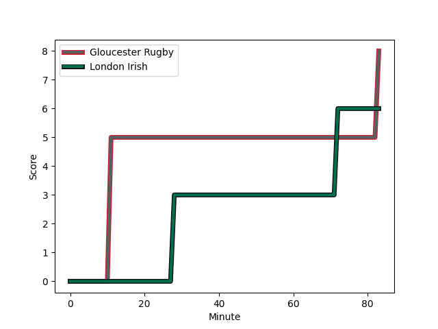
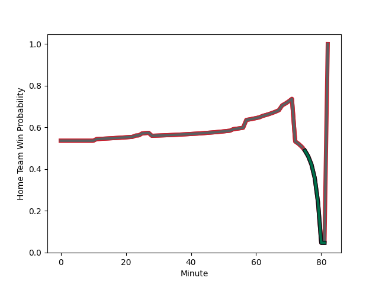

---  
layout: page  
title: London Irish at Gloucester Rugby; 6-8  
date: 2022-12-31 10:00:00 18:00:00 -0500  
categories: match review  
---
# London Irish (1645.77) at Gloucester Rugby (1727.78); 6-8

# Prediction: Gloucester Rugby by 12.2

Gloucester Rugby by 8.2 on a neutral field
## Scores over Time

## Win Probability over Time

# Pre-Match Prediction: Gloucester Rugby by 8.5

Gloucester Rugby by 4.5 on a neutral pitch

|   Away Minutes | Away Player                                                                       |   Away elo |   Away Percentile |   Number |   Home Percentile |   Home elo | Home Player                                                         |   Home Minutes |
|---------------:|:----------------------------------------------------------------------------------|-----------:|------------------:|---------:|------------------:|-----------:|:--------------------------------------------------------------------|---------------:|
|             53 | [Will Goodrick-Clarke](..//playerfiles//WillGoodrick-Clarke_cleaned.md)           |     108.98 |                73 |        1 |                58 |     105.43 | [Harry Elrington](..//playerfiles//HarryElrington_cleaned.md)       |             82 |
|             80 | [Mike Willemse](..//playerfiles//MikeWillemse_cleaned.md)                         |     105.68 |                61 |        2 |                58 |     104.92 | [Santiago Socino](..//playerfiles//SantiagoSocino_cleaned.md)       |             23 |
|             57 | [Oli Hoskins](..//playerfiles//OliHoskins_cleaned.md)                             |     126.75 |                97 |        3 |                93 |     120.33 | [Kirill Gotovtsev](..//playerfiles//KirillGotovtsev_cleaned.md)     |             82 |
|             68 | [Api Ratuniyarawa](..//playerfiles//ApiRatuniyarawa_cleaned.md)                   |     103.87 |                51 |        4 |                82 |     112.8  | [Alex Craig](..//playerfiles//AlexCraig_cleaned.md)                 |             25 |
|             82 | [Chunya Munga](..//playerfiles//ChunyaMunga_cleaned.md)                           |     108.63 |                68 |        5 |                92 |     122.87 | [Matias Alemanno](..//playerfiles//MatiasAlemanno_cleaned.md)       |             82 |
|             68 | [Juan Martin Gonzalez](..//playerfiles//JuanMartinGonzalez_cleaned.md)            |     116.79 |                85 |        6 |                40 |     100.23 | [Harry Taylor](..//playerfiles//HarryTaylor_cleaned.md)             |             57 |
|             82 | [Tom Pearson](..//playerfiles//TomPearson_cleaned.md)                             |     125.08 |                94 |        7 |                71 |     110.09 | [Lewis Ludlow](..//playerfiles//LewisLudlow_cleaned.md)             |             82 |
|             62 | [Matt Rogerson](..//playerfiles//MattRogerson_cleaned.md)                         |     120.29 |                89 |        8 |                92 |     122.41 | [Ruan Ackermann](..//playerfiles//RuanAckermann_cleaned.md)         |             82 |
|             57 | [Ben White](..//playerfiles//BenWhite_cleaned.md)                                 |     103.9  |                49 |        9 |                89 |     120.15 | [Ben Meehan](..//playerfiles//BenMeehan_cleaned.md)                 |             82 |
|             82 | [Paddy Jackson](..//playerfiles//PaddyJackson_cleaned.md)                         |     122.32 |                90 |       10 |                93 |     127.53 | [Santiago Carreras](..//playerfiles//SantiagoCarreras_cleaned.md)   |             82 |
|             82 | [Ollie Hassell-Collins](..//playerfiles//OllieHassell-Collins_cleaned.md)         |     107.33 |                64 |       11 |                95 |     128.04 | [Ollie Thorley](..//playerfiles//OllieThorley_cleaned.md)           |             82 |
|             82 | [Rory Jennings](..//playerfiles//RoryJennings_cleaned.md)                         |     108.16 |                53 |       12 |                12 |      91.69 | [Sebastien Atkinson](..//playerfiles//SebastienAtkinson_cleaned.md) |             82 |
|             82 | [Benhard Janse van Rensburg](..//playerfiles//BenhardJansevanRensburg_cleaned.md) |      96.92 |                24 |       13 |                84 |     116.53 | [Chris Harris](..//playerfiles//ChrisHarris_cleaned.md)             |             82 |
|             82 | [Lucio Cinti](..//playerfiles//LucioCinti_cleaned.md)                             |     100.44 |                34 |       14 |                88 |     120.03 | [Jonny May](..//playerfiles//JonnyMay_cleaned.md)                   |             82 |
|             62 | [James Stokes](..//playerfiles//JamesStokes_cleaned.md)                           |     105.21 |                54 |       15 |                78 |     114.21 | [Lloyd Evans](..//playerfiles//LloydEvans_cleaned.md)               |             82 |
|              2 | [Ignacio Ruiz](..//playerfiles//IgnacioRuiz_cleaned.md)                           |     101.89 |               nan |       16 |                77 |     110.08 | [George McGuigan](..//playerfiles//GeorgeMcGuigan_cleaned.md)       |             59 |
|             29 | [Danilo Fischetti](..//playerfiles//DaniloFischetti_cleaned.md)                   |      97.23 |                14 |       17 |                67 |     106.34 | [Alex Seville](..//playerfiles//AlexSeville_cleaned.md)             |              0 |
|             25 | [Lovejoy Chawatama](..//playerfiles//LovejoyChawatama_cleaned.md)                 |      97.97 |                22 |       18 |                 1 |      80.84 | [Ciaran Knight](..//playerfiles//CiaranKnight_cleaned.md)           |              0 |
|             14 | [Josh Caulfield](..//playerfiles//JoshCaulfield_cleaned.md)                       |      99.88 |               nan |       19 |                90 |     120.73 | [Cameron Jordan](..//playerfiles//CameronJordan_cleaned.md)         |             57 |
|             14 | [Josh Basham](..//playerfiles//JoshBasham_cleaned.md)                             |     107.43 |                60 |       20 |                48 |     104.55 | [Albert Tuisue](..//playerfiles//AlbertTuisue_cleaned.md)           |             25 |
|             20 | [Chandler Cunningham-South](..//playerfiles//ChandlerCunningham-South_cleaned.md) |     102.66 |                50 |       21 |                 5 |      87.64 | [Stephen Varney](..//playerfiles//StephenVarney_cleaned.md)         |              0 |
|             25 | [Joe Powell](..//playerfiles//JoePowell_cleaned.md)                               |     106.94 |                63 |       22 |                81 |     115.23 | [Billy Twelvetrees](..//playerfiles//BillyTwelvetrees_cleaned.md)   |              0 |
|             20 | [Luca Morisi](..//playerfiles//LucaMorisi_cleaned.md)                             |     122.09 |                91 |       23 |                10 |      91.58 | [Tom Seabrook](..//playerfiles//TomSeabrook_cleaned.md)             |              0 |

