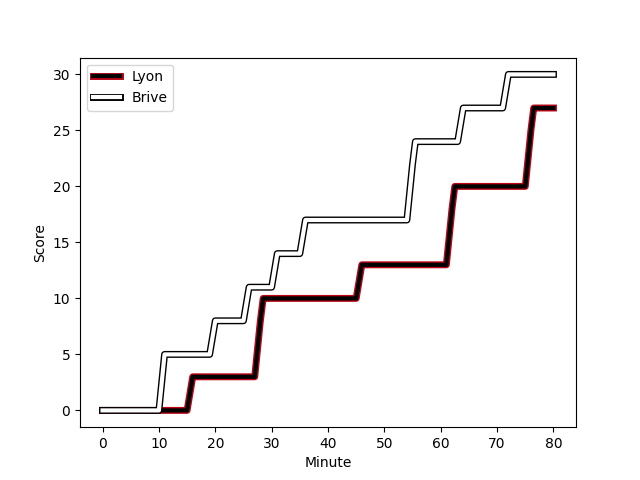
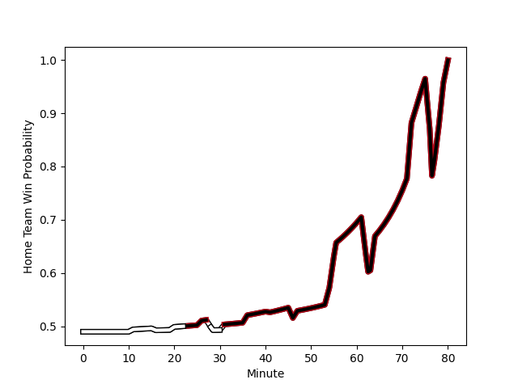

---  
layout: page  
title: Brive at Lyon; 30-27  
date: 2022-12-31 17:00:00 18:00:00 -0500  
categories: match review  
---
# Brive (1514.28) at Lyon (1496.29); 30-27

# Prediction: Lyon by 2.2

Brive by 1.8 on a neutral field
## Scores over Time

## Win Probability over Time

# Pre-Match Prediction: Brive by 3.1

Brive by 0.9 on a neutral pitch

|   Away Minutes | Away Player                                                              |   Away elo |   Away Percentile |   Number |   Home Percentile |   Home elo | Home Player                                                                            |   Home Minutes |
|---------------:|:-------------------------------------------------------------------------|-----------:|------------------:|---------:|------------------:|-----------:|:---------------------------------------------------------------------------------------|---------------:|
|             55 | [Wesley Tapueluelu](..//playerfiles//WesleyTapueluelu_cleaned.md)        |      96.4  |                54 |        1 |                17 |      85.14 | [Hamza Kaabeche](..//playerfiles//HamzaKaabeche_cleaned.md)                            |             47 |
|             65 | [Motu Matu'u](..//playerfiles//MotuMatu'u_cleaned.md)                    |      79.06 |                10 |        2 |                58 |      98    | [Yanis Charcosset](..//playerfiles//YanisCharcosset_cleaned.md)                        |             41 |
|             55 | [Marcel van der Merwe](..//playerfiles//MarcelvanderMerwe_cleaned.md)    |      93.82 |                42 |        3 |                19 |      85.96 | [Paulo Tafili](..//playerfiles//PauloTafili_cleaned.md)                                |             41 |
|             54 | [Andres Zafra Tarazona](..//playerfiles//AndresZafraTarazona_cleaned.md) |      77.32 |                11 |        4 |                51 |      96.22 | [Joel Kpoku](..//playerfiles//JoelKpoku_cleaned.md)                                    |             47 |
|             80 | [Lucas Paulos](..//playerfiles//LucasPaulos_cleaned.md)                  |     101.05 |                63 |        5 |                80 |     109.04 | [Romain Taofifenua](..//playerfiles//RomainTaofifenua_cleaned.md)                      |             80 |
|             80 | [Retief Marais](..//playerfiles//RetiefMarais_cleaned.md)                |     108.01 |                71 |        6 |                57 |      98.66 | [Theo William](..//playerfiles//TheoWilliam_cleaned.md)                                |             80 |
|             59 | [Said Hireche](..//playerfiles//SaidHireche_cleaned.md)                  |     147.07 |                99 |        7 |                93 |     125.55 | [Arno Botha](..//playerfiles//ArnoBotha_cleaned.md)                                    |             47 |
|             80 | [Esteban Abadie](..//playerfiles//EstebanAbadie_cleaned.md)              |     111.4  |                83 |        8 |                92 |     125.56 | [Jordan Taufua](..//playerfiles//JordanTaufua_cleaned.md)                              |             80 |
|             80 | [Paul Abadie](..//playerfiles//PaulAbadie_cleaned.md)                    |      83.8  |                16 |        9 |                97 |     129.46 | [Baptiste Couilloud](..//playerfiles//BaptisteCouilloud_cleaned.md)                    |             54 |
|             54 | [Nicolas Sanchez](..//playerfiles//NicolasSanchez_cleaned.md)            |     136.66 |                96 |       10 |                10 |      73.85 | [Leo Berdeu](..//playerfiles//LeoBerdeu_cleaned.md)                                    |             80 |
|             80 | [Axel Muller](..//playerfiles//AxelMuller_cleaned.md)                    |      99.85 |                62 |       11 |                48 |      95.54 | [Ethan Dumortier](..//playerfiles//EthanDumortier_cleaned.md)                          |             80 |
|             51 | [Thomas Laranjeira](..//playerfiles//ThomasLaranjeira_cleaned.md)        |     124.32 |                92 |       12 |                93 |     124.83 | [Kyle Godwin](..//playerfiles//KyleGodwin_cleaned.md)                                  |             47 |
|             63 | [Seta Tuicuvu](..//playerfiles//SetaTuicuvu_cleaned.md)                  |      87.49 |                31 |       13 |                80 |     110.42 | [Thibault Regard](..//playerfiles//ThibaultRegard_cleaned.md)                          |             80 |
|             80 | [Aaron Grandidier](..//playerfiles//AaronGrandidier_cleaned.md)          |     103.7  |                70 |       14 |                22 |      84.84 | [Tavite Veredamu](..//playerfiles//TaviteVeredamu_cleaned.md)                          |             54 |
|             80 | [Mathis Ferté](..//playerfiles//MathisFerté_cleaned.md)                  |      77.84 |                14 |       15 |                66 |     103.35 | [Alexandre Tchaptchet Noutcha](..//playerfiles//AlexandreTchaptchetNoutcha_cleaned.md) |             80 |
|             29 | [Kevin Fabien](..//playerfiles//KevinFabien_cleaned.md)                  |      97.97 |                56 |       16 |                11 |      75.87 | [Guillaume Marchand](..//playerfiles//GuillaumeMarchand_cleaned.md)                    |             39 |
|             26 | [Enzo Herve](..//playerfiles//EnzoHerve_cleaned.md)                      |     125.54 |                92 |       17 |                89 |     114.13 | [Demba Bamba](..//playerfiles//DembaBamba_cleaned.md)                                  |             39 |
|             25 | [Daniel Brennan](..//playerfiles//DanielBrennan_cleaned.md)              |      84.61 |                17 |       18 |                10 |      80.26 | [Jerome Rey](..//playerfiles//JeromeRey_cleaned.md)                                    |             33 |
|             25 | [Pietro Ceccarelli](..//playerfiles//PietroCeccarelli_cleaned.md)        |     105.18 |                78 |       19 |                35 |      90.82 | [Temo Mayanavanua](..//playerfiles//TemoMayanavanua_cleaned.md)                        |             33 |
|             21 | [Matthieu Voisin](..//playerfiles//MatthieuVoisin_cleaned.md)            |      86.59 |                21 |       20 |                73 |     103.89 | [Mickael Guillard](..//playerfiles//MickaelGuillard_cleaned.md)                        |             33 |
|             15 | [Nathan Fraissenon](..//playerfiles//NathanFraissenon_cleaned.md)        |     102.02 |                55 |       21 |                 4 |      69.56 | [Josiah Maraku](..//playerfiles//JosiahMaraku_cleaned.md)                              |             33 |
|             17 | [Maxence Biasotto](..//playerfiles//MaxenceBiasotto_cleaned.md)          |      95    |               nan |       22 |                21 |      85.96 | [Jonathan Pelissie](..//playerfiles//JonathanPelissie_cleaned.md)                      |             26 |
|             26 | [Abraham Papali'i](..//playerfiles//AbrahamPapali'i_cleaned.md)          |     107.39 |                74 |       23 |                 6 |      75.69 | [Fletcher Smith](..//playerfiles//FletcherSmith_cleaned.md)                            |             26 |

