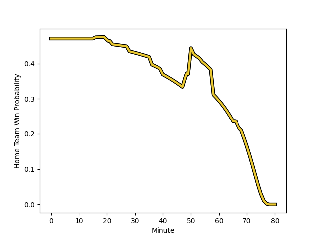

---  
layout: page  
title: La Rochelle at Perpignan; 29-10  
date: 2022-12-31 17:00:00 18:00:00 -0500  
categories: match review  
---
# La Rochelle (1575.74) at Perpignan (1490.59); 29-10

# Prediction: La Rochelle by 4.5

La Rochelle by 8.5 on a neutral field
## Scores over Time

## Win Probability over Time

# Pre-Match Prediction: La Rochelle by 6.0

La Rochelle by 10.0 on a neutral pitch

|   Away Minutes | Away Player                                                               |   Away elo |   Away Percentile |   Number |   Home Percentile |   Home elo | Home Player                                                             |   Home Minutes |
|---------------:|:--------------------------------------------------------------------------|-----------:|------------------:|---------:|------------------:|-----------:|:------------------------------------------------------------------------|---------------:|
|             50 | [Thierry Paiva](..//playerfiles//ThierryPaiva_cleaned.md)                 |     103.05 |                71 |        1 |                19 |      85.8  | [Giorgi Tetrashvili](..//playerfiles//GiorgiTetrashvili_cleaned.md)     |             40 |
|             50 | [Samuel Lagrange](..//playerfiles//SamuelLagrange_cleaned.md)             |      93.13 |                40 |        2 |                48 |      93.35 | [Mike Tadjer Barbosa](..//playerfiles//MikeTadjerBarbosa_cleaned.md)    |             40 |
|             58 | [Uini Atonio](..//playerfiles//UiniAtonio_cleaned.md)                     |     120.83 |                95 |        3 |                49 |      94.95 | [Siua Halanukonuka](..//playerfiles//SiuaHalanukonuka_cleaned.md)       |             40 |
|             80 | [Romain Sazy](..//playerfiles//RomainSazy_cleaned.md)                     |     123.43 |                93 |        4 |                81 |     110.09 | [Piula Faasalele](..//playerfiles//PiulaFaasalele_cleaned.md)           |             80 |
|             63 | [Will Skelton](..//playerfiles//WillSkelton_cleaned.md)                   |     119.42 |                91 |        5 |                43 |      93.64 | [Victor Moreaux](..//playerfiles//VictorMoreaux_cleaned.md)             |             51 |
|             58 | [Remi Bourdeau](..//playerfiles//RemiBourdeau_cleaned.md)                 |     130.03 |                97 |        6 |                90 |     118.55 | [Brad Shields](..//playerfiles//BradShields_cleaned.md)                 |             80 |
|             80 | [Kyle Hatherell](..//playerfiles//KyleHatherell_cleaned.md)               |      72.85 |                 5 |        7 |                70 |     106.2  | [Joaquin Oviedo](..//playerfiles//JoaquinOviedo_cleaned.md)             |             80 |
|             80 | [Paul Boudehent](..//playerfiles//PaulBoudehent_cleaned.md)               |      84.05 |                19 |        8 |                84 |     113.44 | [Genesis Mamea Lemalu](..//playerfiles//GenesisMameaLemalu_cleaned.md)  |             51 |
|             66 | [Tawera Kerr-Barlow](..//playerfiles//TaweraKerr-Barlow_cleaned.md)       |     122.79 |                94 |        9 |                46 |      95.33 | [Sadek Deghmache](..//playerfiles//SadekDeghmache_cleaned.md)           |             54 |
|             80 | [Antoine Hastoy](..//playerfiles//AntoineHastoy_cleaned.md)               |      98.71 |                51 |       10 |                83 |     115.18 | [Jake McIntyre](..//playerfiles//JakeMcIntyre_cleaned.md)               |             80 |
|             50 | [Pierre Boudehent](..//playerfiles//PierreBoudehent_cleaned.md)           |     106.56 |                77 |       11 |                99 |     162.65 | [Mathieu Acebes](..//playerfiles//MathieuAcebes_cleaned.md)             |             80 |
|             68 | [Jonathan Danty](..//playerfiles//JonathanDanty_cleaned.md)               |     108.92 |                77 |       12 |                 3 |      66.7  | [Jeronimo de la Fuente](..//playerfiles//JeronimodelaFuente_cleaned.md) |             80 |
|             80 | [Raymond Rhule](..//playerfiles//RaymondRhule_cleaned.md)                 |     111.05 |                81 |       13 |                60 |     100.26 | [Afusipa Taumoepeau](..//playerfiles//AfusipaTaumoepeau_cleaned.md)     |             54 |
|             80 | [Teddy Thomas](..//playerfiles//TeddyThomas_cleaned.md)                   |     114.26 |                85 |       14 |                65 |      94.42 | [Lucas Dubois](..//playerfiles//LucasDubois_cleaned.md)                 |             80 |
|             80 | [Dillyn Leyds](..//playerfiles//DillynLeyds_cleaned.md)                   |      99.35 |                60 |       15 |                 2 |      58.52 | [Boris Goutard](..//playerfiles//BorisGoutard_cleaned.md)               |             56 |
|             30 | [Reda Wardi](..//playerfiles//RedaWardi_cleaned.md)                       |     114.47 |                89 |       16 |                12 |      81.66 | [Xavier Chiocci](..//playerfiles//XavierChiocci_cleaned.md)             |             40 |
|             30 | [Jules Favre](..//playerfiles//JulesFavre_cleaned.md)                     |     124.14 |                93 |       17 |                 2 |      68.91 | [Seilala Lam](..//playerfiles//SeilalaLam_cleaned.md)                   |             40 |
|             30 | [Quentin Lespiaucq](..//playerfiles//QuentinLespiaucq_cleaned.md)         |      74.79 |                 2 |       18 |                66 |     100.17 | [Ma'afu Fia](..//playerfiles//Ma'afuFia_cleaned.md)                     |             40 |
|             22 | [Ultan Dillane](..//playerfiles//UltanDillane_cleaned.md)                 |      98.99 |                59 |       19 |                 2 |      59.13 | [Tristan Labouteley](..//playerfiles//TristanLabouteley_cleaned.md)     |             29 |
|             22 | [Georges-Henri Colombe](..//playerfiles//Georges-HenriColombe_cleaned.md) |      66.99 |                 2 |       20 |                36 |      90.6  | [Lucas Velarte](..//playerfiles//LucasVelarte_cleaned.md)               |             29 |
|             17 | [Remi Picquette](..//playerfiles//RemiPicquette_cleaned.md)               |      95.93 |                50 |       21 |                56 |      97.1  | [Tom Ecochard](..//playerfiles//TomEcochard_cleaned.md)                 |             26 |
|             14 | [Thomas Berjon](..//playerfiles//ThomasBerjon_cleaned.md)                 |      92.07 |                37 |       22 |                55 |      97.84 | [George Tilsley](..//playerfiles//GeorgeTilsley_cleaned.md)             |             26 |
|             12 | [Pierre Popelin](..//playerfiles//PierrePopelin_cleaned.md)               |      89.07 |                26 |       23 |                73 |     105.85 | [Ali Crossdale](..//playerfiles//AliCrossdale_cleaned.md)               |             24 |

