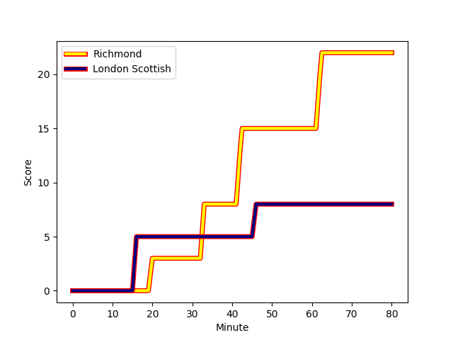

---  
layout: page  
title: London Scottish at Richmond; 8-22  
date: 2022-12-31 00:00:00 18:00:00 -0500  
categories: match review  
---
# London Scottish (1364.9) at Richmond (1304.79); 8-22

# Prediction: London Scottish by 3.0

London Scottish by 6.0 on a neutral field
## Scores over Time

## Win Probability over Time

# Pre-Match Prediction: London Scottish by 1.9

London Scottish by 4.9 on a neutral pitch

|   Away Minutes | Away Player                                                         |   Away elo |   Away Percentile |   Number |   Home Percentile |   Home elo | Home Player                                                       |   Home Minutes |
|---------------:|:--------------------------------------------------------------------|-----------:|------------------:|---------:|------------------:|-----------:|:------------------------------------------------------------------|---------------:|
|             58 | [Maurice Nwakor](..//playerfiles//MauriceNwakor_cleaned.md)         |      91.49 |                28 |        1 |                20 |      89.39 | [Conor Maguire](..//playerfiles//ConorMaguire_cleaned.md)         |             75 |
|             80 | [Sam Riley](..//playerfiles//SamRiley_cleaned.md)                   |      92.81 |                39 |        2 |                67 |      98.91 | [Alex Post](..//playerfiles//AlexPost_cleaned.md)                 |             69 |
|             58 | [Dan Gamble](..//playerfiles//DanGamble_cleaned.md)                 |      95.97 |                45 |        3 |                 0 |      69.28 | [Jimmy Litchfield](..//playerfiles//JimmyLitchfield_cleaned.md)   |             73 |
|             40 | [Angus Southon](..//playerfiles//AngusSouthon_cleaned.md)           |      91.53 |                32 |        4 |                 7 |      79.1  | [Sam Collingridge](..//playerfiles//SamCollingridge_cleaned.md)   |             80 |
|             80 | [Matas Jurevicius](..//playerfiles//MatasJurevicius_cleaned.md)     |      95.94 |                52 |        5 |                35 |      91.88 | [Jake Monson](..//playerfiles//JakeMonson_cleaned.md)             |             76 |
|             80 | [Bailey Ransom](..//playerfiles//BaileyRansom_cleaned.md)           |     111.38 |                90 |        6 |                39 |      93.06 | [David Massey](..//playerfiles//DavidMassey_cleaned.md)           |             72 |
|             55 | [Austin Wallis](..//playerfiles//AustinWallis_cleaned.md)           |      88.42 |                22 |        7 |                74 |     102.13 | [Tobias Saysell](..//playerfiles//TobiasSaysell_cleaned.md)       |             80 |
|             75 | [Will Trenholm](..//playerfiles//WillTrenholm_cleaned.md)           |      92.96 |                39 |        8 |                 8 |      80.98 | [Mark Bright](..//playerfiles//MarkBright_cleaned.md)             |             80 |
|             75 | [Daniel Nutton](..//playerfiles//DanielNutton_cleaned.md)           |      71.88 |                 1 |        9 |                49 |      95.85 | [Jack Stafford](..//playerfiles//JackStafford_cleaned.md)         |             69 |
|             28 | [Harry Sheppard](..//playerfiles//HarrySheppard_cleaned.md)         |      87.67 |                20 |       10 |                26 |      90.39 | [Bill Johnston](..//playerfiles//BillJohnston_cleaned.md)         |             76 |
|             55 | [Harri Morris](..//playerfiles//HarriMorris_cleaned.md)             |      99.95 |                70 |       11 |                 9 |      81.15 | [Will Kaye](..//playerfiles//WillKaye_cleaned.md)                 |             76 |
|             80 | [Bryn Bradley](..//playerfiles//BrynBradley_cleaned.md)             |      97.66 |                57 |       12 |                 4 |      77.78 | [Paul Kiernan](..//playerfiles//PaulKiernan_cleaned.md)           |             80 |
|             80 | [Hayden Hyde](..//playerfiles//HaydenHyde_cleaned.md)               |      74.66 |                 3 |       13 |                 7 |      79.46 | [Jack Caddy](..//playerfiles//JackCaddy_cleaned.md)               |             80 |
|             80 | [Luke Mehson](..//playerfiles//LukeMehson_cleaned.md)               |      95.2  |                48 |       14 |                31 |      91.53 | [Alexander O'Meara](..//playerfiles//AlexanderO'Meara_cleaned.md) |             80 |
|             80 | [Cameron Anderson](..//playerfiles//CameronAnderson_cleaned.md)     |      87.78 |                20 |       15 |                 8 |      83.05 | [Darren Atkins](..//playerfiles//DarrenAtkins_cleaned.md)         |             80 |
|             52 | [Nathan Chamberlain](..//playerfiles//NathanChamberlain_cleaned.md) |      91.58 |               nan |       16 |                34 |      92.16 | [Joseph Vajner](..//playerfiles//JosephVajner_cleaned.md)         |             11 |
|             40 | [Matt Wilkinson](..//playerfiles//MattWilkinson_cleaned.md)         |      89.91 |                26 |       17 |                31 |      91.29 | [James Lennon](..//playerfiles//JamesLennon_cleaned.md)           |             11 |
|             25 | [Noah Ferdinand](..//playerfiles//NoahFerdinand_cleaned.md)         |      56.11 |                 0 |       18 |                22 |      88.82 | [Miles Wakeling](..//playerfiles//MilesWakeling_cleaned.md)       |              8 |
|             25 | [Charlie Ingall](..//playerfiles//CharlieIngall_cleaned.md)         |      84.24 |                13 |       19 |                38 |      91.9  | [Luke Spring](..//playerfiles//LukeSpring_cleaned.md)             |              7 |
|             22 | [William Hobson](..//playerfiles//WilliamHobson_cleaned.md)         |     100.15 |                70 |       20 |               nan |      92.32 | [George Cave](..//playerfiles//GeorgeCave_cleaned.md)             |              5 |
|             22 | [Harrison Courtney](..//playerfiles//HarrisonCourtney_cleaned.md)   |     100.29 |               nan |       21 |               nan |      94.08 | [Alex Burrage](..//playerfiles//AlexBurrage_cleaned.md)           |              4 |
|              5 | [Brian Tuilagi](..//playerfiles//BrianTuilagi_cleaned.md)           |      69.9  |                 0 |       22 |               nan |      91.57 | [Zuriel Makele](..//playerfiles//ZurielMakele_cleaned.md)         |              4 |
|              5 | [Luca Petrozzi](..//playerfiles//LucaPetrozzi_cleaned.md)           |      83.8  |                 9 |       23 |                31 |      90.88 | [Henri Williams](..//playerfiles//HenriWilliams_cleaned.md)       |              4 |

