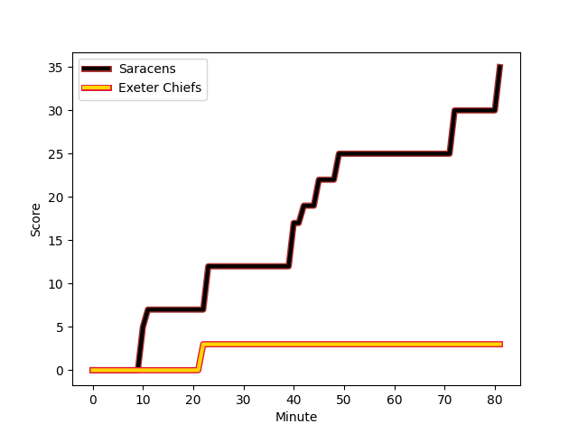
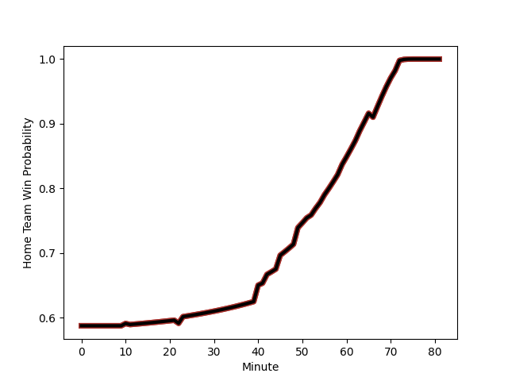

---  
layout: page  
title: Exeter Chiefs at Saracens; 3-30  
date: 2022-12-31 10:00:00 18:00:00 -0500  
categories: match review  
---
# Exeter Chiefs (1545.4) at Saracens (1698.65); 3-30

# Prediction: Saracens by 22.3

Saracens by 15.3 on a neutral field
## Scores over Time

## Win Probability over Time

# Pre-Match Prediction: Saracens by 22.0

Saracens by 15.0 on a neutral pitch

|   Away Minutes | Away Player                                                         |   Away elo |   Away Percentile |   Number |   Home Percentile |   Home elo | Home Player                                               |   Home Minutes |
|---------------:|:--------------------------------------------------------------------|-----------:|------------------:|---------:|------------------:|-----------:|:----------------------------------------------------------|---------------:|
|             53 | [Scott Sio](playerfiles//ScottSio_cleaned.md)                       |      89.57 |                21 |        1 |                99 |     131    | [Mako Vunipola](playerfiles//MakoVunipola_cleaned.md)     |             66 |
|             53 | [Jack Yeandle](playerfiles//JackYeandle_cleaned.md)                 |     125.16 |                98 |        2 |               100 |     136.96 | [Jamie George](playerfiles//JamieGeorge_cleaned.md)       |             66 |
|             53 | [Harry Williams](playerfiles//HarryWilliams_cleaned.md)             |     113.2  |                95 |        3 |                36 |      93.02 | [Marco Riccioni](playerfiles//MarcoRiccioni_cleaned.md)   |             66 |
|             81 | [Ruben van Heerden](playerfiles//RubenvanHeerden_cleaned.md)        |     111.1  |                88 |        4 |                91 |     114    | [Maro Itoje](playerfiles//MaroItoje_cleaned.md)           |             81 |
|             59 | [Jonny Gray](playerfiles//JonnyGray_cleaned.md)                     |     107.56 |                85 |        5 |                64 |      99.34 | [Nick Isiekwe](playerfiles//NickIsiekwe_cleaned.md)       |             63 |
|             81 | [Santiago Grondona](playerfiles//SantiagoGrondona_cleaned.md)       |     100.88 |                68 |        6 |                65 |      99.15 | [Andy Christie](playerfiles//AndyChristie_cleaned.md)     |             81 |
|             63 | [Christ Tshiunza](playerfiles//ChristTshiunza_cleaned.md)           |      90.21 |                27 |        7 |                97 |     128.28 | [Jackson Wray](playerfiles//JacksonWray_cleaned.md)       |             52 |
|             81 | [Greg Fisilau](playerfiles//GregFisilau_cleaned.md)                 |      92.32 |               nan |        8 |                95 |     125.99 | [Billy Vunipola](playerfiles//BillyVunipola_cleaned.md)   |             81 |
|             63 | [Sam Maunder](playerfiles//SamMaunder_cleaned.md)                   |      87.8  |                16 |        9 |                41 |      94.24 | [Ivan van Zyl](playerfiles//IvanvanZyl_cleaned.md)        |             55 |
|             81 | [Joe Simmonds](playerfiles//JoeSimmonds_cleaned.md)                 |     111.42 |                86 |       10 |                96 |     128.01 | [Owen Farrell](playerfiles//OwenFarrell_cleaned.md)       |             81 |
|             81 | [Olly Woodburn](playerfiles//OllyWoodburn_cleaned.md)               |     112.21 |                90 |       11 |                97 |     122.67 | [Sean Maitland](playerfiles//SeanMaitland_cleaned.md)     |             66 |
|             66 | [Solomone Kata](playerfiles//SolomoneKata_cleaned.md)               |     104.49 |                76 |       12 |                97 |     126.34 | [Nick Tompkins](playerfiles//NickTompkins_cleaned.md)     |             81 |
|             81 | [Henry Slade](playerfiles//HenrySlade_cleaned.md)                   |     119.36 |                94 |       13 |                74 |     103.47 | [Elliot Daly](playerfiles//ElliotDaly_cleaned.md)         |             11 |
|             63 | [Jack Nowell](playerfiles//JackNowell_cleaned.md)                   |     106.9  |                83 |       14 |                65 |      99.97 | [Max Malins](playerfiles//MaxMalins_cleaned.md)           |             81 |
|             81 | [Josh Hodge](playerfiles//JoshHodge_cleaned.md)                     |      80.81 |                 9 |       15 |                95 |     123.77 | [Alex Goode](playerfiles//AlexGoode_cleaned.md)           |             81 |
|             28 | [Dan Frost](playerfiles//DanFrost_cleaned.md)                       |     121.39 |                97 |       16 |                34 |      90.63 | [Kapeli Pifeleti](playerfiles//KapeliPifeleti_cleaned.md) |             15 |
|             28 | [Josh Iosefa-Scott](playerfiles//JoshIosefa-Scott_cleaned.md)       |     100.26 |                65 |       17 |                41 |      93.82 | [Eroni Mawi](playerfiles//EroniMawi_cleaned.md)           |             15 |
|             28 | [Patrick Schickerling](playerfiles//PatrickSchickerling_cleaned.md) |     102.28 |                66 |       18 |                24 |      90.04 | [Eduardo Bello](playerfiles//EduardoBello_cleaned.md)     |             15 |
|             22 | [Jack Dunne](playerfiles//JackDunne_cleaned.md)                     |      94.41 |                45 |       19 |                81 |     105.34 | [Hugh Tizard](playerfiles//HughTizard_cleaned.md)         |             18 |
|             18 | [Lewis Pearson](playerfiles//LewisPearson_cleaned.md)               |      85.22 |                12 |       20 |                96 |     118.93 | [Ben Earl](playerfiles//BenEarl_cleaned.md)               |             29 |
|             18 | [Tom Cairns](playerfiles//TomCairns_cleaned.md)                     |      95    |               nan |       21 |                73 |     100.88 | [Aled Davies](playerfiles//AledDavies_cleaned.md)         |             26 |
|             15 | [Tom Hendrickson](playerfiles//TomHendrickson_cleaned.md)           |      93.04 |                44 |       22 |                51 |      96.25 | [Alex Lozowski](playerfiles//AlexLozowski_cleaned.md)     |             70 |
|             18 | [Rory O'Loughlin](playerfiles//RoryO'Loughlin_cleaned.md)           |     102.3  |                70 |       23 |                41 |      93.37 | [Alex Lewington](playerfiles//AlexLewington_cleaned.md)   |             15 |

