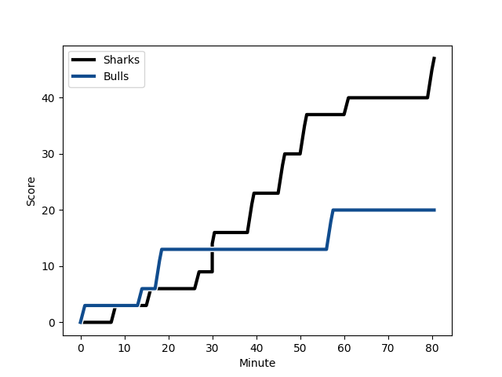
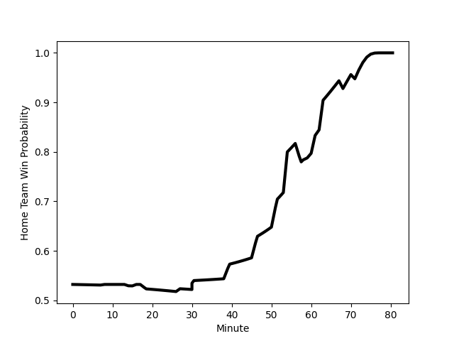

---  
layout: page  
title: Bulls at Sharks; 20-47  
date: 2022-12-31 15:45:00 18:00:00 -0500  
categories: match review  
---
# Bulls (1571.73) at Sharks (1625.77); 20-47

# Prediction: Sharks by 8.4

Sharks by 5.4 on a neutral field
## Scores over Time

## Win Probability over Time

# Pre-Match Prediction: Sharks by 9.8

Sharks by 6.8 on a neutral pitch

|   Away Minutes | Away Player                                                             |   Away elo |   Away Percentile |   Number |   Home Percentile |   Home elo | Home Player                                                                   |   Home Minutes |
|---------------:|:------------------------------------------------------------------------|-----------:|------------------:|---------:|------------------:|-----------:|:------------------------------------------------------------------------------|---------------:|
|             44 | [Simphiwe Matanzima](..//playerfiles//SimphiweMatanzima_cleaned.md)     |      99.62 |                64 |        1 |                91 |     110.03 | [Ox Nche](..//playerfiles//OxNche_cleaned.md)                                 |             59 |
|             66 | [Johan Grobbelaar](..//playerfiles//JohanGrobbelaar_cleaned.md)         |     118.87 |                97 |        2 |                98 |     123.35 | [Bongi Mbonambi](..//playerfiles//BongiMbonambi_cleaned.md)                   |             54 |
|             71 | [Mornay Smith](..//playerfiles//MornaySmith_cleaned.md)                 |      98.7  |                64 |        3 |                88 |     107.62 | [Thomas du Toit](..//playerfiles//ThomasduToit_cleaned.md)                    |             62 |
|             59 | [Ruan Vermaak](..//playerfiles//RuanVermaak_cleaned.md)                 |      89.09 |                23 |        4 |                98 |     132.46 | [Eben Etzebeth](..//playerfiles//EbenEtzebeth_cleaned.md)                     |             71 |
|             80 | [Ruan Nortje](..//playerfiles//RuanNortje_cleaned.md)                   |     103.98 |                78 |        5 |                12 |      83.17 | [Gerbrandt Grobler](..//playerfiles//GerbrandtGrobler_cleaned.md)             |             80 |
|             80 | [Marco van Staden](..//playerfiles//MarcovanStaden_cleaned.md)          |      99.9  |                67 |        6 |                91 |     112.7  | [Siya Kolisi](..//playerfiles//SiyaKolisi_cleaned.md)                         |             80 |
|             80 | [Cyle Brink](..//playerfiles//CyleBrink_cleaned.md)                     |      88.3  |                20 |        7 |                84 |     106.93 | [Henco Venter](..//playerfiles//HencoVenter_cleaned.md)                       |             59 |
|             52 | [Elrigh Louw](..//playerfiles//ElrighLouw_cleaned.md)                   |     104.77 |                75 |        8 |                89 |     109.92 | [Sikhumbuzo Notshe](..//playerfiles//SikhumbuzoNotshe_cleaned.md)             |             80 |
|             54 | [Bernard van der Linde](..//playerfiles//BernardvanderLinde_cleaned.md) |      92.81 |                34 |        9 |                84 |     107.18 | [Grant Williams](..//playerfiles//GrantWilliams_cleaned.md)                   |             59 |
|             80 | [Chris Smith](..//playerfiles//ChrisSmith_cleaned.md)                   |     102.31 |                70 |       10 |                80 |     108.38 | [Curwin Bosch](..//playerfiles//CurwinBosch_cleaned.md)                       |             80 |
|             80 | [Kurt-Lee Arendse](..//playerfiles//Kurt-LeeArendse_cleaned.md)         |     133.03 |                99 |       11 |                97 |     122.47 | [Makazole Mapimpi](..//playerfiles//MakazoleMapimpi_cleaned.md)               |             80 |
|             80 | [Harold Vorster](..//playerfiles//HaroldVorster_cleaned.md)             |     119.89 |                95 |       12 |                80 |     106.63 | [Rohan Janse van Rensburg](..//playerfiles//RohanJansevanRensburg_cleaned.md) |             71 |
|             63 | [Cornal Hendricks](..//playerfiles//CornalHendricks_cleaned.md)         |      98.19 |                61 |       13 |                95 |     120.95 | [Lukhanyo Am](..//playerfiles//LukhanyoAm_cleaned.md)                         |             80 |
|             80 | [Canan Moodie](..//playerfiles//CananMoodie_cleaned.md)                 |     118.17 |                94 |       14 |                29 |      90.91 | [Marnus Potgieter](..//playerfiles//MarnusPotgieter_cleaned.md)               |             80 |
|             79 | [Johan Goosen](..//playerfiles//JohanGoosen_cleaned.md)                 |     100.26 |                65 |       15 |                80 |     106.85 | [Boeta Chamberlain](..//playerfiles//BoetaChamberlain_cleaned.md)             |             68 |
|             36 | [Gerhard Steenekamp](..//playerfiles//GerhardSteenekamp_cleaned.md)     |     110.07 |                91 |       16 |                26 |      92.44 | [Kerron van Vuuren](..//playerfiles//KerronvanVuuren_cleaned.md)              |             26 |
|             28 | [Nizaam Carr](..//playerfiles//NizaamCarr_cleaned.md)                   |     101.72 |                74 |       17 |                85 |     110.21 | [Phepsi Buthelezi](..//playerfiles//PhepsiButhelezi_cleaned.md)               |             21 |
|             26 | [Embrose Papier](..//playerfiles//EmbrosePapier_cleaned.md)             |     106.92 |                83 |       18 |                81 |     106.01 | [Jaden Hendrikse](..//playerfiles//JadenHendrikse_cleaned.md)                 |             21 |
|             21 | [Janko Swanepoel](..//playerfiles//JankoSwanepoel_cleaned.md)           |      89.94 |                28 |       19 |                15 |      90.75 | [Dian Bleuler](..//playerfiles//DianBleuler_cleaned.md)                       |             21 |
|             17 | [Lionel Mapoe](..//playerfiles//LionelMapoe_cleaned.md)                 |     105.39 |                78 |       20 |                17 |      88.46 | [Carlu Sadie](..//playerfiles//CarluSadie_cleaned.md)                         |             18 |
|             14 | [Jan Hendrik Wessels](..//playerfiles//JanHendrikWessels_cleaned.md)    |      86.76 |                14 |       21 |                92 |     117.25 | [Lionel Cronje](..//playerfiles//LionelCronje_cleaned.md)                     |             12 |
|              9 | [Sebastian Lombard](..//playerfiles//SebastianLombard_cleaned.md)       |      93.08 |               nan |       22 |                65 |      99.59 | [Hyron Andrews](..//playerfiles//HyronAndrews_cleaned.md)                     |              9 |
|              1 | [David Kriel](..//playerfiles//DavidKriel_cleaned.md)                   |     108.84 |                86 |       23 |                10 |      81.85 | [Yaw Penxe](..//playerfiles//YawPenxe_cleaned.md)                             |              9 |

