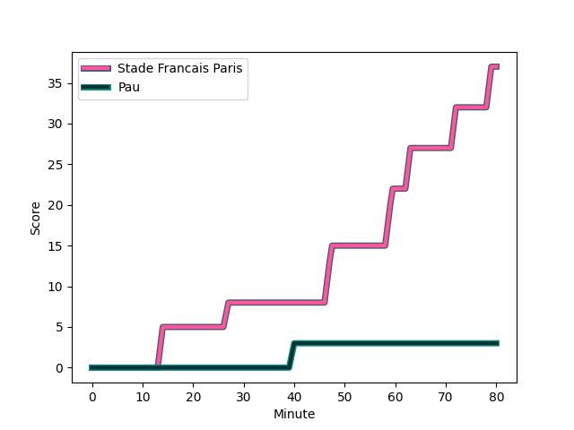
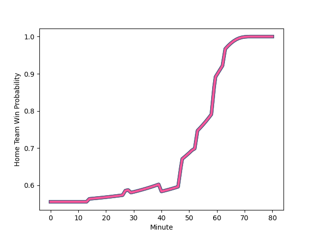

---  
layout: page  
title: Pau at Stade Francais Paris; 3-37  
date: 2022-12-31 17:00:00 18:00:00 -0500  
categories: match review  
---
# Pau (1602.49) at Stade Francais Paris (1699.77); 3-37

# Prediction: Stade Francais Paris by 13.7

Stade Francais Paris by 9.7 on a neutral field
## Scores over Time

## Win Probability over Time

# Pre-Match Prediction: Stade Francais Paris by 11.9

Stade Francais Paris by 7.9 on a neutral pitch

|   Away Minutes | Away Player                                                           |   Away elo |   Away Percentile |   Number |   Home Percentile |   Home elo | Home Player                                                                   |   Home Minutes |
|---------------:|:----------------------------------------------------------------------|-----------:|------------------:|---------:|------------------:|-----------:|:------------------------------------------------------------------------------|---------------:|
|             48 | [Siegfried Fisi'ihoi](..//playerfiles//SiegfriedFisi'ihoi_cleaned.md) |     123.39 |                96 |        1 |                84 |     108.84 | [Clement Castets](..//playerfiles//ClementCastets_cleaned.md)                 |             45 |
|             52 | [Youri Delhommel](..//playerfiles//YouriDelhommel_cleaned.md)         |      88.66 |                30 |        2 |                19 |      85.01 | [Mickael Ivaldi](..//playerfiles//MickaelIvaldi_cleaned.md)                   |             56 |
|             56 | [Siate Tokolahi](..//playerfiles//SiateTokolahi_cleaned.md)           |      96.6  |                55 |        3 |                91 |     115.65 | [Giorgi Melikidze](..//playerfiles//GiorgiMelikidze_cleaned.md)               |             56 |
|             52 | [Lekima Tagitagivalu](..//playerfiles//LekimaTagitagivalu_cleaned.md) |     101.56 |                67 |        4 |                44 |      93.87 | [Marcos Kremer](..//playerfiles//MarcosKremer_cleaned.md)                     |             66 |
|             80 | [Mickael Capelli](..//playerfiles//MickaelCapelli_cleaned.md)         |     133.69 |                98 |        5 |                80 |     113.94 | [JJ van der Mescht](..//playerfiles//JJvanderMescht_cleaned.md)               |             80 |
|             80 | [Sacha Zegueur](..//playerfiles//SachaZegueur_cleaned.md)             |      73.56 |                 7 |        6 |                47 |      94.97 | [Romain Briatte](..//playerfiles//RomainBriatte_cleaned.md)                   |             80 |
|             58 | [Reece Hewat](..//playerfiles//ReeceHewat_cleaned.md)                 |      95.81 |                48 |        7 |                83 |     111.89 | [Sekou Macalou](..//playerfiles//SekouMacalou_cleaned.md)                     |             80 |
|             80 | [Beka Gorgadze](..//playerfiles//BekaGorgadze_cleaned.md)             |     119.26 |                91 |        8 |                99 |     144.75 | [Giovanni Habel-Kueffner](..//playerfiles//GiovanniHabel-Kueffner_cleaned.md) |             64 |
|             53 | [Thibault Daubagna](..//playerfiles//ThibaultDaubagna_cleaned.md)     |     142.01 |                99 |        9 |                67 |     103    | [Morgan Parra](..//playerfiles//MorganParra_cleaned.md)                       |             60 |
|             59 | [Zack Henry](..//playerfiles//ZackHenry_cleaned.md)                   |     136.63 |                96 |       10 |                98 |     140.69 | [Joris Segonds](..//playerfiles//JorisSegonds_cleaned.md)                     |             80 |
|             80 | [Émilien Gailleton](..//playerfiles//ÉmilienGailleton_cleaned.md)     |     105.21 |                72 |       11 |                92 |     123.41 | [Lester Etien](..//playerfiles//LesterEtien_cleaned.md)                       |             80 |
|             80 | [Nathan Decron](..//playerfiles//NathanDecron_cleaned.md)             |     127.54 |                95 |       12 |                96 |     131.23 | [Julien Delbouis](..//playerfiles//JulienDelbouis_cleaned.md)                 |             80 |
|             70 | [Tumua Manu](..//playerfiles//TumuaManu_cleaned.md)                   |     127.64 |                95 |       13 |                89 |     118.59 | [Jeremy Ward](..//playerfiles//JeremyWard_cleaned.md)                         |             80 |
|             80 | [Elliot Roudil](..//playerfiles//ElliotRoudil_cleaned.md)             |      82.03 |                12 |       14 |                81 |     111.03 | [Sione Tui](..//playerfiles//SioneTui_cleaned.md)                             |             29 |
|             80 | [Jack Maddocks](..//playerfiles//JackMaddocks_cleaned.md)             |      87.11 |                30 |       15 |                86 |     117.19 | [Leo Barre](..//playerfiles//LeoBarre_cleaned.md)                             |             59 |
|             32 | [Remi Seneca](..//playerfiles//RemiSeneca_cleaned.md)                 |     117.42 |                93 |       16 |                51 |      99.34 | [Paolo Odogwu](..//playerfiles//PaoloOdogwu_cleaned.md)                       |             51 |
|             28 | [Hugo Auradou](..//playerfiles//HugoAuradou_cleaned.md)               |      92.85 |                42 |       17 |                73 |     102.09 | [Moses Alo-Emile](..//playerfiles//MosesAlo-Emile_cleaned.md)                 |             35 |
|             28 | [Lucas Rey](..//playerfiles//LucasRey_cleaned.md)                     |      78.54 |                 9 |       18 |                82 |     106.24 | [Lucas Peyresblanques](..//playerfiles//LucasPeyresblanques_cleaned.md)       |             24 |
|             27 | [Dan Robson](..//playerfiles//DanRobson_cleaned.md)                   |     106.07 |                75 |       19 |                44 |      92.77 | [Paul Alo-Emile](..//playerfiles//PaulAlo-Emile_cleaned.md)                   |             24 |
|             24 | [Guram Papidze](..//playerfiles//GuramPapidze_cleaned.md)             |      75.48 |                 6 |       20 |                90 |     123.96 | [Kylan Hamdaoui](..//playerfiles//KylanHamdaoui_cleaned.md)                   |             21 |
|             22 | [Thibault Hamonou](..//playerfiles//ThibaultHamonou_cleaned.md)       |      90.03 |                34 |       21 |                96 |     128.56 | [James Hall](..//playerfiles//JamesHall_cleaned.md)                           |             20 |
|             21 | [Thibault Debaes](..//playerfiles//ThibaultDebaes_cleaned.md)         |     119.33 |                88 |       22 |                61 |     100.59 | [Paul-Hugo Champ](..//playerfiles//Paul-HugoChamp_cleaned.md)                 |             16 |
|             10 | [Thomas Carol](..//playerfiles//ThomasCarol_cleaned.md)               |      90.53 |                34 |       23 |                 8 |      78.16 | [Mathieu Hirigoyen](..//playerfiles//MathieuHirigoyen_cleaned.md)             |             14 |

