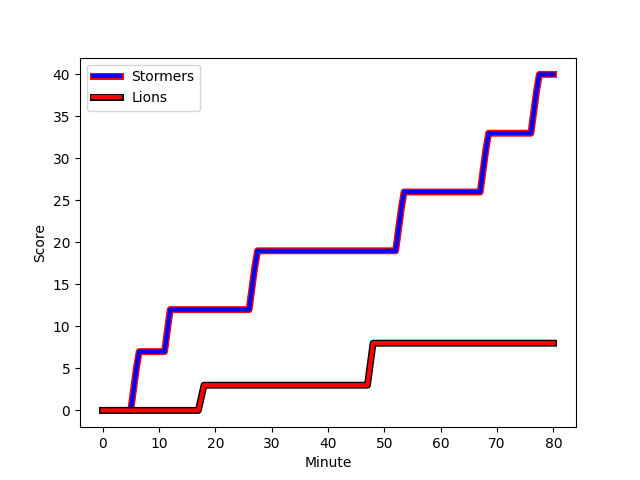
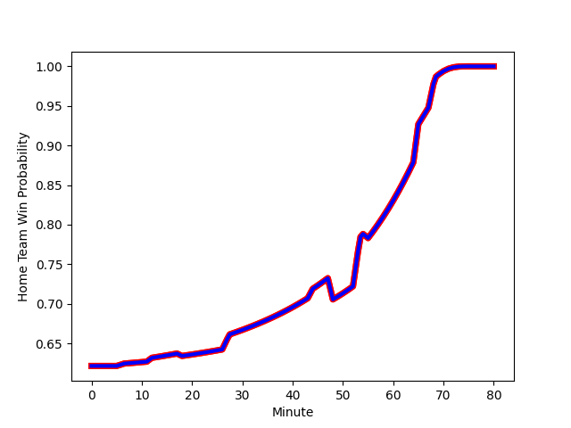

---  
layout: page  
title: Lions at Stormers; 8-40  
date: 2022-12-31 18:00:00 18:00:00 -0500  
categories: match review  
---
# Lions (1470.23) at Stormers (1637.87); 8-40

# Prediction: Stormers by 20.8

Stormers by 16.8 on a neutral field
## Scores over Time

## Win Probability over Time

# Pre-Match Prediction: Stormers by 23.2

Stormers by 19.2 on a neutral pitch

|   Away Minutes | Away Player                                                                   |   Away elo |   Away Percentile |   Number |   Home Percentile |   Home elo | Home Player                                                              |   Home Minutes |
|---------------:|:------------------------------------------------------------------------------|-----------:|------------------:|---------:|------------------:|-----------:|:-------------------------------------------------------------------------|---------------:|
|             68 | [Jean-Pierre Smith](..//playerfiles//Jean-PierreSmith_cleaned.md)             |      94.9  |                49 |        1 |                94 |     119.58 | [Steven Kitshoff](..//playerfiles//StevenKitshoff_cleaned.md)            |             68 |
|             65 | [PJ Botha](..//playerfiles//PJBotha_cleaned.md)                               |      88.71 |                30 |        2 |                65 |     100.96 | [Joseph Dweba](..//playerfiles//JosephDweba_cleaned.md)                  |             55 |
|             80 | [Asenathi Ntlabakanye](..//playerfiles//AsenathiNtlabakanye_cleaned.md)       |      78.27 |                 8 |        3 |                86 |     110.63 | [Neethling Fouche](..//playerfiles//NeethlingFouche_cleaned.md)          |             58 |
|             72 | [Willem Alberts](..//playerfiles//WillemAlberts_cleaned.md)                   |     106.17 |                75 |        4 |                72 |     104.83 | [Ben-Jason Dixon](..//playerfiles//Ben-JasonDixon_cleaned.md)            |             55 |
|             80 | [Pieter Jansen van Vuuren](..//playerfiles//PieterJansenvanVuuren_cleaned.md) |     102.66 |                71 |        5 |                73 |     105.34 | [Marvin Orie](..//playerfiles//MarvinOrie_cleaned.md)                    |             80 |
|             80 | [Jarod Cairns](..//playerfiles//JarodCairns_cleaned.md)                       |      72.9  |                 4 |        6 |                98 |     138.48 | [Deon Fourie](..//playerfiles//DeonFourie_cleaned.md)                    |             55 |
|             80 | [Ruan Venter](..//playerfiles//RuanVenter_cleaned.md)                         |     110    |                79 |        7 |                75 |     105.74 | [Willie Engelbrecht](..//playerfiles//WillieEngelbrecht_cleaned.md)      |             68 |
|             65 | [Emmanuel Tshituka](..//playerfiles//EmmanuelTshituka_cleaned.md)             |      77.65 |                 9 |        8 |                92 |     124.69 | [Hacjivah Dayimani](..//playerfiles//HacjivahDayimani_cleaned.md)        |             80 |
|             44 | [Sanele Nohamba](..//playerfiles//SaneleNohamba_cleaned.md)                   |     119.78 |                93 |        9 |                58 |      99.52 | [Albertus Paul de Wet](..//playerfiles//AlbertusPauldeWet_cleaned.md)    |             80 |
|             80 | [Jordan Hendrikse](..//playerfiles//JordanHendrikse_cleaned.md)               |      78.24 |                 9 |       10 |                76 |     110.32 | [Manie Libbok](..//playerfiles//ManieLibbok_cleaned.md)                  |             80 |
|             80 | [Edwill van der Merwe](..//playerfiles//EdwillvanderMerwe_cleaned.md)         |     115.7  |                86 |       11 |                77 |     107.87 | [Leolin Zas](..//playerfiles//LeolinZas_cleaned.md)                      |             51 |
|             72 | [Marius Louw](..//playerfiles//MariusLouw_cleaned.md)                         |     121.03 |                91 |       12 |                88 |     117.73 | [Daniel du Plessis](..//playerfiles//DanielduPlessis_cleaned.md)         |             68 |
|             80 | [Henco van Wyk](..//playerfiles//HencovanWyk_cleaned.md)                      |     115.01 |                86 |       13 |                42 |      93.04 | [Suleiman  Hartzenberg](..//playerfiles//SuleimanHartzenberg_cleaned.md) |             80 |
|             44 | [Rabz Maxwane](..//playerfiles//RabzMaxwane_cleaned.md)                       |      76.86 |                10 |       14 |                66 |     101.47 | [Angelo Davids](..//playerfiles//AngeloDavids_cleaned.md)                |             80 |
|             80 | [Quan Horn](..//playerfiles//QuanHorn_cleaned.md)                             |     118.67 |                89 |       15 |                94 |     130.03 | [Damian Willemse](..//playerfiles//DamianWillemse_cleaned.md)            |             80 |
|             36 | [Morne Van den Berg](..//playerfiles//MorneVandenBerg_cleaned.md)             |      84.37 |                13 |       16 |                63 |     101.58 | [Clayton Blommetjies](..//playerfiles//ClaytonBlommetjies_cleaned.md)    |             29 |
|             36 | [Manuel Rass](..//playerfiles//ManuelRass_cleaned.md)                         |      89.44 |                23 |       17 |                80 |     105.65 | [Andre-Hugo Venter](..//playerfiles//Andre-HugoVenter_cleaned.md)        |             25 |
|             15 | [Jaco Visagie](..//playerfiles//JacoVisagie_cleaned.md)                       |      91.42 |                49 |       18 |                56 |      97.11 | [Connor Evans](..//playerfiles//ConnorEvans_cleaned.md)                  |             25 |
|             15 | [Sibusiso Sangweni](..//playerfiles//SibusisoSangweni_cleaned.md)             |      91.15 |                39 |       19 |                19 |      83.05 | [Junior Pokomela](..//playerfiles//JuniorPokomela_cleaned.md)            |             25 |
|             12 | [Morgan Naude](..//playerfiles//MorganNaude_cleaned.md)                       |     107.38 |               nan |       20 |                28 |      91    | [Sazi Sandi](..//playerfiles//SaziSandi_cleaned.md)                      |             22 |
|              8 | [Ruben Schoeman](..//playerfiles//RubenSchoeman_cleaned.md)                   |     116.02 |                88 |       21 |                26 |      87.43 | [Marcel Theunissen](..//playerfiles//MarcelTheunissen_cleaned.md)        |             12 |
|              8 | [Gianni Dean Lombard](..//playerfiles//GianniDeanLombard_cleaned.md)          |     101.57 |                62 |       22 |                99 |     135.76 | [Brok Harris](..//playerfiles//BrokHarris_cleaned.md)                    |             12 |
|            nan | nan                                                                           |     nan    |               nan |       23 |                 8 |      77.12 | [Godlen Masimla](..//playerfiles//GodlenMasimla_cleaned.md)              |             12 |

