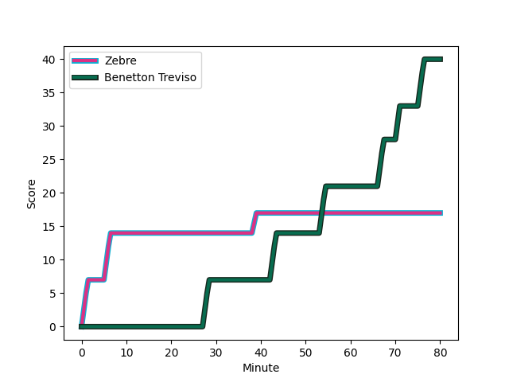
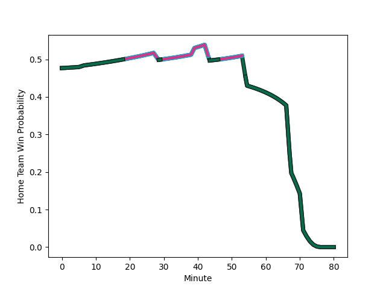

---  
layout: page  
title: Benetton Treviso at Zebre; 40-17  
date: 2022-12-31 13:30:00 18:00:00 -0500  
categories: match review  
---
# Benetton Treviso (1468.04) at Zebre (1439.23); 40-17

# Prediction: Zebre by 1.1

Benetton Treviso by 2.9 on a neutral field
## Scores over Time

## Win Probability over Time

# Pre-Match Prediction: Benetton Treviso by 0.6

Benetton Treviso by 3.4 on a neutral pitch

|   Away Minutes | Away Player                                                         |   Away elo |   Away Percentile |   Number |   Home Percentile |   Home elo | Home Player                                                            |   Home Minutes |
|---------------:|:--------------------------------------------------------------------|-----------:|------------------:|---------:|------------------:|-----------:|:-----------------------------------------------------------------------|---------------:|
|             40 | [Cherif Traore](..//playerfiles//CherifTraore_cleaned.md)           |      86.08 |                20 |        1 |                27 |      88.66 | [Juan Manuel Pitinari](..//playerfiles//JuanManuelPitinari_cleaned.md) |             56 |
|             54 | [Giacomo Nicotera](..//playerfiles//GiacomoNicotera_cleaned.md)     |     104.94 |                76 |        2 |                20 |      85.13 | [Luca Bigi](..//playerfiles//LucaBigi_cleaned.md)                      |             56 |
|             68 | [Tiziano Pasquali](..//playerfiles//TizianoPasquali_cleaned.md)     |      98.45 |                57 |        3 |                58 |      97.32 | [Muhamed Hasa](..//playerfiles//MuhamedHasa_cleaned.md)                |             44 |
|              1 | [Scott Scrafton](..//playerfiles//ScottScrafton_cleaned.md)         |     107.99 |                78 |        4 |                81 |     110.76 | [Jan Uys](..//playerfiles//JanUys_cleaned.md)                          |             47 |
|             80 | [Federico Ruzza](..//playerfiles//FedericoRuzza_cleaned.md)         |      94.02 |                45 |        5 |                92 |     122.31 | [Josh Furno](..//playerfiles//JoshFurno_cleaned.md)                    |             80 |
|             80 | [Sebastian Negri](..//playerfiles//SebastianNegri_cleaned.md)       |      81.46 |                14 |        6 |                59 |      97.34 | [Giacomo Ferrari](..//playerfiles//GiacomoFerrari_cleaned.md)          |             65 |
|             80 | [Manuel Zuliani](..//playerfiles//ManuelZuliani_cleaned.md)         |      89.23 |                29 |        7 |                 6 |      73.84 | [Iacopo Bianchi](..//playerfiles//IacopoBianchi_cleaned.md)            |             80 |
|             61 | [Henry Time-Stowers](..//playerfiles//HenryTime-Stowers_cleaned.md) |      77.24 |                10 |        8 |                86 |     115.89 | [Taina Fox-Matamua](..//playerfiles//TainaFox-Matamua_cleaned.md)      |             80 |
|             61 | [Alessandro Garbisi](..//playerfiles//AlessandroGarbisi_cleaned.md) |      88.07 |                26 |        9 |                20 |      86.04 | [Alessandro Fusco](..//playerfiles//AlessandroFusco_cleaned.md)        |             67 |
|             54 | [Jacob Umaga](..//playerfiles//JacobUmaga_cleaned.md)               |     102.52 |                59 |       10 |                45 |      95.55 | [Tiff Eden](..//playerfiles//TiffEden_cleaned.md)                      |             71 |
|             80 | [Onisi Ratave](..//playerfiles//OnisiRatave_cleaned.md)             |     102.71 |                68 |       11 |                 4 |      66.43 | [Jacopo Trulla](..//playerfiles//JacopoTrulla_cleaned.md)              |             80 |
|             68 | [Juan Ignacio Brex](..//playerfiles//JuanIgnacioBrex_cleaned.md)    |     109.19 |                78 |       12 |                97 |     133.92 | [Enrico Lucchin](..//playerfiles//EnricoLucchin_cleaned.md)            |             80 |
|             80 | [Tommaso Menoncello](..//playerfiles//TommasoMenoncello_cleaned.md) |     108.33 |                77 |       13 |                11 |      78.3  | [Erich Cronje](..//playerfiles//ErichCronje_cleaned.md)                |             67 |
|             80 | [Edoardo Padovani](..//playerfiles//EdoardoPadovani_cleaned.md)     |     113.36 |                82 |       14 |                95 |     128.62 | [Jacobus van Wyk](..//playerfiles//JacobusvanWyk_cleaned.md)           |             80 |
|             80 | [Matteo Minozzi](..//playerfiles//MatteoMinozzi_cleaned.md)         |     113.22 |                84 |       15 |                17 |      80.47 | [Lorenzo Pani](..//playerfiles//LorenzoPani_cleaned.md)                |             80 |
|             79 | [Riccardo Favretto](..//playerfiles//RiccardoFavretto_cleaned.md)   |      92.14 |               nan |       16 |               nan |      94.25 | [Riccardo Genovese](..//playerfiles//RiccardoGenovese_cleaned.md)      |             36 |
|             40 | [Federico Zani](..//playerfiles//FedericoZani_cleaned.md)           |      98.52 |                58 |       17 |                25 |      87.38 | [Andrea Zambonin](..//playerfiles//AndreaZambonin_cleaned.md)          |             33 |
|             26 | [Siua Maile](..//playerfiles//SiuaMaile_cleaned.md)                 |      93.34 |                43 |       18 |                51 |      95.65 | [Paolo Buonfiglio](..//playerfiles//PaoloBuonfiglio_cleaned.md)        |             24 |
|             26 | [Tomas Albornoz](..//playerfiles//TomasAlbornoz_cleaned.md)         |     120.42 |                89 |       19 |                 0 |      48.4  | [Marco Manfredi](..//playerfiles//MarcoManfredi_cleaned.md)            |             24 |
|             19 | [Manfredi Albanese](..//playerfiles//ManfrediAlbanese_cleaned.md)   |     100.94 |                63 |       20 |                 8 |      77.13 | [Luca Andreani](..//playerfiles//LucaAndreani_cleaned.md)              |             15 |
|             19 | [Alessandro Izekor](..//playerfiles//AlessandroIzekor_cleaned.md)   |      73.81 |                 5 |       21 |                34 |      87.19 | [Ratko Jelic](..//playerfiles//RatkoJelic_cleaned.md)                  |             13 |
|             12 | [Filippo Alongi](..//playerfiles//FilippoAlongi_cleaned.md)         |      93.21 |                42 |       22 |               nan |      94.11 | [Matteo Moscardi](..//playerfiles//MatteoMoscardi_cleaned.md)          |             13 |
|             12 | [Filippo Drago](..//playerfiles//FilippoDrago_cleaned.md)           |      90.18 |                36 |       23 |               nan |      92.23 | [Nicolò Teneggi](..//playerfiles//NicolòTeneggi_cleaned.md)            |              9 |

