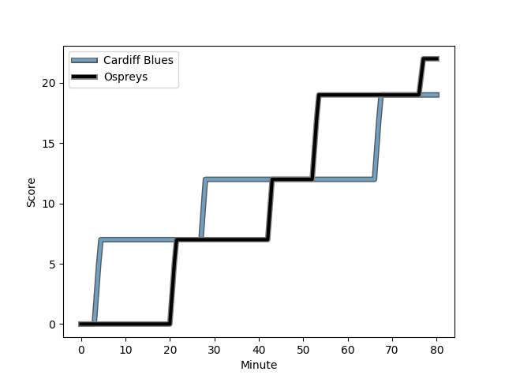
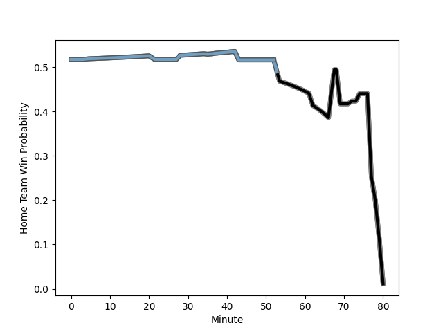

---  
layout: page  
title: Ospreys at Cardiff Blues; 22-19  
date: 2023-01-01 16:00:00 18:00:00 -0500  
categories: match review  
---
# Ospreys (1660.73) at Cardiff Blues (1691.97); 22-19

# Prediction: Cardiff Blues by 7.1

Cardiff Blues by 3.1 on a neutral field
## Scores over Time

## Win Probability over Time

# Pre-Match Prediction: Cardiff Blues by 1.3

Ospreys by 2.7 on a neutral pitch

|   Away Minutes | Away Player                                                                 |   Away elo |   Away Percentile |   Number |   Home Percentile |   Home elo | Home Player                                                           |   Home Minutes |
|---------------:|:----------------------------------------------------------------------------|-----------:|------------------:|---------:|------------------:|-----------:|:----------------------------------------------------------------------|---------------:|
|             54 | [Gareth Thomas](..//playerfiles//GarethThomas_cleaned.md)                   |      81.66 |                 1 |        1 |                33 |     100.34 | [Rhys Carré](..//playerfiles//RhysCarré_cleaned.md)                   |             80 |
|             37 | [Sam Parry](..//playerfiles//SamParry_cleaned.md)                           |      98.52 |                26 |        2 |                49 |     102.67 | [Liam Belcher](..//playerfiles//LiamBelcher_cleaned.md)               |             35 |
|             54 | [Tom Botha](..//playerfiles//TomBotha_cleaned.md)                           |      85.39 |                 3 |        3 |               nan |     107.21 | [William Davies-King](..//playerfiles//WilliamDavies-King_cleaned.md) |             47 |
|             80 | [Adam Beard](..//playerfiles//AdamBeard_cleaned.md)                         |     105.23 |                57 |        4 |                69 |     108.39 | [Lopeti Timani](..//playerfiles//LopetiTimani_cleaned.md)             |             62 |
|             69 | [Alun Wyn Jones](..//playerfiles//AlunWynJones_cleaned.md)                  |     120.71 |                90 |        5 |                55 |     105.18 | [Seb Davies](..//playerfiles//SebDavies_cleaned.md)                   |             80 |
|             80 | [Jac Morgan](..//playerfiles//JacMorgan_cleaned.md)                         |     107.47 |                64 |        6 |                72 |     110.29 | [Josh Turnbull](..//playerfiles//JoshTurnbull_cleaned.md)             |             80 |
|             80 | [Justin Tipuric](..//playerfiles//JustinTipuric_cleaned.md)                 |     130.28 |                96 |        7 |                86 |     117.69 | [Thomas Young](..//playerfiles//ThomasYoung_cleaned.md)               |             62 |
|             74 | [Ethan Roots](..//playerfiles//EthanRoots_cleaned.md)                       |     115.8  |                84 |        8 |                65 |     109.42 | [Taulupe Faletau](..//playerfiles//TaulupeFaletau_cleaned.md)         |             80 |
|             69 | [Rhys Webb](..//playerfiles//RhysWebb_cleaned.md)                           |     112.73 |                78 |        9 |                91 |     122.26 | [Tomos Williams](..//playerfiles//TomosWilliams_cleaned.md)           |             80 |
|             80 | [Owen Williams](..//playerfiles//OwenWilliams_cleaned.md)                   |     128.62 |                93 |       10 |                83 |     118.91 | [Jarrod Evans](..//playerfiles//JarrodEvans_cleaned.md)               |             80 |
|             72 | [Keelan Giles](..//playerfiles//KeelanGiles_cleaned.md)                     |      82.81 |                 4 |       11 |                81 |     115.14 | [Josh Adams](..//playerfiles//JoshAdams_cleaned.md)                   |             80 |
|             80 | [Keiran Williams](..//playerfiles//KeiranWilliams_cleaned.md)               |     120.42 |                88 |       12 |                63 |     108.28 | [Ben Thomas](..//playerfiles//BenThomas_cleaned.md)                   |             80 |
|             72 | [Michael Collins](..//playerfiles//MichaelCollins_cleaned.md)               |     122.55 |                91 |       13 |                99 |     143.46 | [Rey Lee-Lo](..//playerfiles//ReyLee-Lo_cleaned.md)                   |             80 |
|             80 | [Alex Cuthbert](..//playerfiles//AlexCuthbert_cleaned.md)                   |     130.76 |                96 |       14 |                 2 |      79.2  | [Owen Lane](..//playerfiles//OwenLane_cleaned.md)                     |             74 |
|             80 | [Jack Walsh](..//playerfiles//JackWalsh_cleaned.md)                         |     103.35 |                48 |       15 |                99 |     148.44 | [Liam Williams](..//playerfiles//LiamWilliams_cleaned.md)             |             80 |
|             43 | [Dewi Lake](..//playerfiles//DewiLake_cleaned.md)                           |      96.82 |                19 |       16 |                25 |      98.2  | [Kirby Myhill](..//playerfiles//KirbyMyhill_cleaned.md)               |             45 |
|             26 | [Nicky Smith](..//playerfiles//NickySmith_cleaned.md)                       |     101.04 |                36 |       17 |               nan |      97.89 | [Keiron Assiratti](..//playerfiles//KeironAssiratti_cleaned.md)       |             33 |
|             26 | [Tomas Francis](..//playerfiles//TomasFrancis_cleaned.md)                   |     129.27 |                98 |       18 |                85 |     116.67 | [Ellis Jenkins](..//playerfiles//EllisJenkins_cleaned.md)             |             18 |
|             11 | [Reuben Morgan-Williams](..//playerfiles//ReubenMorgan-Williams_cleaned.md) |     105.91 |                56 |       19 |                58 |     107.7  | [James Ratti](..//playerfiles//JamesRatti_cleaned.md)                 |             18 |
|             11 | [Rhys Davies](..//playerfiles//RhysDavies_cleaned.md)                       |     115.33 |                84 |       20 |                60 |     103.55 | [Corey Domachowski](..//playerfiles//CoreyDomachowski_cleaned.md)     |              6 |
|              8 | [Joe Hawkins](..//playerfiles//JoeHawkins_cleaned.md)                       |      92.23 |                12 |       21 |               nan |     nan    | nan                                                                   |            nan |
|              8 | [Cai Evans](..//playerfiles//CaiEvans_cleaned.md)                           |      95.67 |               nan |       22 |               nan |     nan    | nan                                                                   |            nan |
|              6 | [Morgan Morris](..//playerfiles//MorganMorris_cleaned.md)                   |      91.91 |                13 |       23 |               nan |     nan    | nan                                                                   |            nan |

