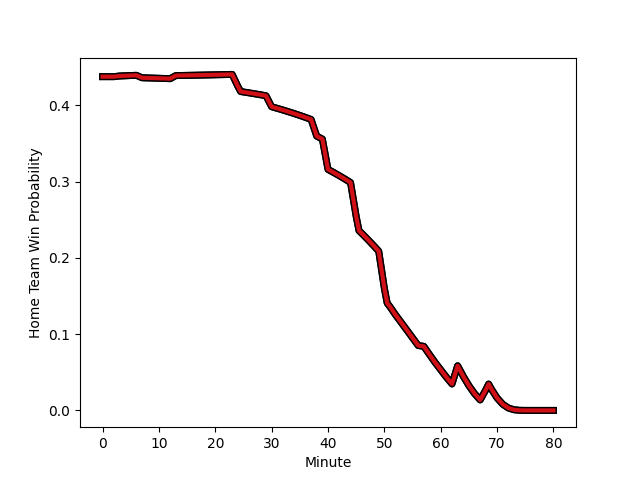

---  
layout: page  
title: Stade Toulousain at Clermont Auvergne; 32-13  
date: 2023-01-01 21:00:00 18:00:00 -0500  
categories: match review  
---
# Stade Toulousain (1616.52) at Clermont Auvergne (1507.56); 32-13

# Prediction: Stade Toulousain by 6.9

Stade Toulousain by 10.9 on a neutral field
## Scores over Time

## Win Probability over Time

# Pre-Match Prediction: Stade Toulousain by 5.0

Stade Toulousain by 9.0 on a neutral pitch

|   Away Minutes | Away Player                                                             |   Away elo |   Away Percentile |   Number |   Home Percentile |   Home elo | Home Player                                                         |   Home Minutes |
|---------------:|:------------------------------------------------------------------------|-----------:|------------------:|---------:|------------------:|-----------:|:--------------------------------------------------------------------|---------------:|
|             52 | [Rodrigue Neti](..//playerfiles//RodrigueNeti_cleaned.md)               |      87.26 |                33 |        1 |                95 |     120.75 | [Etienne Falgoux](..//playerfiles//EtienneFalgoux_cleaned.md)       |             40 |
|             52 | [Julien Marchand](..//playerfiles//JulienMarchand_cleaned.md)           |     105.28 |                77 |        2 |                40 |      91.93 | [Yohan Beheregaray](..//playerfiles//YohanBeheregaray_cleaned.md)   |             57 |
|             57 | [Charlie Faumuina](..//playerfiles//CharlieFaumuina_cleaned.md)         |     147.06 |                99 |        3 |                87 |     112.33 | [Davit Kubriashvili](..//playerfiles//DavitKubriashvili_cleaned.md) |             40 |
|             60 | [Richie Arnold](..//playerfiles//RichieArnold_cleaned.md)               |      94.24 |                51 |        4 |                10 |      80.94 | [Miles Amatosero](..//playerfiles//MilesAmatosero_cleaned.md)       |             69 |
|             80 | [Emmanuel Meafou](..//playerfiles//EmmanuelMeafou_cleaned.md)           |      99.5  |                60 |        5 |                85 |     113.37 | [Tomas Lavanini](..//playerfiles//TomasLavanini_cleaned.md)         |             80 |
|             60 | [Anthony Jelonch](..//playerfiles//AnthonyJelonch_cleaned.md)           |      89.67 |                31 |        6 |               nan |      95    | [Cyriac Guilly](..//playerfiles//CyriacGuilly_cleaned.md)           |             71 |
|             60 | [Alban Placines](..//playerfiles//AlbanPlacines_cleaned.md)             |     109.4  |                80 |        7 |                13 |      77.93 | [Loic Godener](..//playerfiles//LoicGodener_cleaned.md)             |             80 |
|             80 | [Alexandre Roumat](..//playerfiles//AlexandreRoumat_cleaned.md)         |     132.4  |                97 |        8 |                99 |     141.78 | [Fritz Lee](..//playerfiles//FritzLee_cleaned.md)                   |             80 |
|             80 | [Paul Graou](..//playerfiles//PaulGraou_cleaned.md)                     |     123.11 |                95 |        9 |                96 |     126.03 | [Sebastien Bezy](..//playerfiles//SebastienBezy_cleaned.md)         |             63 |
|             80 | [Antoine Dupont](..//playerfiles//AntoineDupont_cleaned.md)             |     113.04 |                87 |       10 |                58 |     100.83 | [Jules Plisson](..//playerfiles//JulesPlisson_cleaned.md)           |             57 |
|             63 | [Juan Cruz Mallia](..//playerfiles//JuanCruzMallia_cleaned.md)          |     103.28 |                65 |       11 |                87 |     117.26 | [Alivereti Raka](..//playerfiles//AliveretiRaka_cleaned.md)         |             80 |
|             57 | [Sofiane Guitoune](..//playerfiles//SofianeGuitoune_cleaned.md)         |      92.69 |                42 |       12 |                24 |      85.83 | [Irae Simone](..//playerfiles//IraeSimone_cleaned.md)               |             57 |
|             80 | [Pierre-Louis Barassi](..//playerfiles//Pierre-LouisBarassi_cleaned.md) |      97.96 |                54 |       13 |                59 |      98.9  | [Damian Penaud](..//playerfiles//DamianPenaud_cleaned.md)           |             80 |
|             80 | [Arthur Retiere](..//playerfiles//ArthurRetiere_cleaned.md)             |      98.73 |                58 |       14 |                69 |     103.21 | [Bautista Delguy](..//playerfiles//BautistaDelguy_cleaned.md)       |             80 |
|             80 | [Melvyn Jaminet](..//playerfiles//MelvynJaminet_cleaned.md)             |     130.53 |                94 |       15 |                 8 |      75.81 | [Cheikh Tiberghien](..//playerfiles//CheikhTiberghien_cleaned.md)   |             80 |
|             28 | [Cyril Baille](..//playerfiles//CyrilBaille_cleaned.md)                 |     110.86 |                86 |       16 |                31 |      89.91 | [Giorgi Beria](..//playerfiles//GiorgiBeria_cleaned.md)             |             40 |
|             28 | [Guillaume Cramont](..//playerfiles//GuillaumeCramont_cleaned.md)       |      84.06 |                20 |       17 |                37 |      91.58 | [Rabah Slimani](..//playerfiles//RabahSlimani_cleaned.md)           |             40 |
|             23 | [Paul Mallez](..//playerfiles//PaulMallez_cleaned.md)                   |      93.55 |               nan |       18 |                27 |      90.69 | [Benjamin Boudou](..//playerfiles//BenjaminBoudou_cleaned.md)       |             23 |
|             23 | [Dimitri Delibes](..//playerfiles//DimitriDelibes_cleaned.md)           |     112.7  |                83 |       19 |                71 |     106.59 | [Anthony Belleau](..//playerfiles//AnthonyBelleau_cleaned.md)       |             23 |
|             20 | [Rynhardt Elstadt](..//playerfiles//RynhardtElstadt_cleaned.md)         |     108.41 |                79 |       20 |                11 |      79.07 | [Samuel Ezeala](..//playerfiles//SamuelEzeala_cleaned.md)           |             23 |
|             20 | [Selevasio Tolofua](..//playerfiles//SelevasioTolofua_cleaned.md)       |     101.85 |                67 |       21 |                34 |      88.65 | [Baptiste Jauneau](..//playerfiles//BaptisteJauneau_cleaned.md)     |             17 |
|             20 | [Yannick Youyoutte](..//playerfiles//YannickYouyoutte_cleaned.md)       |      95.22 |                55 |       22 |               nan |      81.88 | [Edward Annandale](..//playerfiles//EdwardAnnandale_cleaned.md)     |             11 |
|             17 | [Lucas Tauzin](..//playerfiles//LucasTauzin_cleaned.md)                 |      94.4  |                45 |       23 |               nan |      94.43 | [Yoni Tuataane](..//playerfiles//YoniTuataane_cleaned.md)           |              9 |

