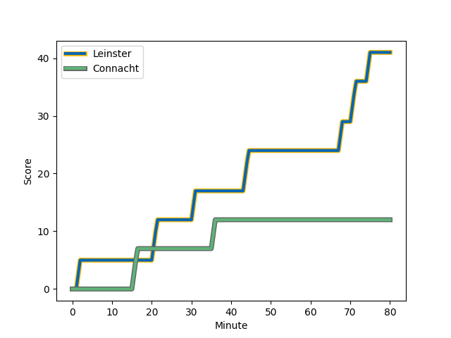
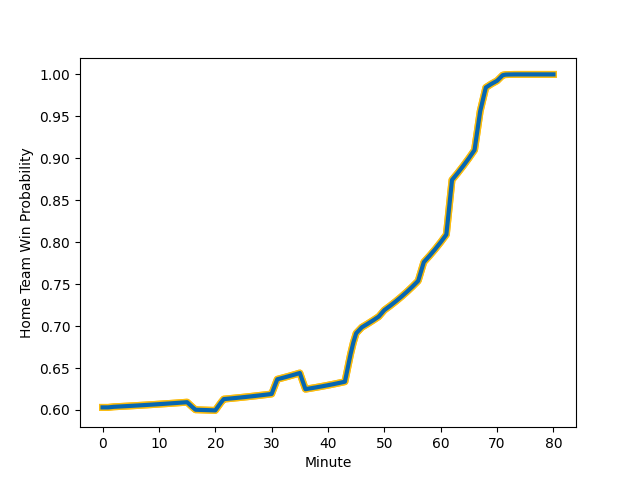

---  
layout: page  
title: Connacht at Leinster; 12-41  
date: 2023-01-01 20:35:00 18:00:00 -0500  
categories: match review  
---
# Connacht (1492.55) at Leinster (1704.0); 12-41

# Prediction: Leinster by 25.1

Leinster by 21.1 on a neutral field
## Scores over Time

## Win Probability over Time

# Pre-Match Prediction: Leinster by 23.9

Leinster by 19.9 on a neutral pitch

|   Away Minutes | Away Player                                                                   |   Away elo |   Away Percentile |   Number |   Home Percentile |   Home elo | Home Player                                                           |   Home Minutes |
|---------------:|:------------------------------------------------------------------------------|-----------:|------------------:|---------:|------------------:|-----------:|:----------------------------------------------------------------------|---------------:|
|             52 | [Peter Dooley](..//playerfiles//PeterDooley_cleaned.md)                       |     135.33 |                99 |        1 |               nan |      97.98 | [Michael Milne](..//playerfiles//MichaelMilne_cleaned.md)             |             50 |
|             69 | [Dave Heffernan](..//playerfiles//DaveHeffernan_cleaned.md)                   |      84.44 |                19 |        2 |                95 |     123.21 | [Ronan Kelleher](..//playerfiles//RonanKelleher_cleaned.md)           |             62 |
|             52 | [Dominic Robertson-McCoy](..//playerfiles//DominicRobertson-McCoy_cleaned.md) |      97.18 |               nan |        3 |                25 |      88.36 | [Michael Alaalatoa](..//playerfiles//MichaelAlaalatoa_cleaned.md)     |             62 |
|             80 | [Darragh Murray](..//playerfiles//DarraghMurray_cleaned.md)                   |      90.45 |                33 |        4 |               nan |      94.85 | [Brian Deeny](..//playerfiles//BrianDeeny_cleaned.md)                 |             50 |
|             80 | [Niall Murray](..//playerfiles//NiallMurray_cleaned.md)                       |     110.91 |                81 |        5 |                86 |     114.5  | [James Ryan](..//playerfiles//JamesRyan_cleaned.md)                   |             80 |
|             57 | [Cian Prendergast](..//playerfiles//CianPrendergast_cleaned.md)               |      80.63 |                13 |        6 |                84 |     112.58 | [Ryan Baird](..//playerfiles//RyanBaird_cleaned.md)                   |             80 |
|             52 | [Shamus Hurley-Langton](..//playerfiles//ShamusHurley-Langton_cleaned.md)     |      95.19 |                50 |        7 |                94 |     125.38 | [Josh van der Flier](..//playerfiles//JoshvanderFlier_cleaned.md)     |             80 |
|             80 | [Jarrad Butler](..//playerfiles//JarradButler_cleaned.md)                     |      99.94 |                64 |        8 |                95 |     126.48 | [Caelan Doris](..//playerfiles//CaelanDoris_cleaned.md)               |             80 |
|             67 | [Caolin Blade](..//playerfiles//CaolinBlade_cleaned.md)                       |      92.67 |                39 |        9 |                86 |     112.94 | [Jamison Gibson-Park](..//playerfiles//JamisonGibson-Park_cleaned.md) |             67 |
|             80 | [Jack Carty](..//playerfiles//JackCarty_cleaned.md)                           |      96.25 |                47 |       10 |                98 |     147.06 | [Johnny Sexton](..//playerfiles//JohnnySexton_cleaned.md)             |             63 |
|             80 | [John Porch](..//playerfiles//JohnPorch_cleaned.md)                           |     123.96 |                93 |       11 |                48 |      95.48 | [Rob Russell](..//playerfiles//RobRussell_cleaned.md)                 |             80 |
|             45 | [David Hawkshaw](..//playerfiles//DavidHawkshaw_cleaned.md)                   |     106.28 |                73 |       12 |                96 |     131.04 | [Charlie Ngatai](..//playerfiles//CharlieNgatai_cleaned.md)           |             72 |
|             80 | [Tom Farrell](..//playerfiles//TomFarrell_cleaned.md)                         |      97.78 |                53 |       13 |                86 |     114.75 | [Liam Turner](..//playerfiles//LiamTurner_cleaned.md)                 |             62 |
|             80 | [Diarmuid Kilgallen](..//playerfiles//DiarmuidKilgallen_cleaned.md)           |      93.83 |                44 |       14 |                73 |     105.56 | [Jordan Larmour](..//playerfiles//JordanLarmour_cleaned.md)           |             80 |
|             46 | [Tiernan O'Halloran](..//playerfiles//TiernanO'Halloran_cleaned.md)           |      93.84 |                46 |       15 |                97 |     132.84 | [Jimmy O'Brien](..//playerfiles//JimmyO'Brien_cleaned.md)             |             80 |
|             35 | [Tom Daly](..//playerfiles//TomDaly_cleaned.md)                               |      82.7  |                17 |       16 |               nan |      94.6  | [Alex Soroka](..//playerfiles//AlexSoroka_cleaned.md)                 |             30 |
|             34 | [Byron Ralston](..//playerfiles//ByronRalston_cleaned.md)                     |      90.61 |                37 |       17 |                37 |      91.7  | [Andrew Porter](..//playerfiles//AndrewPorter_cleaned.md)             |             30 |
|             28 | [Denis Buckley](..//playerfiles//DenisBuckley_cleaned.md)                     |     117.97 |                93 |       18 |                68 |     104.06 | [Jamie Osborne](..//playerfiles//JamieOsborne_cleaned.md)             |             18 |
|             28 | [Sam Illo](..//playerfiles//SamIllo_cleaned.md)                               |      90.55 |                33 |       19 |               nan |      96.58 | [Vakh Abdaladze](..//playerfiles//VakhAbdaladze_cleaned.md)           |             18 |
|             28 | [Conor Oliver](..//playerfiles//ConorOliver_cleaned.md)                       |     113.57 |                85 |       20 |                59 |      99.53 | [John McKee](..//playerfiles//JohnMcKee_cleaned.md)                   |             18 |
|             23 | [Oisin Dowling](..//playerfiles//OisinDowling_cleaned.md)                     |      83.97 |                18 |       21 |                90 |     122.36 | [Harry Byrne](..//playerfiles//HarryByrne_cleaned.md)                 |             17 |
|             13 | [Kieran Marmion](..//playerfiles//KieranMarmion_cleaned.md)                   |     105.81 |                75 |       22 |                32 |      91.8  | [Cormac Foley](..//playerfiles//CormacFoley_cleaned.md)               |             13 |
|             11 | [Shane Delahunt](..//playerfiles//ShaneDelahunt_cleaned.md)                   |     116.6  |                91 |       23 |                82 |     111.12 | [Scott Penny](..//playerfiles//ScottPenny_cleaned.md)                 |              8 |

