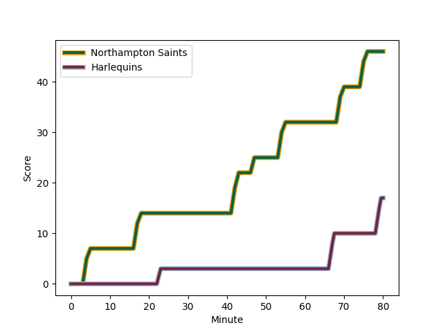
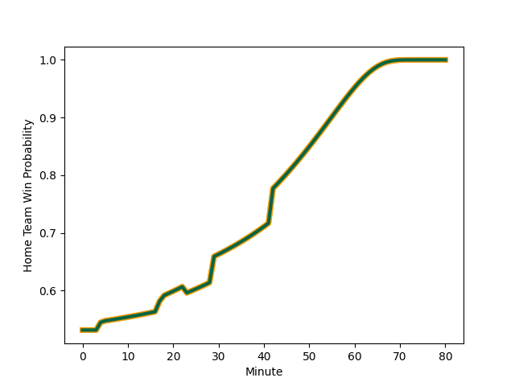

---  
layout: page  
title: Harlequins at Northampton Saints; 17.0-46.0  
date: 2023-01-01 10:00:00 18:00:00 -0500  
categories: match review  
---
# Harlequins (1602.93) at Northampton Saints (1654.81); 17.0-46.0

# Prediction: Northampton Saints by 9.2

Northampton Saints by 5.2 on a neutral field
## Scores over Time

## Win Probability over Time

# Pre-Match Prediction: Northampton Saints by 6.7

Northampton Saints by 2.7 on a neutral pitch

|   Away Minutes | Away Player                                                       |   Away elo |   Away Percentile |   Number |   Home Percentile |   Home elo | Home Player                                                             |   Home Minutes |
|---------------:|:------------------------------------------------------------------|-----------:|------------------:|---------:|------------------:|-----------:|:------------------------------------------------------------------------|---------------:|
|             63 | [Fin Baxter](..//playerfiles//FinBaxter_cleaned.md)               |     101.36 |                37 |        1 |                97 |     126.2  | [Alex Waller](..//playerfiles//AlexWaller_cleaned.md)                   |             55 |
|             70 | [Jack Walker](..//playerfiles//JackWalker_cleaned.md)             |      93.64 |                12 |        2 |                19 |      96.58 | [Sam Matavesi](..//playerfiles//SamMatavesi_cleaned.md)                 |             29 |
|             46 | [Simon Kerrod](..//playerfiles//SimonKerrod_cleaned.md)           |     100.5  |                33 |        3 |                75 |     109.67 | [Paul Hill](..//playerfiles//PaulHill_cleaned.md)                       |             65 |
|              4 | [Dino Lamb](..//playerfiles//DinoLamb_cleaned.md)                 |     114.45 |                82 |        4 |                72 |     109.57 | [David Ribbans](..//playerfiles//DavidRibbans_cleaned.md)               |             69 |
|             80 | [George Hammond](..//playerfiles//GeorgeHammond_cleaned.md)       |      93.85 |                16 |        5 |                81 |     113.06 | [Alex Moon](..//playerfiles//AlexMoon_cleaned.md)                       |             80 |
|             80 | [Archie White](..//playerfiles//ArchieWhite_cleaned.md)           |     111.84 |                76 |        6 |                27 |      98.26 | [Lukhan Salakaia-Loto](..//playerfiles//LukhanSalakaia-Loto_cleaned.md) |             80 |
|             60 | [Tom Lawday](..//playerfiles//TomLawday_cleaned.md)               |     101.59 |                47 |        7 |                94 |     124.26 | [Angus Scott-Young](..//playerfiles//AngusScott-Young_cleaned.md)       |             80 |
|             80 | [Alex Dombrandt](..//playerfiles//AlexDombrandt_cleaned.md)       |     122.85 |                89 |        8 |                30 |      99.08 | [Lewis Ludlam](..//playerfiles//LewisLudlam_cleaned.md)                 |             55 |
|             46 | [Lewis Gjaltema](..//playerfiles//LewisGjaltema_cleaned.md)       |     109.57 |                74 |        9 |                81 |     113.57 | [Alex Mitchell](..//playerfiles//AlexMitchell_cleaned.md)               |             46 |
|             59 | [Tommaso Allan](..//playerfiles//TommasoAllan_cleaned.md)         |     105.86 |                55 |       10 |                14 |      93.69 | [Fin Smith](..//playerfiles//FinSmith_cleaned.md)                       |             40 |
|             80 | [Josh Bassett](..//playerfiles//JoshBassett_cleaned.md)           |     117.58 |                86 |       11 |                62 |     107    | [James Ramm](..//playerfiles//JamesRamm_cleaned.md)                     |             80 |
|             80 | [Andre Esterhuizen](..//playerfiles//AndreEsterhuizen_cleaned.md) |     113.23 |                77 |       12 |                 7 |      88.69 | [Fraser Dingwall](..//playerfiles//FraserDingwall_cleaned.md)           |             80 |
|             80 | [Joe Marchant](..//playerfiles//JoeMarchant_cleaned.md)           |     106.45 |                58 |       13 |                60 |     107.02 | [Matt Proctor](..//playerfiles//MattProctor_cleaned.md)                 |             65 |
|             63 | [Cadan Murley](..//playerfiles//CadanMurley_cleaned.md)           |      91.39 |                10 |       14 |                79 |     112.25 | [Tommy Freeman](..//playerfiles//TommyFreeman_cleaned.md)               |             80 |
|             80 | [Nick David](..//playerfiles//NickDavid_cleaned.md)               |     105.28 |                54 |       15 |                85 |     117.84 | [George Furbank](..//playerfiles//GeorgeFurbank_cleaned.md)             |             80 |
|             10 | [Jack Musk](..//playerfiles//JackMusk_cleaned.md)                 |     109.18 |                74 |       16 |                99 |     136.31 | [Mike Haywood](..//playerfiles//MikeHaywood_cleaned.md)                 |             51 |
|             17 | [Jordan Els](..//playerfiles//JordanEls_cleaned.md)               |      98.15 |                22 |       17 |                84 |     110.09 | [Emmanuel Iyogun](..//playerfiles//EmmanuelIyogun_cleaned.md)           |             25 |
|             34 | [Wilco Louw](..//playerfiles//WilcoLouw_cleaned.md)               |     121.31 |                94 |       18 |                 5 |      86.57 | [Alfie Petch](..//playerfiles//AlfiePetch_cleaned.md)                   |             15 |
|             76 | [Charlie Matthews](..//playerfiles//CharlieMatthews_cleaned.md)   |     102.13 |                45 |       19 |                13 |      93.77 | [Karl Wilkins](..//playerfiles//KarlWilkins_cleaned.md)                 |             11 |
|             20 | [Luke Wallace](..//playerfiles//LukeWallace_cleaned.md)           |      87.82 |                 6 |       20 |                97 |     134.75 | [Sam Graham](..//playerfiles//SamGraham_cleaned.md)                     |             25 |
|             34 | [Danny Care](..//playerfiles//DannyCare_cleaned.md)               |     132.72 |                98 |       21 |                43 |     101.53 | [Callum Braley](..//playerfiles//CallumBraley_cleaned.md)               |             34 |
|             21 | [Will Edwards](..//playerfiles//WillEdwards_cleaned.md)           |     120.56 |                88 |       22 |                45 |     102.4  | [Rory Hutchinson](..//playerfiles//RoryHutchinson_cleaned.md)           |             15 |
|             17 | [Oscar Beard](..//playerfiles//OscarBeard_cleaned.md)             |     114.12 |                79 |       23 |                96 |     131.93 | [Courtnall Skosan](..//playerfiles//CourtnallSkosan_cleaned.md)         |             40 |

